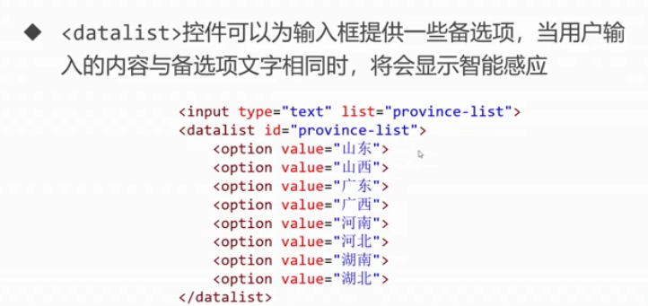

# HTML5(Hyper Text Markup Language)笔记及问题


## 笔记

- **超链接**

  - 邮箱链接：`herf="mailto:邮箱链接"`
  - 电话链接：`href="tel:电话 "`

- **音频和视频**

  - 音频：`<audio></audio>`

  - 视频：`<video></video>`

    -  <u>兼容到IE9</u>
    -  标签对当中书写不兼容浏览器中的显示文字
    -  controls：显示播放控键
    -  autoplay：音频自动播放属性（常用浏览器可能不允许
    -  loop：循环播放

- **区块标签**

  - 文档区域：`<section></section>`  <u>(语义比div大)</u>
  - 文档核心内容：`<article></article>` <u>(会被搜索引擎主要抓取)</u>
  - 文档的非必要相关内容：`<aside></aside>` <u>(例如广告等)</u>
  - 导航条：`<nav></nav>`
  - 页头：`<header></header>`
  - 网页核心部分：`<main></main>`
  - 页脚：`<footer></footer>`

- **语义化标签**

  - `<b></b>`  `<i></i>`  `<u></u>`
  - `<strong></strong>`   ` <em></em>`   `<mark></mark>`
  - `<figure> <figcaption></figcaption> </figure>` <u>(表示一段独立的内容是一个单独的引用单元)</u>

- **表单**

  - `action`：表单要提交到的后台程序的网址
  - `method`：表单提交方式，可选值有`get`或`post`

- **input标签**

  - `type`：确定文本类型

    - 单行文本框：`type="text"`  密码框：`type="password"`

      - `placeholder`：文本提示文字
      - `disabled`：文本是否被锁死
      - `value`：文本框内的值

    - `required`：设置必填

    - 单选按钮：`type="radio"`     复选框：`type="checkbox"`

      - `checked`：默认被选中
      - `name`：将按钮归为一类
      - `value`：按钮提交给服务器的值
      - `label`：将文字和按钮进行绑定，用 `label` 标签包裹 `input` 标签＋文字

    - 三种按钮：

      - 普通按钮：`type="button"`
      - 提交按钮：`type="submit"`
      - 重置按钮：`type="reset"`
      - `value`属性：设置按钮中文字

    - H5新控键:

      - 颜色控键：`type="color"`
      - 日期控键：`type="date"`
      - 时间控键：`type="time"`
      - 邮箱控键：`type="email"`<u>(自动检测类型)</u>
      - 数字控键：`type="number"`<u>(可限制最小最大值)</u>
      - 拖拽条：`type="range"`<u>(可限制最小最大值)</u>
      - 网址：`type="url"`<u>(自动检测类型)</u>
      - 搜索框：`type="reseach"`<u>(框框后面多个小叉叉)</u>

    - `datalist`控键

      

- **下拉菜单**

  - `<select> <option></option> </select>`
  - `option`标签中也要设置value属性
  - `option`标签中添加`selected`设为默认选中

- **多行文本框**

  - `<textarea></textarea>`
  - `cols`属性：设置列
  - `rows`属性：设置行 

- **表格** 

  - ````HTML
    <table>
        <!--表格标题-->
        <caption></caption>
        <!--表头-->
        <thead>
            <!--一个<tr></tr>表示一行-->
            <tr>
                <!--th中内容自动加粗居中-->
                <th></th>
                <th></th>
        	</tr>
        </thead>
        <!--表格数据-->
        <tbody>
            <tr>
                <td></td>
                <td></td>
            </tr>
        </tbody>
        <!--表格尾部-->
        <tfoot>
            <tr>
                <td></td>
                <td></td>
            </tr>
        </tfoot>
    </table>
    ````

  - `colspan`属性：列跨度，合并列，用来设置给 `td` 或者 `th`

  - `rowspan`属性：行跨度，合并行，用来设置给 `td` 或者 `th`

  - `cellpadding`属性：定义单元格内容与边框之间大小，已废弃

  - `cellspacing`属性：定义两个单元格之间的空间大小，已废弃


## 问题

- **超链接**
  - 锚点bottom：想要锚点bottom生效必须给底部元素设置name：bottom，否则无法生效。<u>（但是锚点top生效无需给顶部元素设置name）</u>
