# DOM

>Document Object Model，文档对象模型
>
>是JavaScript操作HTML文档的接口
>
>最大特点是将文档表达为节点树


- **节点的nodeType属性值**：可以显示节点的具体类型

  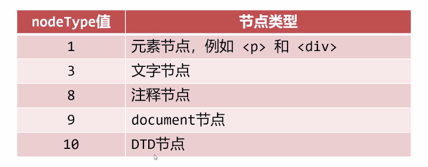

- **访问元素节点**：
  
  - 通过ID名：`document.getElementById()`；
    - 如果两个标签书写了相同的标签名，那么该方法只能检索到第一个 `Id` 属性符合的标签；
  - 通过标签名：`document.getElementsByTagName()`；
    - 无论页面中有几个标签名符合的元素，都会得到一个元素的数组
  - 通过类名：`document.getElementsByClassName()`；
    - 无论页面中有几个标签名符合的元素，都会得到一个元素的数组
  - 通过选择器：`document.querySelector()`；
    - 括号内的值书写是与CSS选择器结构相同的；
    - 只能得到页面上的一个元素；
  - 通过选择器得到元素数组：`document.querySelectorAll()`；
    - 括号内的值书写是与CSS选择器结构相同的；
    - 可以得到所有符合的元素构成的数组；

在测试 `DOM` 代码时，通常 JS 代码一定要写到 HTML 节点的后面，**否则无法找到相应的HTML节点**；如果将 JS 代码写在 HTML 节点前，可以将 JS 代码写在 `window.onload = function() {}` 中，使用该事件可以使页面加载完毕后，再执行指定的代码，这就是所谓的延迟运行；

````html
<script>
    window.onload = function() {
        var box = document.getELementById('box');
        console.log(box);		// 输出Id为box的标签
        // 如果不将以上语句写在window.onload中那么控制台将输出undefined
    }
</script>
````


- **节点的关系**（打点直接调用）

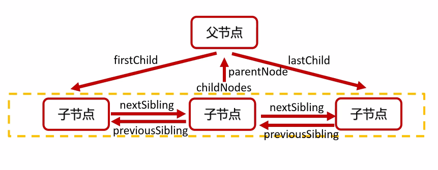

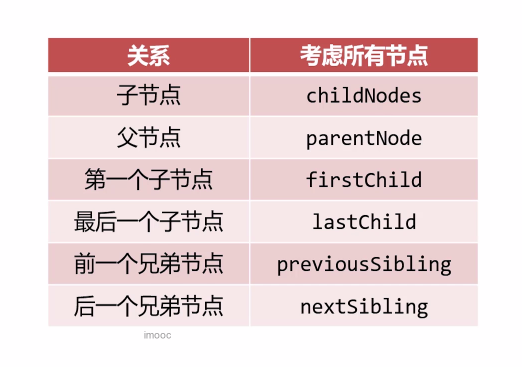

**注意：文本节点也属于节点，在IE9开始，空白文本节点也算节点**

因为文本节点时常不需要被考虑进去，在IE9开始，引入了一些**只考虑元素节点的属性**

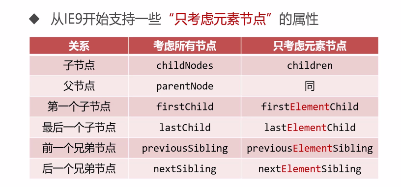

那么在不能兼容的只考虑元素节点的浏览器中，我们则需要封装一些函数来帮助该对象获取其元素节点；

````js
// 类似children功能
function getElementChildNodes(node) {
    var arr = [];
    // 循环遍历childNodes方法所取到的所有子节点
    for (var i = 0; i < node.childNodes.length; i++) {
        // 如果判断一直所取得得子节点的类型为元素节点，则将该节点推入准备好的结果数组中
        if(node.childNodes[i].nodeType == 1) {
            arr.push(node.childNodes[i]);
        }
    }
    return arr;
}
console.log(getElementChildNodes(box));         
// 输出一个包含 box中的四个p标签的数组

// 类似previousElementSibling功能
function getElementPreviousSibling(node) {
    // 方法一：
    /*
    // 若获取到的前面没有任何兄弟节点则返回 null
    if (node.previousSibling == null) {
        return null;
    }
    // 当获取到的兄弟节点不是元素节点时进入循环
    while (node.previousSibling.nodeType != 1) {
        // 指向下一个节点
        node = node.previousSibling;
        // 此时若获取到的节点为 null，则返回 null
        // 由于若此时节点为 null 则其没有nodeType
        // 此时若不写这条判断语句会报错 Uncaught TypeError: Cannot read property 'nodeType' of null
        if (node.previousSibling == null) {
            return null;
        }
    }
    return node.previousSibling;
    */
   // 方法二：
   while (node.previousSibling) {
        if (node.previousSibling.nodeType != 1) {
            node = node.previousSibling;
        } else {
            return node.previousSibling;
        }
   }
   return null;
}
console.log(getElementPreviousSibling(para));

// 获取一个元素的所有兄弟元素
var p2 = box.children[1];
// console.log(p2);
function getElementSibling(node) {
    var arr = [];
    var curr_node = node;
    while (node.previousSibling) {
        if (node.previousSibling.nodeType == 1) {
            arr.unshift(node.previousSibling);
        }
        node = node.previousSibling;
    }
    // 一定要记得在存储完前面的兄弟元素后将node指针归位
    node = curr_node;
    while (node.nextSibling) {
        if (node.nextSibling.nodeType == 1) {
            arr.push(node.nextSibling);
        }
        node = node.nextSibling;
    }
    return arr;
}
console.log(getElementSibling(p2));   

````


- **`innerHTML` 和 `innerText`**

  - `innerHTML` ：可以在文档中插入HTML文本，该文本会被当成HTML标签识别；
  - `innerText` ：只可在文档中插入text文本，不能以HTML标签识别

  ````js
  box.innerHTML = '<p>耶，我被更改啦</p>'
  box.innerText = '我只能被识别为纯文本 - /\ -'
  ````


- 对所**获取节点样式**的操作：`node.style.backgroundColor = 'red'`

  需要特别注意的是，在CSS中许多中间写中划线的样式的名称，在用 JS 设置时必须**将中划线命名改为驼峰命名**，因为 JS 中的中划线为减号，无法被识别； 

  通过 JS 设置的 CSS 样式是被设置 为**行内样式**的；

- 如何改变**元素节点的HTML属性**：

  - 更改标准的W3C属性 (如 `href、src` 等)，直接打点更改 : `oImg.src = 'image/2.jpg'`

  - 更改非标准的W3C属性 ，需要使用 `setAttribute() 和 getAttribute()`；

    ````js
    box.setAttribute('data-n', 10);
    var n = box.getAttribute('data-n');
    alert(n); 			// 10
    ````

- **节点的的创建，移动和克隆**

  - 创建：`createElement()`

    但由于创建出来的节点为**孤儿节点**，因此需要使用 `appendChild()` 或 `insertBefore()` 方法将孤儿节点插入DOM树；

    `父节点.appendChild(孤儿节点)` ： 孤儿节点将成为父节点的子节点，挂载在父节点最后一个子节点的位置；

    `父节点.insertBefore(孤儿节点, 标杆节点)`：孤儿节点将成为父节点的子节点，被挂载在标杆节点之前一个位置；

  - 移动：`新父节点.appendChild(需移动的节点)` 或 `新父节点.insertBefore(需移动的节点, 标杆子节点)`

    令一个已经挂载到DOM树上的节点成为 `appendChild()` 或 `insertBefore()` 方法的参数，那么该节点将会被移动；

  - 删除：`父节点.removeChild(需要删除的子节点)` 

  - 克隆节点：`var 新节点 = 老节点.cloneNode()`

    新节点为一个孤儿节点，需要将其插入DOM树；

    `cloneNode()` 方法可以写参数 `true` 或者 `false`：如果填写 `true` 表示深度克隆，则该节点的所有后代节点也会被一起克隆；如果填写 `false` 表示只克隆节点本身；

- **事件的监听**

  ````js
  obox.onclick = function () {
  	statement;
  }
  // 匿名函数在事件触发时被调用
  ````

  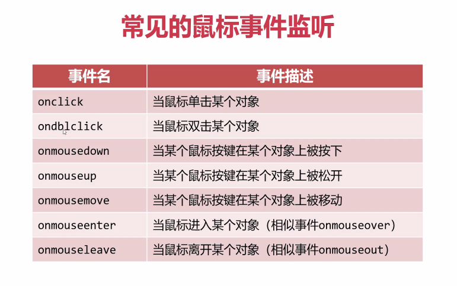

  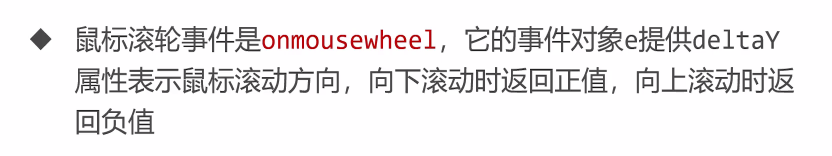

  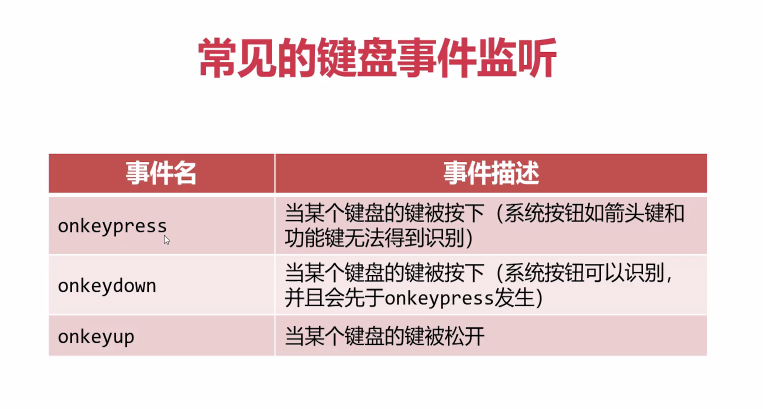

  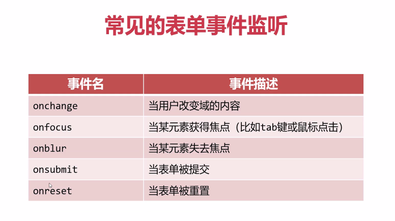

  补充：oninput 表示正在修改域内容；

  ````html
  <form id = 'myform'>
      <p> 
          姓名：
      	<input type='text' name='nameField'>	
      </p>
      <p> 
          年龄：
      	<input type='text' name='ageField'>	
      </p>
  <form>
  <sctipt>
      var myForm = document.getElementById('myform');
      // 直接通过id获取表单元素，再使用元素的name 通过表单打点调用
      var nameField = myForm.nameField;
      var nameField = myForm.nameField;
  <script>
  ````

  小tips：获取表单元素中的域标签元素的特别方法；

  

  **问题：**

  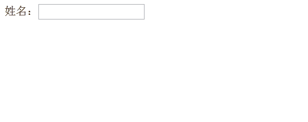

  ````html
  <form id="form">
          姓名：<input type="text" name="name" id="name">
          <span id="error"></span>
  </form>
  ````

  ````js
  var oform = document.getElementById('form');
  var oname = document.getElementById('name');
  var oerror = document.getElementById('error');
  
  oname.onblur = function() {
      console.log('brul');
      if (!oname.value) {
          error.innerText = '用户名不能为空';
      } else {
          error.innerText = '';
      }
  }
  oname.onfocus = function() {
      console.log('focus');
      error.innerText = '请输入您的姓名'
      // 以下方法会使oform的内容被更新，oname刚获取焦点便失去焦点，因此不可取
      // oform.innerHTML = oform.innerHTML + '请输入您的姓名';
      console.log(oname);
  }
  ````

  此时如果不设置 `error` 模块，而直接使用 `innerHTML` 将内容更新的话，会使 `form` 中的 `HTML` 代码被更新，造成失焦，不可取；

  

  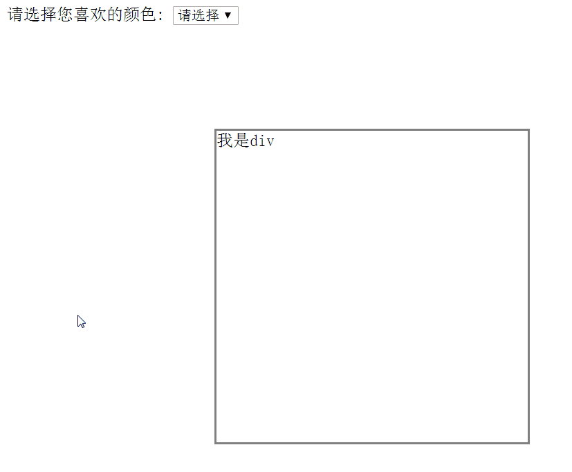

  ````html
  <label for="color-select">Choose a color:</label>
  <select name="color" id="color-select">
      <option value="">-- Please choose a color --</option>
      <option value="yellow">黄色</option>
      <option value="orange">橘色</option>
      <option value="pink">粉色</option>
      <option value="purple">紫色</option>
  </select>
  
  <div class="box" id="box">
      <span id="prompt">我是一个div</span>
  </div>
  ````

  ````js
  var oselect = document.getElementById('color-select');
  var obox = document.getElementById('box');
  // 下拉框选中项改变事件
  oselect.onchange = function() {
      // 获取选中项中的索引
      // 注意：这条语句要写在事件中，写在事件外的话只能获取到最开始选中的optionIndex
      var index = oselect.selectedIndex;
      // 获取选中的option的值
      var color = oselect.options[index].value;
      obox.style.backgroundColor = color;
      if (color == '') {
          obox.firstElementChild.innerText = '我的颜色没有改变';
      } else {
          obox.firstElementChild.innerText = '我的颜色变为' + color;
      }
  
  }
  ````

  下拉框选项改变事件是 `onChange`，为下拉框设置该事件，每当被选中的 `option` 改变，则事件函数中的内容被触发；

  想获取下拉框中当前被选中的 `option`，无法直接获得其 `value` 和其 `text`，只能通过 **`index = oselect.selectedIndex`**  先获取当前被选中的 `option` 的索引，而后通过 **`oselect.options[index].value`** 来获得当前选中的 `option` 的 `value` 值；

  

- **事件传播** 

  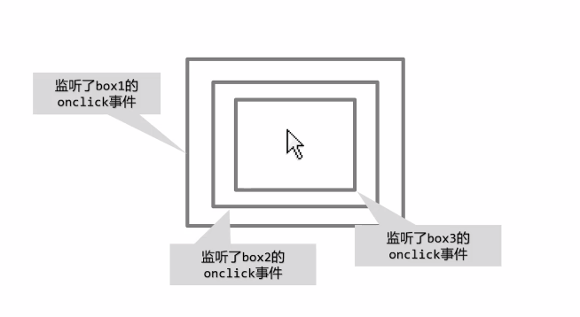

  **响应顺序：box3 => box2 => box1**

  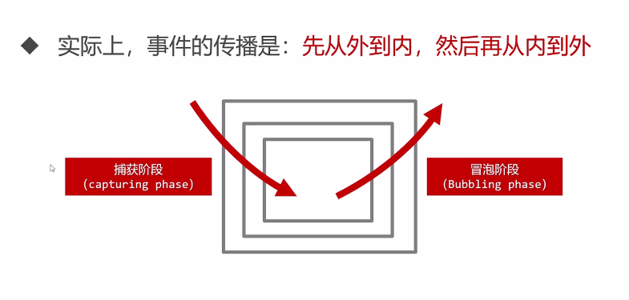

  **先捕获再冒泡**，但此与以上响应顺序不符，这是因为 `onxxx` 写法只能监听冒泡阶段，不能监听捕获阶段；

  因此我们引入了 **`addEventListener()`** 方法；

  DOM0级事件监听：

  > onclick、onkeypress、onfocus 等以 on 开头的事件监听
  >
  > 它们只能监听冒泡阶段	

  DOM2级事件监听：

  >addEventListener('click', function () { statement; }, true) 方法
  >
  >如果第三个参数为true，则监听捕获阶段；为 false，则监听冒泡阶段；
  >
  >注意：第一个参数为事件名，事件名前不加 on

  注意事项：

  - 写在最内层的元素，不再区分捕获阶段和冒泡阶段，会先执行写在前面的监听然后执行后写的监听；
  
  - 如果给元素设置相同的两个或多个同名事件，则DOM0级写法后面写的会覆盖先写的，而DOM2级会按顺序执行；
  
    

- **事件对象**

  ````js
  box.onclick = function (e) {
      
  }
  // 函数形参中的e，即为事件发生时传入的事件对象
  ````

  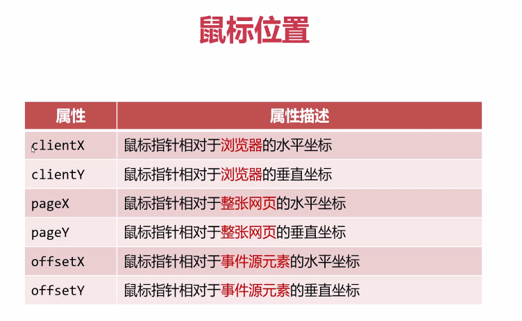

  特别注意：DOM规定如果盒子出现了嵌套现象，就算我们只给外层的盒子设定了事件，`offset` 在进入内层盒子时左上角时，坐标也会重新从 $(0, 0)$ 开始算起；

  ````html
  <div id="box1">
      <div id="box2">
          <div id="box3"></div>
      </div>
  </div>
  <p id='info'></p>
  ````

  ````js
  // 由此可知，onmousemove事件只设置给了外层box一个元素
  odiv[0].onmousemove = function (e) {
      oinfo.innerHTML = 'offset X/Y：' + e.offsetX + ',' + e.offsetY + 
          '<br>' + 'client X/Y：' + e.clientX + ',' + e.clientY + 
          '<br>' + 'page X/Y：' + e.pageX + ',' + e.pageY;
  }
  ````

  

  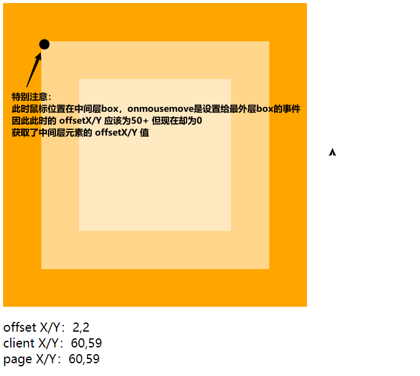

  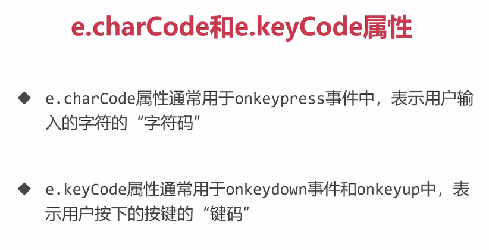

  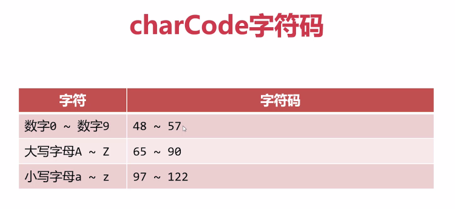

  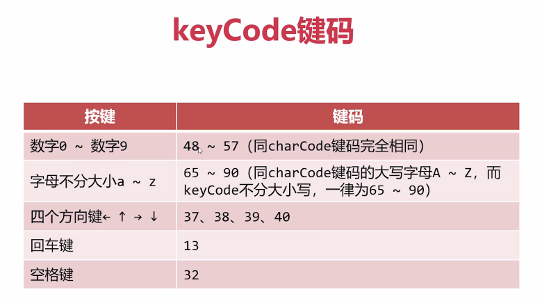

  - 阻止默认事件：`e.preventDefault()`

    ````js
    
    ````

  - 阻止事件的传播：`e.stopPropagtion()`

    ```js
    
    ```

- **事件委托** 

  ````html
  <button id="btn">点击一下添加表单项</button>
  <ul id="list">
      <li>表单项1</li>
      <li>表单项2</li>
  </ul>
  ````

  ````js
  // 给ul中的多个li设置点击一下 颜色变为红色的事件
  var olist = document.getElementById('list');
  var oli = document.getElementsByTagName('li');
  // console.log(oli);
  for (var i = 0; i < oli.length; i++) {
      oli[i].onclick = function (e) {
          // console.log(this);
          // 错误，因为此时的i已经为 oli.length
          // oli[i].style.color = 'red';
          // 使用上下文规则
          this.style.color = 'red';
      }
  }
  ````

  **当有大量元素需要批量添加事件监听时**，需要使用循环给每一个事件都绑定事件监听，而每一个事件监听的注册都会消耗一定系统内存，而批量添加事件监听会导致内存消耗非常大，且实际上每个事件处理函数都是不同的函数，这些函数本身也会占用内存；

  ````js
  // 点击按钮添加li标签，并给li标签添加事件
  var btn = document.getElementById('btn');
  btn.onclick = function () {
      var li = document.createElement('li');
      li.innerHTML = '我是新添加的HTML'
      olist.appendChild(li);
      li.onclick = function () {
          li.style.color = 'red';
      }
  }
  ````

  **当有动态元素节点被创建，而这些新创建的元素都需要绑定事件时**，逐一绑定消耗也非常的大；

  

  于是产生了事件委托，**即利用事件冒泡的机制，将后代元素事件委托给祖先元素**；

  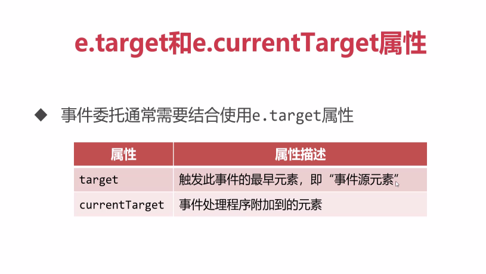

  则以上的 `onclick` 事件可以被改写为：

  ````js
  olist.onclick = function (e) {
      // 此时的e.target为点击的标签元素
      // 在点击li标签时，li标签通过冒泡将事件传给了ul标签
      // 所以可将事件设置给ul标签
      e.target.style.color = 'red';
  }
  ````

  

  **注意事项**：

  - `onmouseenter` 和 `onmouseover` ：都表示鼠标进入，但是 `onmouseenter` 不冒泡，因此当事件附加给哪个节点，就是哪个节点自己触发的DOM事件，没有冒泡过程，换而言之，对于设置事件的节点来说，它的 `e.target` 就是自己；

  - `onmouseleave` 和 `onmouseout`：都表示鼠标移出，区别同上；

  - 最内层的元素不能再有额外的内层元素了；

    ````html
    <ul id='list'>
        <li><span>ABCD</span>列表项</li>
        <li><span>ABCD</span>列表项</li>
        <li><span>ABCD</span>列表项</li>
    </ul>
    ````

    ````js
    var olist = document.getELementById('list');
    olist.onclick = funtion (e) {
        e.target.sytle.color = 'red';
    }
    ````

    此时我们的目的是当我们点击 `li` 时，列表项就变红，但此时由于 `li` 有内层元素`span`，那么当点击 `ABCD` 时，变红的只有 `ABCD`，而 `列表项` 三个字无变化，因为此时 `e.target == <span>`；

- **定时器：`setInterval(function () {}, 2000)`**

  第一个参数：是函数，这个函数将自动被以固定时间间隔调用，如果是具名函数，那么也可直接将具名函数函数名传入参数；

  第二个参数：是间隔时间，以毫秒为单位；

  第三个参数及以后：表示传入第一个参数函数的参数；

  定时器可以一直重复调用第一个参数中的函数，每次调用的时间间隔为第二个参数所设置的时间间隔；

  清除定时器：`clearInterval(需要清除的定时器的名称)` 

  ````js
  var info = document.getElementById('info');
  var btn1 = document.getElementById('btn1');
  var btn2 = document.getElementById('btn2');
  var timer, a = 0;
  btn1.onclick = function () {
      clearInterval(timer);
      timer = setInterval(function () {
          info.innerHTML = ++a;
      }, 1000);
  }
  btn2.onclick = function () {
      clearInterval(timer);
  }
  ````

  如果一次暂定都没有按，而疯狂的按开始，此时会产生一个定时器叠加的问题，因此为了防止定时器叠加，应该每次在设置定时器之前先清除定时器，`btn1.onclick` 语句中设置的 `clearInterval()` 就是这个作用；

- **延时器：`setTimeout(function () {}, 2000)`**

  参数意义与定时器基本相同，但延时器中第一个参数函数只会执行一次，第二个参数代表执行这个函数所延迟的时间；

  清除延时器：`clearTimeout(所需清除的延时器的名字)`

- **异步 (asynchronous)**

  > 不会阻塞CPU继续执行其他语句，当异步完成时，会执行 " 回调函数 (callback) "

  ````js
  setTimeout(function () {
      console.log('A');
  }, 2000)
  console.log('B');
  // 此时控制台必然会先输出B，再输出A
  ````

  `setTimeout()` 就是一个异步语句，而它的第一个参数就是回调函数，写在异步语句后的 `console.log('B')` 是一个正常语句，异步语句的设置不会阻碍正常语句的运行；

- **JS + CSS3 结合实现动画**

  利用 `transition` 属性 与 JS 相结合，实现小盒子的左右移动：

  ````js
  var btn_move = document.getElementById('btn_move');
  var move_box = document.getElementById('move_box');
  var lock = true;
  // pos表示盒子此时在page的左边或右边
  // pos == 1,则盒子在左边，向右移动
  // pos == 2,则盒子在右边，向左移动
  var pos = 1;
  btn_move.onclick = function () {
      if (pos == 1) {
          move_box.style.transition = 'all 2s';
          move_box.style.left = '1100px';
          pos = 2;
      } else if (pos == 2) {
          move_box.style.transition = 'all 2s';
          move_box.style.left = '100px';
          pos = 1;
      }
  }
  ````

  此时会出现一个问题，当点击按钮时，盒子并不会移动到上一次点击的终点，而会直接向本次点击的目的地运行，因此为了让每一次的移动都达到终点，我们设置了函数节流；

  **函数节流**：一个函数执行一次后，只有大于设定的执行周期后才允许执行第二次，而实现此功能我们需借助 `setTimeout()` 延时器；

  ````js
  // 设置一个锁并假定最开始时，锁为打开状态
  var lock = true;
  
  function jieliu_fun() {
      // 如果锁是关闭状态，则该函数不执行
      if (!lock) return;
      // 函数核心语句
      
      // 关锁
      lock = false;
      // 指定的毫秒数后将锁打开
      setTimeout(function () {
          lock = ture;
      }, 2000);
  }
  ````

  错误的设置方法：

  ````js
  // 设置一个锁并假定最开始时，锁为打开状态
  var lock = true;
  
  function jieliu_fun() {
      // 如果锁是关闭状态，则该函数不执行
      if (!lock) return;
      // 关锁
      lock = false;
      // 函数核心语句
      
      // 指定的毫秒数后将锁打开
      lock = ture;
  }
  ````

  这样设置是错误的，因为当核心语句执行完毕，锁就会打开，但是此时 `transition` 中设置的时间还在继续，此时如果盒子并未移动完毕，再点一下 `btn`，此时 `lock` 处于打开状态，盒子依旧会立即反向运行，此时的 `lock` 是无效的；

  **特别注意**：**在 `setTimeout()` 中设置的延时应该与 `transition` 中设置的过渡时间相等**，不宜过长，也不宜过短；

- **DOM对象的自定义属性：`data-*`**

  - 设置 `data-*` 的两种方法
    1. 直接在 html 标签中设置
    2. 在 js 中使用 `DOM对象.dataset.自定义属性名 = '自定义属性值'`

  - 读取 `data-*` 方法
    1. 使用 `getAttribute('data-自定义属性名')`
    2. 使用 `DOM对象.dataset.自定义对象名`

  ````html
  <!-- 设置自定义属性方法一： -->
  <h2 data-weather="rain">今天下雨啦</h2>
  ````

  ````js
  var h2 = document.getElementsByTagName('h2')[0];
  // 方法二：使用 DOM对象.dataset.需要定义的属性名 = '需要定义的属性值' 设置
  h2.dataset.date = '2020/4/12';
  // 读取方法一：
  console.log(h2.getAttribute('data-weather'));
  console.log(h2.getAttribute('data-date'));
  // 读取方法二：读取自定义属性时 也可使用dataset
  console.log(h2.dataset.weather);
  console.log(h2.dataset.date);
  ````

  

