# JavaScript笔记及问题


## 笔记

  - **`ECMAScript` 和 `JavaScript`的关系**

    - `ECMAScript` 是 `JavaScript` 的标准
      - `ECMAScript` **规范了** `JavaScript`
      - `JavaScript` **实现了** `ECMAScript`

  - **JS书写位置**

    - 直接在 `<body>` 标签中引入 `<script>` 标签，在标签中写入js代码；
    - 书写的单独的 js文件，然后在 `<body>` 标签中用 `<script src=''>` 标签引入；
    - 在HTML5中 `<script type='text/javascript'>` 标签中的 `type='text/javascript'` 可以省略不写；

  - **报错处理**

    - `Uncaught SyntaxError: Invalid or unexpected token`

      未捕获的语法错误：不合法或错误的符号

      `Uncaught SyntaxError: Invalid shorthand property initializer`

      未捕获的语法错误：无效的简写属性初始值设定项

      - 对象的属性赋值时：`:` 写为 `= `；

    - `Uncaught ReferencesError: xxx is not defined`

      未捕获的引用错误：xxx没有被定义

      - 某变量未被定义 或者 函数拼写错误
      
    - `Uncaught RangeError: Maximum call stack size exceeded`

      未捕获的范围错误，最大值过度

      - 循环或者递归函数终止值设定错误
      
    - ` TypeError: 99 is not valid value for the expected return type integer[]`

      类型错误：xxx不是有效的被期望的返回值；

      - 返回值或调用值类型错误；

  - **REPL环境**

    - 可以使用其测试临时表达式的值

    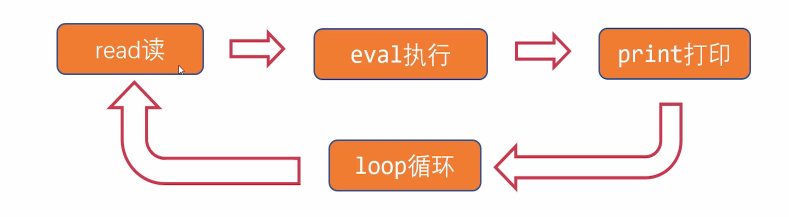

  - **对输出语句的解析**

    - ` alert("WW.");`
      - `alert()`：是内置函数，函数就是功能的封装，调用函数需要使用圆括号；
    - `console.log("HH.");`
      - `console` 是JS的内置对象，通过 `console.log` 可以调用它的内置的 `log` 方法；

  - **变量**

    - 不是数值本身，是存储数值的容器

    - 例如`var a = 5;`

      - 使用 `var` 关键字定义变量，`=` 将 5 赋值给 a

    - **变量合法命名**

      - 只能由字母、数字、下划线、$组成，但不能以数字开头；
      - 不能是关键字或保留字 ；
      -  吧变量名大小写敏感，a和A是两个不同的变量；

    - 常用变量命名法

      - **驼峰命名法**：大量使用
      - c风格命名法：用下划线将单词分割开

    - 变量默认值

      - 当一个变量只被定义，没有赋初值，则默认值是 undefined；
      - 一个变量只有被 var 定义 且 被赋初值后，才算完全定义；

    - 可以使用逗号同时声明和初始化两个变量

      - 例如 `var a = 0,b = 1;`

    - 变量声明提升：可以**提前使用一个稍后才声明的变量**，而不引发异常；

      - 在执行所有代码前，JS有与预解析阶段，会预读所有变量的定义

      - **注意：变量声明提升只提升定义，不提升值！**

        例如：

        ````js
        console.log(a);
        var a = 12;
        ````

        变量声明提升会使 `console.log` 语句**不报错**，但控制台**输出的值为 `undefined`**；

        

        例如：

        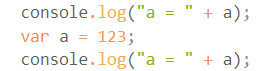

        

        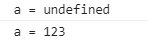

      - 实际开发中不要刻意使用

  - **JS中两大数据类型**

    - **基本数据类型**

      - **Number**

        - 整数和浮点数，统称为Number类型；

        - 科学计数法：`3e8`  表示 $3*10^8$;

        - 不同进制的数字

          - 二进制数值以 0b开头
          - 八进制数值以0开头
          - 十六进制数字以0x开头

        - 特殊值 `NaN`, 意义为 `not a number`，但它是一个数字类型的值，在数学运算中如果结果不能得到数字，其结果往往都是 `NaN`;

          它有一个 **不自等** 属性，即 $NaN != NaN$

      - **String**

        - 需要用引号包裹；

        - $+$ 号 可以拼接多个字符串；

        - `length` 属性：

          ````js
          "abc".length                        //3
          "我喜欢JS，也喜欢HTML5".length       //14
          "".length                          //0
          ````

          

        - String的**常见方法**

          > **注意：字符串是从0开始编号的；**

          

          - **charAt()** 可以得到指定位置的字符；

            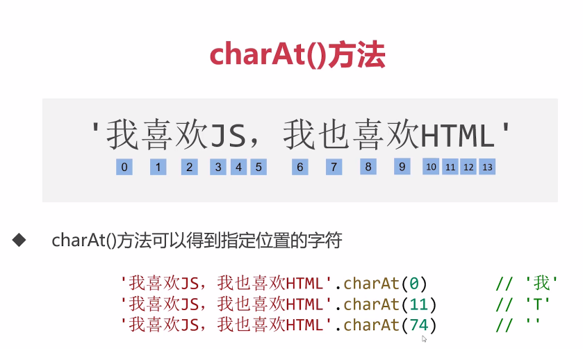

            

          - **substring()、substr() 和 slice()** 截取子字符串的三种方法

            - **`substring(a, b)`** 方法表示 得到从a开始到b结束 (**不包括b处**) 的字串；

              ````js
              '我喜欢JS，我也喜欢HTML'.substring(3, 5)   //'JS'
              
              '我喜欢JS，我也喜欢HTML'.substring(3, 5)  //'HTML'
              ````

              - 如果省略第二个参数，则自动获取到字符串末尾；
              - 如果 **参数a大于参数b**，数字顺序将自动调整为小数在前；

            - **`substr(a, b)`** 方法表示从a开始，长度为b的字符串；

              ````js
              '我喜欢JS，我也喜欢HTML'.substr(3, 2)   //'JS'
              ````

              - 如果省略第二个参数，则自动获取到字符串末尾；
              - a 可以为复数，表示倒数位置，倒数第一个数为-1；

            - **`slice(a, b)`** 方法表示 得到从a开始到b结束 (**不包括b处**) 的字串；

              - 与 `substring(a, b)` 不同的是：
                1. `slice(a, b)` 中 a，b 可以为负数；
                2. a参数必须小于b参数；

          - **toUpperCase() 和 toLowerCase()** 转换大小写

            - `toUpperCase()`  转换为大写
            - `toLowerCase()`  转换为小写

          - **indexOf()** 返回某个指定子字符串，在字符串中首次出现的位置，若要检索的字符串没有出现，则返回 -1；

            ````js
            'abcdeb'.indexOf('b')		// 1
            'abcdeb'.indexOf('de')		// 3
            'abcdeb'.indexOf('m')		// -1
            ````

      - **Boolean**

        - true
        - false 

      - **Undefined**

      - **Null**

        - 当我们需要将对象销毁、数组销毁或者删除事件监听时，通常将它们设置为 `null` ;

          

      - **数据类型转换**

        - **`Number();`** 其他类型转换为数字类型

          ````js
          Number("123");				// 123
          Number("123.4");			// 123.4
          Number("123年");			   // NaN
          Number("2e3");				// 2000
          Number("");					// 0
          
          Number(true);				// 1
          Number(false);				// 0
          
          Number(undefined);			//NaN
          Number(null);				// 0
          ````

        

        - **`parseInt();`** 将字符串转为整数，自动截取小数点前数字，且不会四舍五入

          ````js
          parseInt('3.14');				// 3
          parseInt('200px');				// 200
          parseInt('3.14是圆周率');		 // 3
          parseInt('圆周率是3.14');		 // NaN
          parseInt('3.99');				// 3
          parseInt('-3.99');				// -3
          
          parseInt(3.99);					// 3
          ````

        

        - **`parseFloat();`** 将字符串转化为浮点数

          ````js
          parseInt('3.14');				// 3
          parseInt('200px');				// 200
          parseInt('3.14是圆周率');		 // 3
          parseInt('圆周率是3.14');		 // NaN
          parseInt('3.99');				// 3
          parseInt('12.67.89');			// 12.67
          ````

          因为 true 、false、undefined 和 null 在转换前都会先被系统内部隐式转换为字符串，然后在写入

          

        - **`String();`** 将其他类型转换为字符串

          ````js
          String(123);				// '123'
          String(123.4);				// '123.4'
          String(2e3);				// '2000'
          String(NaN);				// 'NaN'
          String(Infinity);			// 'Infinity'
          String(0xf);				// '15'
          
          //非十进制的数字会被转化为十进制后再转为str
          ````

          

        - **`toString();`** 方法，**不是函数必须打点调用**，转换规则同 `String`

          ````js
          true.toString();			// 'true'
          NaN.toString();				// 'NaN'
          6.toString();				//报错，修改如下
          (6).toString();				// '6' 或者修改如下
          var a = 6;
          a.toString();				// '6'
          ````

          

        - **`Boolean();`** 将其他类型转换为 Boolean 类型

          ````js
          //数字 -> 布尔型，0和NaN转换为false，其他都为true
          Boolean(123);			// true
          Boolean(0);				// false
          Boolean(NaN);			// false
          Boolean(Infinity);		// true
          Boolean(-Infinity);		// true
          
          //字符串 -> 布尔值，空字符串转为false，其他都为true
          Boolean('');			// false
          Boolean('123');			// true
          Boolean('false');		// true
          
          //undefined 和 null 都转为false
          Boolean(undefined);		// false
          Boolean(null);			// false
          ````

          

    - **复杂数据类型** (引用类 型 )
      
    - Object、Array、Function、RegExp、Date、Map、Symbol 等等
      
    - **`typeof` 运算符**
      - 用来检测值或者变量的类型，它并非内置函数，而是一个操作符；
      - 两种使用方式
        - `typeof(表达式)`
        - `typeof 变量名`
      - 例如：`typeof 5` 一般用于在 `console` 中的 `REPL环境` 中进行测试；
      - 特别的：**typeof 对 `null` 和 `Array`类型的检测结果为 `object`**

  - **表达式与操作符**

    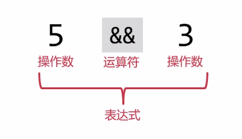

    -  **关系表达式**

      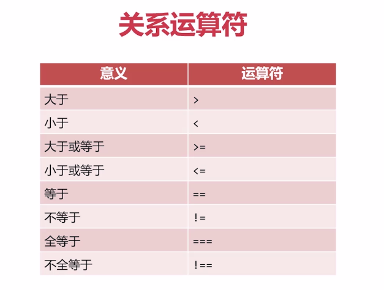

      - `==` 和 `===`

        - `==`：只比较值，不比较类型
        - `===`：即比较值，也比较类型

        ````js
        1 == true			//true
        1 === true			//false
        
        0 == false			//true
        0 === false			//false
        
        0 == undefined		//false
        0 === undefined		//false
        
        NaN == NaN			//false
        NaN === NaN			//false
        
        undefined == null	//true
        undefined === null	//false
        
        //类型不同的两个变量在比较的时候会被进行隐式强制类型转换
        ````

        - 特别地：**undefined 和 null 在相等比较时结果为true**

        - 由于NaN不自等，JS特别为NaN的比较提供了一个 `isNaN()` 函数；

          但该函数有一个bug，即只要该变量传入 `Number()` 的执行结果为NaN，则 `isNaN()` 函数都会返回 true；

      

    - **算术表达式**

      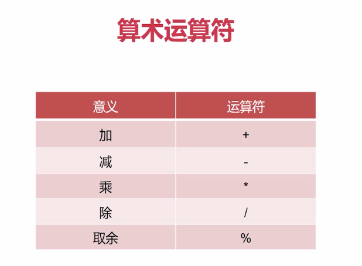

      - 隐式类型转换：如果参与数学运算的某操作数不是数字类型，那么JavaScript会自动将此操作数转换为数字类型；

        ````js
        3 * '4'			// 12
        true + true		// 2
        false + 2		// 2
        3 * '2天'	   // NaN
        3 + null		// 3
        3 + undefined	// NaN
        ````

        其本质是内部调用 Number() 函数

      - 特别地：+号在遇见字符串时，不会进行隐式类型转换，只有**加号两边的操作数都是数字**，才作加号，其他情况做连字符；

        

      -  **有关IEEE754**

        - 在JS中，有些小数的数学运算不是很精准；例如：

          ````js
          0.1 + 0.2		//0.30000000000000004
          ````

          这是因为JS使用了IEEE754二进制浮点数算术标准，使得个别小数运算产生 _<u>丢失精度</u>_  的问题

        - 解决方法：在小数运算时，要调用数字 `toFixed()` 方法保留指定的小数位数；

          ````js
          (0.1 + 0.2).toFixed(2)				// "0.30"
          Number((0.1 + 0.2).toFixed(2))		// 0.3
          //toFixed 括号内的参数表示 保留几位小数
          //注意：toFixed()方法，返回结果为字符串！！！
          ````

          **注意：toFixed()方法，返回结果为字符串！！！**

          

      - **Math对象**

        - 幂和开根号

          ````js
          Math.pow(2, 3)				// 表示2的3次方 = 8
          Math.pow(2, 3)				// 表示3的2次方 = 9
          
          Math.sqrt(81)				// 表示81开根号 = 9
          Math.sqrt(-81)				// 不符合数学规则 = NaN
          ````

        - 向上取整和向下取整

          ````js
          Math.ceil(2.3)				// 表示向上取整 = 3
          Math.floor(2.3)				// 表示向下取整 = 2
          
          Math.ceil(-2.3)				// 表示向上取整 = -2
          Math.floor(-2.3)			// 表示向下取整 = -3
          
          Math.ceil(2)				// 表示向上取整 = 2
          Math.floor(2)				// 表示向下取整 = 2
          ````

          

        

    - **逻辑表达式**

      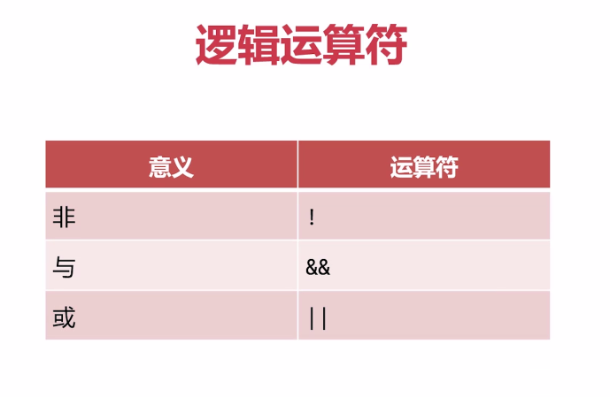

      - 短路计算

        - 在 `a && b` 运算中，如果 a 的值为真，那么表达式的结果为 b；如果 a 为假，那么表达式的结果为 a；例如：

        ````js
        3 && 6;				// 6
        undefined && 15;	// undefined
        15 && undefined;	// undefined
        null && 2;			// null
        '' && 16;			// ''
        NaN && undefined;	// NaN
        ````

        - 在 `a || b` 运算中，如果 a 的值为真，那么表达式结果就为 a；如果 a 为假，那么表达式结果为 b；例如：

        ````js
        3 || 6;				// 3
        0 || 6;				// 6
        null || undefined;	// undefined
        'a' || 'b'			// 'a'
        NaN || null			// null
        ````

      - **逻辑运算的优先级是：非 -> 与 ->或**

        

    - **赋值表达式**

      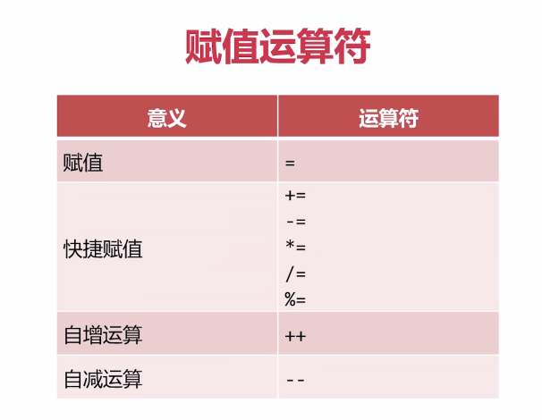

      ````js
      var a;
      console.log(a = 4);			// 4
      ````

      

    - **综合表达式**

      - 运算顺序：非运算 -> 数学运算 -> 关系运算 -> 逻辑运算

        ````js
        5 < 3 + 3				//  true
        3 > 2 && 8 > 3 + 4		// true
        3 > 2 && 8 > 3 + 5		// false
        !13 < 5 - 3				// true
        !13 < 5 - 5				// false
        ````
    
  - **switch语句**

    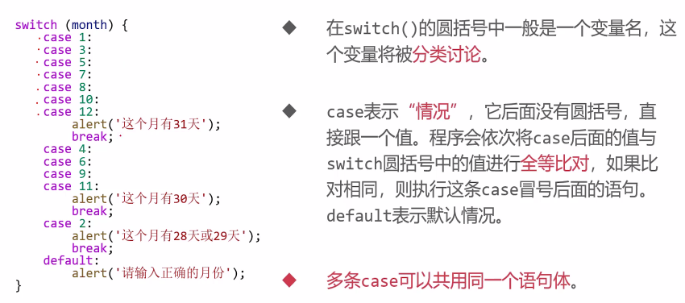

    if语句在执行完自己某一分支的语句时，会自动跳出 if语句体，但switch语句必须通过书写 `break` 语句来跳出语句体，否则后面的case将会自动执行；

    

  - **三元运算符**

    - `条件表达式 ? 表达式1 : 表达式2`
    - 当条件表达式为真时，则调用表达式1；反之，则调用表达式2；

  - **for循环**

    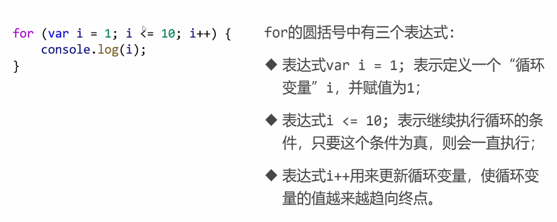

    注意：在for循环中，分隔每个条件语句的符号是分号；

  - **break和continue**

    - `break`：立即终止循环，只能用在循环语句当中；
    - `continue`：终止该循环的本次迭代，继续进行下一次迭代；
    
  - **随机数函数**

    - `Math.random()`：得到 0~1 之间的小数

    - 得到 $[a,b]$ 之间的整数，可套用以下公式：

      ````js
      parseInt(Math.random() * (b - a + 1) + a);
      ````

  - **for和while的使用场景**

  - **for循环的label标签和continue的合用**

  - **数组**

    - 定义数组

      方法一：`var arr = ['a', 'b', 'c', 'd']`

      方法二：`var arr = new Array(‘a’, ‘b’, ‘c’, ‘d’);` 或 `new arr = new Array(4);`	// 定义一个长度为4，值为undefined的数组；

      > 下标越界时，会返回undefined，而不会报错；

     

    - 更改数组项：`arr[1] = 8;`

      如果更改的数组项超过了lenght - 1，则会创造这一项；

    

    - 数组的遍历：使用循环语句；

     

    - 数组类型的检测

      > **由于用typeof检测数组得到的结果是object**，因此可以用 `Array.isArray()`方法来检测数组；

    

    - 数组的头尾操作方法

      ````js
      push(): 在尾部插入新项
      pop(): 无参数，在尾部删除，并返回被删除的项
      unshift(): 在头部插入新项
      shift(): 无参数，在头部删除，并返回被删除的值
      ````

    -  数组的 `splice()` 方法：可在数组中替换、插入、删除数组项

      ````js
      var arr = ['A', 'B', 'C', 'D', 'E', 'F', 'G'];
      arr.splice(3, 2, 'X', 'Y', 'Z');
      // 表示从下标为3的数字开始连续替换两项，将其中两项替换为'X','Y','z'
      // 如果第二个参数为0，则代表在下标为3的项之前插入新项
      // 如果只写前两个参数，则表示删除几项
      console.log(arr);
      // 输出 ['A', 'B', 'C', 'X', 'Y', 'Z', 'F', 'G']
      ````

      被 `splice()` 会返回包含被删除项的一个**数组**，；

    - 数组的 `slice(a， b)` 方法：截取子数组从下标为 a 的项开始，到下标为 b (但不包括下标为b) 的项结束；

      如果没有第二个参数，则表示从指定项开始，直到数组结尾的子数组；

      该方法参数允许为负数，表示数组的倒数第几项；

      **该方法，不会改变原数组；**

    - `join()` 方法和 `split()` 方法

      - `join()`：使数组转为字符串

        参数表示以什么字符作为连接符，留空则默认以逗号分隔，类似调用`toString()` 方法；

        ````js
        console.log(arr1.join());
        console.log(arr1.toString());
        // 输出结果同为 HH,520,WW,D,can,99999999
        ````

      - `split()`：使字符串转化为数组

        参数表示在什么字符的位置拆分字符串，一般不能留空；

      

    - `contact()` 方法：连接合并多个数组，但不改变原数组；

    - `reverse()` 方法：将原数组倒置，**改变原数组**；

    - `indexOf()` 方法：搜素数组中的元素，并**返回它所在的位置**，如果元素不存在，则返回-1；

    - `includes()` 方法：判断一个数组是否包含一个指定的项，**返回布尔值**；

    - 特别地，`indexOf()` 方法和 `includes()` 方法，都是使用 `===` 进行判断的；
    
  - **函数**

    - 定义数组

      ````js
      // 两者的区别在于
      fun1();			// 报错
      fun2();			// 不报错
      //这涉及到一个函数声明提升的问题，对于fun1来说，并没有提升函数的定义，只是将变量提升了，但此时变量虽然被var，值却还是undefined，因此报错；
      
      // 方法一：类似于把一个匿名函数，赋值给一个变量
      new fun1 = function () {};
      // 或者
      // 方法二：直接定义一个不匿名函数
      function fun2() {};
      ````

    - 参数：`arguments[]`，一个类数组对象

    - 数组中的 `arr.sort(function () {})` 方法

      它的参数是一个函数，当执行这个方法时，方法的底层会调用这个函数，这个函数的意义在于，实现排序的方式；

      ````js
      var arr = [1, 5 ,45, 910, 1029, 411];
      arr.sort(function (a, b) {
          // 由小到大排序
          if (a > b) {
              return 1;
          } else {
              return -1;
          }
          // 或者写做 return a - b;
      })
      console.log(arr);
      ````

    - 递归：函数自己调用自己

      - **实现数组深克隆**

        ````js
        var arr = [
            2, 3, 5,
            [1, 3, 4],
            ['ww', 2, ['sept', 10]],
            ['hh', 4, 1]
        ];
        function copy(arr) {
            // 每一层递归都会创建一个新的数组空间
            // 由于函数作用域的问题，当每层递归结束，该变量被销毁
            var copy_arr = [];
            for (var i = 0; i < arr.length; i++) {
                // 如果检测类型为引用类型值
                if (typeof arr[i] == 'object') {
                    // console.log(arr[i]);
                    // 将递归得到的返回值推入数组
                    copy_arr.push(copy(arr[i]));
                } else {
                    // 直接将遍历得到的基本类型值推入数组
                    copy_arr.push(arr[i]);
                }
            }
            // 跳出循环后返回deepClone完成的数组
            return copy_arr;
        }
        var copy_arr = copy(arr);
        arr[1]++;
        arr[3].push(6);
        arr[4].unshift('HH');
        console.log(arr);
        console.log(copy_arr);
        ````

    - 变量作用域问题

      ````js
      var a, b;
      function fun() {
          var a = 5;
          // 因为函数中的a被重新var，相当于重新为a开辟了一个空间
          // 此时的a = 5，是函数中的局部变量，与外部的全局变量a无关
          b = 5;
          // 此时的b因未在函数中被重新定义，因此是直接引用了全局变量中b的值
          b++;
          console.log(a, b);          // 5 6
      }
      fun();
      // 由上可知，在函数被运行后b的值发生改变，而a由于在函数中被遮蔽，因此依旧undefined
      console.log(a, b);              // undefined 6
      ````

      > 遮蔽效应：如果函数内部定义了与全局变量变量名相同的局部变量，则在函数执行时，函数内的局部变量会暂时将全局变量遮蔽；

      

      易错点：

      ````js
      var a = 10;
      function fun() {
          console.log(a);  // undefined
          a++;
          var a = 5;
          console.log(a);  // 5
      }
      fun();
      console.log(a);  //10
      ````

      - 为什么 `fun()` 函数的第一条执行语句是输出 `undefined` 呢？

        因js中的**变量预解析处理机制**，在进入 `fun()` 时，`局部变量 a` 已被预解析处理，也就是说 `fun()` 已知有一个`局部变量 a`，但其值暂时为 `undefined`，所以此时的 `a++` 的操作对象并不是针对`全局变量 a`，而是针对于 `值为undefined 的局部变量 a`；

    - 形参也是局部变量

      ````js
      var a = 10;
      function fun(a) {
          // 7作为形参传入，同时也是函数fun()中的局部变量
          console.log(a);     // 7
          a++;
          console.log(a);     // 8
      }
      fun(7);
      console.log(a);         // 10
      ````

      因为 a 被定义为形参，其实也是作为 `fun()` 的一个局部变量；

    - 作用域链：在函数的嵌套中，变量会从内到外逐层寻找他的定义；

    - **注意：在初次给变量赋值时，如果没有加 var，则将定义全局变量**

      ````js
      var a = 10, b = 20;
      function fun() {
          c = 30;
          var b = 50;
          b++;
          c++;
          console.log(b, c);      // 51 31
      }
      fun();
      console.log(b, c);          // 20 31
      // 此时在函数的外部可以访问c的值，因为c定义时没有加var，是全局变量
      ````

    - 闭包：是函数本身和该函数声明时所处的环境状态的组合；

      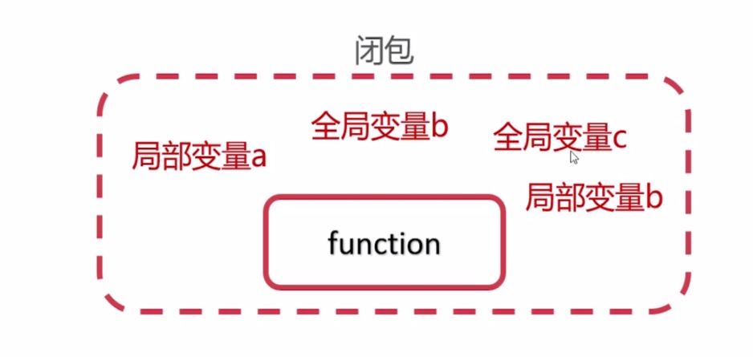

      简而言之，函数能够<u>记住其**定义时**所处的环境</u>，即使函数不在其定义的环境中被调用，也能访问自身定义时所处的变量；

      ````js
      function fun() {
          var name = '慕课网';
          function innerFun() {
              alert(name);
          }
          return innerFun;
      }
      var inn = fun();
      var name = 'imooc';
      inn();      // 调用inn()，警告框弹出'慕课网'，而不是undefined
      ````

      - 为什么 `inn()` 执行后弹出的警告框为 '慕课网' ？

        错误理解：按照正常情况 `inn = innerFun()`，这是把 `fun()` 的内部函数放在外部调用，这样其实是无法获取到 `Fun()` 内部设置的局部变量 `name = '慕课网'` 的值的，因此输出 `imooc` ;

        但是，js中有一个**闭包原则**，由于闭包原则`innerFun()` 定义在 `Fun()` 闭包环境中，因此它能记住 `Fun()` 的环境，使用`inn()` 调用 `innerFun()`时，可以获取到 `Fun()` 中定义的局部变量 `name = '慕课网'`；

      另外，闭包有记忆性，闭包产生时，函数所处的环境状态会始终保存在内存中，不会在外部函数调用后被自动清除；

      

      闭包的记忆性使用范例：

      假定体温不正常要被zuo起来，但是每个小区对标准体温的设定不一样，A小区设定标准体温为 37.3，B小区的标准体温为37.1，使用闭包的记忆性实现这个功能；

      ````js
      function createCheckTemp(standardTemp) {
          function checkTemp(realTemp) {
              if (realTemp > standardTemp) {
                  console.log('你的体温不正常，要被zuo起来！！！');
              } else {
                  console.log('哇！你的体温好正常~');
              }
          }
          return checkTemp;
      }
      // A小区标准体温37.3
      var checkTempA = createCheckTemp(37.3);
      checkTempA(37.5);
      checkTempA(37.2);
      // B小区标准体温37.1
      var checkTempB = createCheckTemp(37.1);
      checkTempB(37.5);
      checkTempB(37.2);
      ````

      

      闭包模拟私有变量：

      定义一个变量a，要求是能保证这个a只能被进行指定操作 (如加1，乘2)，而不能进行其他操作；

      ````js
      function fun() {
          var a = 5;
          return {
              getA: function() {
                  alert(a);
              },
              addA: function() {
                  a++;
              },
              powA: function() {
                  a *= a;
              }
          }
      }
      // 此时obj为fun()返回的对象
      var obj = fun();
      // 由于闭包的特性，只能通过对象中的方法对fun()中的局部变量a进行操作
      // 此时构成了一个私有变量的概念，即a的值只有fun()函数内的方法可以访问；
      obj.getA();
      obj.addA();
      obj.powA();
      obj.getA();
      ````

      不能滥用闭包，否则可能会造成网页的性能问题，严重时可能导致内存泄漏；所谓内存泄露是指程序中已动态分配的内存由于某种原因未释放或无法释放；

      解决方法是，在退出函数之前将不需要用到的局部变量全部删除；

      
      
    - IIFE (Immdediately Invoked Function Expression)：立即调用函数表达式，一旦定义就被调用
    
      `(function () { statement }) ();`
    
      作用一：为变量赋值；
    
      ````js
      var obj = {
          name : 'xm',
          age : 18,
          sex : 'male',
          sayHello : (function(age, sex) {
              console.log(age, sex)		// undefined undefined
          }) (age, sex)
      }
      obj.sayHello
      ````
    
      **IIFE的上下文是window**，因此即使在对象中调用，获取的值依然是`undefined`
    
      ````js
      var age = 18, sex = 'male';
      var sayHello = (function() {
          if (age < 18) {
              console.log('你好，小朋友');
          } else if (sex == 'male') {
              console.log('你好，先生');
          } else {
              console.log('你好，女士');
          }
      }) ()
      ````
    
      作用二：将全局变量变为局部变量
    
      ````js
      var arr = [];
      for (var i = 0; i < 5; i++) {
          arr[i] = function() {
              alert(i);
          }
      }
      arr[0]()     // 5
      arr[1]()     // 5
      arr[2]()     // 5
      arr[3]()     // 5
      arr[4]()     // 5
      ````
    
      我们想要的是输出 0 1 2 3 4，但是由于我们使用的是**同一个i**，因此在输出函数时，输出的数值全为5，此时我们结合闭包特性，调用IIEF重写数组赋值时的循环；
    
      ````js
      for (var i = 0; i < 5; i++) {
          // 由于闭包的特性，此时的每一个IIFE保存的都是函数执行当时的i值
          arr[i] = (function(i) {
              alert(i);
          })(i);
      }
      arr[0]()     // 0
      arr[1]()     // 1
      arr[2]()     // 2
      arr[3]()     // 3
      arr[4]()     // 4
      ````
    
      

  - **回调函数 (CallBack)**

    >A callback is a function that is passed as an argument to another function and is executed after its parent function has completed.
    >
    >
    >
    >callback是一个函数，它可以作为一个参数再另一个函数被调用，并且可以在父函数执行完成之后被执行 (这利用了JS是异步编程语言的特性)；
    >
    >ps：异步编程语言：代码的执行顺序并不是从上至下顺序执行的；

    ````js
    function doSomething(msg, callback) {
        alert(msg);
        if (typeof callback == "function")
            callback();
    }
    doSomething("回调函数", function () {
        alert("匿名函数实现回调!");
    });
    // 先输出“回调函数”，后输出"匿名函数实现回调"
    // 回调函数会自动在父函数执行之后执行
    ````

    如果回调函数中使用了 `this` 需要特别注意：

    ````js
    var clientData = {
        id: 0411,
        fullName: 'not set',
        self = this,
        setUersName: function (firstName, lastName) {
            this.fullName = firstName + ' ' + lastName;
        }
    }
    function getUserInput(firstName, lastName, callback) {
        callback(firstName, lastName);
        // 这条语句相当把setUserName函数写入
        // 因此在调用它时，this指向window
    }
    getUersInput('Barack', 'Obama', clientData.setUersName);
    // 这句语句相当于给window.fullName设置了值
    
    console.log(clientData.fullName);		// not set
    ````
    
      此时可以使用 `call 和 apply`，来改变this指向：
    
      ````js
      // 增加新的参数作为回调对象，叫做’callbackObj‘
      function getUserInput(firstName, lastName, callBack, callbackObj) {
          callback.apply(callbackObj, [firstName, lastName]);
      }
      getUserInput('Barack', 'Obama', clientData.setUserName, clientData);
      ````

  

## 问题

  - **if条件语句**

    ````js
    //由于promopt获取的内容为字符串，所以要自己调用一个Number函数
    var a = Number(prompt("请输入一个数字"));
    console.log(typeof(a));		//number
    
    if(a > 0 && a % 2 == 0){
        alert("该数字是偶数");
    } if(a > 0 && a % 2 != 0) {
        alert('该数字是奇数');
    } else {
        alert('该数非奇非偶');
    }
    ````

    此时如果输入一个奇数则，结果不会出现差错；但**若输入一个偶数，则alert将会弹出两条语句，一条为 “该数字是偶数”，一条为 “该数非奇非偶”**；由此可知，这三条if并未组成一个 `if...else...` 结构，只有第二条和第三条是一个结构。

    因此，可写正确判断如下：

    ````js
    if(a > 0 && a % 2 == 0){
        alert("该数字是偶数");
    } else if(a > 0 && a % 2 != 0) {
        alert('该数字是奇数');
    } else {
        alert('该数非奇非偶');
    }
    ````

    或者用嵌套写法写做：

    ````js
    if (a > 0) {
        if ( a % 2 == 0) {
            alert(a + '是偶数');
        } else {
            alert(a + '是奇数');
        }
    } else {
        alert(a + '是非奇非偶');
    }
    ````

  - **switch条件语句**

    ````js
    switch (grade) {
        case (grade >= 85 && grade <= 100):
            grade_rank = '优秀';
            break;
        case (grade >= 70 && grade <= 84):
            grade_rank = '良好';
            break;
        case (grade >= 60 && grade <= 69):
            grade_rank = '及格';
            break;
        case (grade >= 0 && grade <= 59):
            grade_rank = '不及格';
            break;
        default:
            grade_rank = '成绩输入有误';
            break;
    }
    console.log(grade_rank);
    ````

    此时无论输入什么成绩，返回值都为 “成绩输入有误”。

    当写法改为：

    ````js
    switch (true) {
       .
       .
       .
       .
    }
    console.log(grade_rank);
    ````

    重新输入值测试，得到的结果均为正确结果。

    

    **由此，SWITCH有三点注意事项：**

    - 在switch中没有true参数时，只能是相等判定控制，即 “如果 expression 等于 value，就执行 statement”；
    - 只有在使用 true 参数时，即可以进行比较运算控制了；
    - 此外**case后数值 和 switch括号内数值 是全等比较，不但要数值相等，还要类型相等**；

    换一种理解方式，是当括号内的值为取值范围时，返回值应该为true或false；所以实质上是case括号内的返回值和switch括号内的返回值对比；

    

    - 当在输入框中输入 1 ，问此时以下程序会输出什么？

    ````js
    var num = Number(prompt('请输入数字：'));
    switch (num) {
        case 1:
            document.write('JavaScript');
        case 2:
            document.write('Java');
        case 3:
            document.write('C++');
        default:
            document.write('退出');
    }
    ````

    如果认为输出 `JavaScript` 那么答案一定是错误的；

    **在switch语句中要尤其注意break的使用**，如果不给每个 case 后加 break，那么当条件符合 case 后数值时，并不会跳出 switch语句，而是会继续接着往下执行，将符合条件后的所有语句都执行一遍；

    因此上例输出的的结果为，`JavaScript Java C++ 退出`

    

  - **"出一错误"**

    - 小兔子拔萝卜，第一天拔一个，第二天拔两个，以此类推，请问多少天能把萝卜拔光？

      ````js
      var num = 1;
      var sum = 0;
      while (sum < 500) {
          sum += num;
          num++;
      }
      // 当条件(sum)和累加值(num),不是同一个值时，这里容易产生一个“出一错误”，即最终答案和正确答案有一个数字的出入，需自己注意人为调整
      console.log(num - 1);
      console.log(sum);
      ````

  - **关于NaN的不自等现象**

    ````js
    var str = 'IMOOC521';
    var num = parseInt(str);		// num = NaN,但是答案并不输出NaN
    if (num == NaN) {
        alert(NaN);
    } else if (num == 521) {
        alert(521);
    } else if (typeof num == 'number') {
        alert('number');
        alert(num);
    } else {
        alert('str');
    }
    ````

    在 str 进行 parseInt 后，num 的值为 NaN，但由于NaN的不自等性质，在经过 if 判断后，alert 并不会判断 num == NaN 为 true ，从而输出 NaN，而是 `typeof num == ‘number’` ，从而输出 number；
    
    可以调用 `isNaN(num)` 来确定一个数是否为 NaN，num为需要与 NaN对比的变量；**注意：isNaN() 并不是对象的内置方法，不可打点调用**
    
    其实判断一个字符串是否为纯数值，也可以用 `isNaN()` 来判断，如果为纯数字字符串，返回值为 `false` ，其余情况返回值为 `true`

  - **`slice()` 方法 ，截取数组超过数组最大长度问题**

    ````js
     var arr = [1, 2, 3, 4, 5, 6, 7, 8, 9];
    var newArr = arr.slice(-6, 8);
    console.log(newArr);        
    // 预想输出[4, 5, 6, 7, 8, 9, undefined, undefined]
    // 实际输出[4, 5, 6, 7, 8, 9]
    ````

    当 `slice()` 方法截取长度超过，原数组自身长度时，不会截取到超过数组长度的项；

  - **`indexOf()` 方法的第二个参数**

    ````js
    var arr = [1, 2, 3, 4, 5, 6];
    var index = arr.indexOf(3, 6);
    console.log(index);      // -1
    ````

    第二个参数代表含义：从哪个下标开始检索；

  - **类型比较问题**

    ````js
    null == null;						// true
    undefined == undefined;				// true
    null == undefined;					// true
    null === undefined;					// false
    4 == [4];							// true
    ````

    由于在比较使用 `==` 两个值时，两边的数字会自动进行隐式类型转换；因此会出现 `null == undefined` 和 `4 == [4]` 返回值为 true 的情况；

  - **数组克隆问题**

    ````js
    var a = [4];
    var b = a;
    a = [4, 44];			// 此时是给a赋值了一个新的地址的数组，并非对原来地址上的数组作出改动，所以b指向地址的数组值不变；
    console.log(b);         // [4]
    console.log(a);         // [4, 44]
    a = b;					// 此时将b指向地址，传递给a，即a,b指向同一地址
    console.log(b)          // [4] 
    console.log(a)          // [4]
    b.push(44);				// 此时对b指向地址的数组进行操作
    // 因为a,b指向同一地址，所以 b.push() 操作也会影响到a指向数组的值;
    console.log(a);         // [4, 44]
    console.log(b);         // [4, 44]
    ````

    注意分清，不同变量指向的地址是否相同，本题情况就是对 a 指向的地址进行了重新赋值；

  - **函数声明提升的函数优先提升**

    ````js
    fun();			// 输出B
    // 输出B，是因为function fun()的变量声明提升，此时fun = function (),虽然也被提升，但值为undefined，因此并不会覆盖 function fun()的声明提升
    var fun = function () {
      	console.log('A');  
    };
    function fun() {
        console,log('B');
    }
    // 输出A，是因为函数是优先提升的，也就是function fun()的声明提升在，变量fun的声明提升之前，在函数执行之后，fun的值不再是undefined，因此其覆盖了function fun()的声明提升，答案输出A
    fun();			// 输出A
    ````

  - **同一个函数不同闭包**

    ````js
    function addCount() {
        var count = 0;
        return function () {
            count = count + 1;
            console.log(count);
        };
    }
    var fun1 = addCount();			// 产生闭包1
    var fun2 = addCount();			// 产生闭包2
    fun1();     // 错误：1 正确：1
    fun2();     // 错误：2 正确：1
    fun2();     // 错误：3 正确：2
    fun1();     // 错误：4 正确：2
    ````

    当函数被调用时，会自动创建一个该次调用属于自己的闭包；

    因此，即使是调用同一个函数，**不同的调用所产生的闭包也是不同的**；

    像上例，fun1和fun2产生的就是不同的闭包，因此它们虽然各自都有一个局部变量 `count` ，但是它们所拥有的 `count` 本质上**并不是一个 `count`**，只guiz是处于不同闭包环境中的同名变量而已；

    ````js
    function f1() {
        var n = 999;
        nAdd = function () { n += 1 }
        function f2() {
            alert(n);
        }
        return f2;
    }
    var reason = f1();
    var result = f1();
    
    result(); // 999
    reason(); // 999
    nAdd();
    result(); // 1000
    reason(); // 999
    ````

    其次，闭包环境中的值并非固定的，上例中通过全局变量 `nAdd` 来操作 `result` 所产生闭包中的值，就导致 `n` 的值发生变化；

    由此可知：一个函数的最新闭包是动态的，它会根据外部的调整而调整；

    - 为什么 `reason` 中的值没有发生变化呢？

    **？？？？**

    

  - **上下文规则——闭包篇**

    ````js
    var name = "The Window";
    var object = {
        name: "My Object",
        getNameFunc: function () {
            return function () {
                return this.name;
            };
        }
    };
    alert(object.getNameFunc()());      // This Window
    
    var name = "The Window";
    var object = {
        name: "My Object",
        getNameFunc: function () {
            var that = this;
            return function () {
                return that.name;
            };
        }
    };
    alert(object.getNameFunc()());      // My Object
    ````

  - 如果函数的 `return` 语句后没有任何值，输出的是 `undefined`


