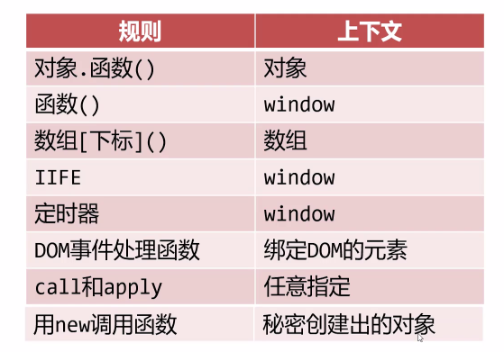
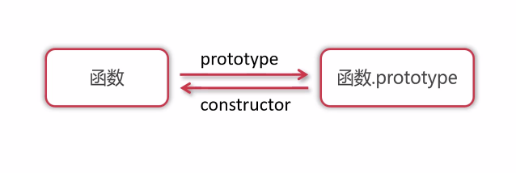
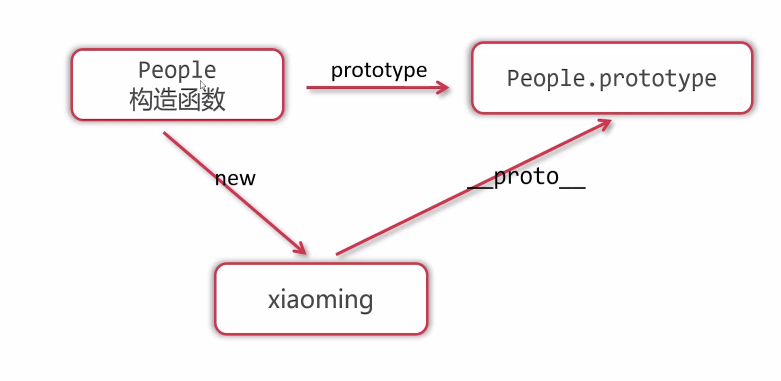
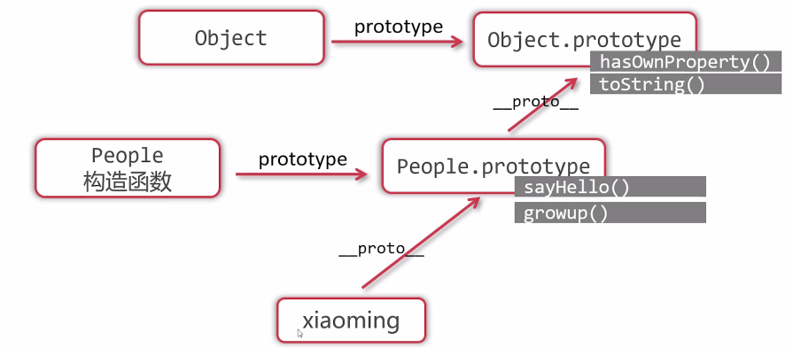
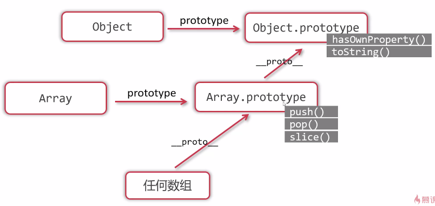
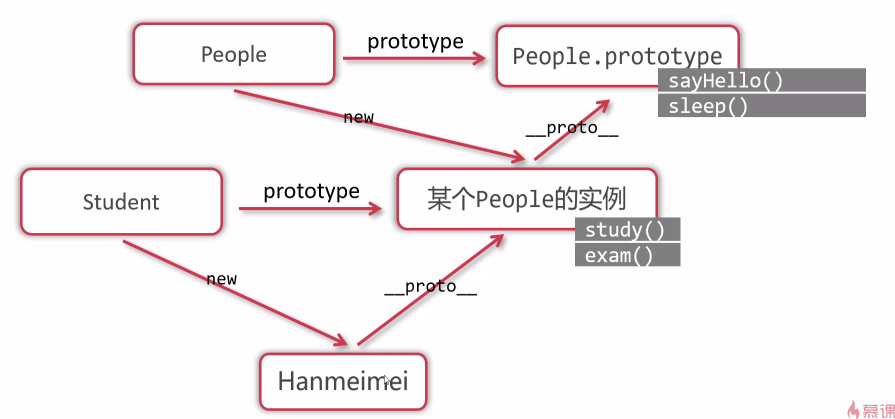
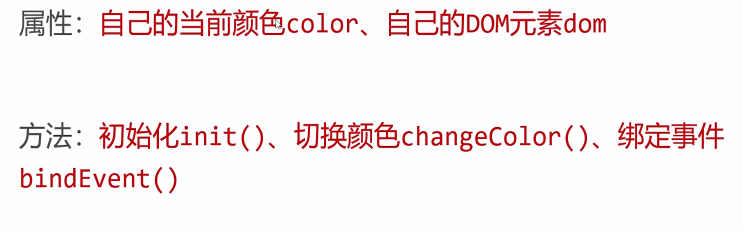
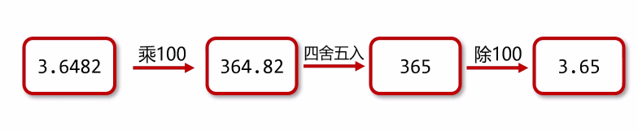
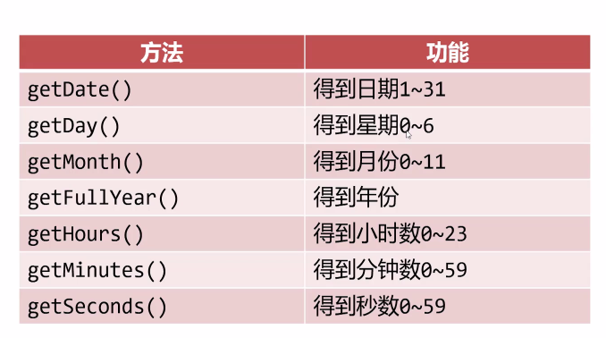

#  面 向 对 象

1. 当对象的属性键名不规范时，则这个键名必须用引号包裹；

   ````js
   var xiaoming = {
   	name: ‘xiaoming’,
   	age: 18,
   	sex: ‘man’,
       hobby: [‘football’, ‘swim’, ‘coding’],
       //其中favorite-book由于包含短横不符合命名规则所以用引号包裹。
       ‘favorite-book’: ‘shukehebeita’,
   	sayHello: function () {
   		console.log(‘你好，我是小明’);
   	}
   }
   var key = ‘age’;
   ````

   

2. 符合命名规范的可以通过对象名.对象值来访问，不符合命名规范的或者属性名以变量形式储存的使用方括号来访问；

   ````js
   xiaoming.name					// 输出xiaoming
   xiaoming[‘favorite-name’]		// 输出shekehebeita
   xiaoming.sayHello()				// 输出 你好，我是小明
   xiaoming.key					// undefined
   xiaoming[name]					// 报错
   xiaoming['name']				// 输出xioaming
   xiaoming[key]					// 输出18
   xiaoming.age					// 输出18
   ````

   特别注意：**如果要使用方括号获取或设置其属性值，一定要给属性值加上引号，否则无法获取**；

   

3. 更改或创建属性值

   ````js
   xiaoming.lover = ‘xiaohong’;
   xiaoming.age = 20;
   xiaoming['dd'] = 'ff'
   ````

   

4. 属性删除：delete xiaoming.sex

   

5. 对象的遍历：`for...in...`

   ````js
   for (var k in obj) {
       console.log('属性' + k + '的值是' + obj[k]);
   }
   // k表示属性名，obj表示对象名
   ````

   

6. 深克隆和浅克隆

   首先，当对象是引用类型值时：

   -  不能使用var obj2 = obj1克隆一个对象；

     ````js
     var obj1 = {
         a: 1,
         b: 2,
         c: 3
     };
     var obj2 = obj1;
     obj2.a++;
     console.log(obj1.a);
     // 输出2，因为obj2并没有克隆obj1，只是作为一个指针指向了obj1对象的地址
     ````

   - 使用 `==` 或者 `===` 进行对象比较时，比较的不是值是地址；

     ````js
     var obj = {
     	a: 1,
         b: 2,
         c: 3
     };
     var obj2 = {
         a: 1,
         b: 2,
         c: 3
     };
     console.log(obj1 == obj2);				// false
     console.log(obj1 === obj2);				// false
     ````

     

   

   对象的**浅克隆**：只克隆对象的表层，如果对象的某些属性值又是引用类型值，则传递其引用；使用for...in...循环可实现浅克隆；

   

   对象的**深克隆**：克隆对象全貌；使用递归克隆；

   ````js
   var obj1 = {
   	a: 1,
   	b: 2,
   	c: [33, 44, {
   		m: 55,
   		n: 66,
   		p: [77, 88]
   	}]
   };
   ````

   


- ### 函数上下文规则

  - 函数的上下文是**由调用方式决定**；

    ````js
    var xiaoming = {
        name: ‘xiaoming’,
        age: 18,
        sayHello: function () {
            console.log('我是'+ this.name + ‘,我今年’ + this.age);
        }
    }
    xiaoming.sayHello();		// 我是xiaoming，我今年18
    var say = xiaoming.sayHello;
    say();						// 我是undefined，我今年undefined
    
    // 造成以上情况的原因就是this代指的对象不同
    // 上一个this代指的是xiaoming
    // 下一个this代指的的是window
    ````
    
    
    
    
    
  - 备份上下文

    ````js
    var self = this;
    ````

  - `call(), apply(), bind()`：三者均是用来重新定义 this指向 的

    不同点：

    1. bind() 的返回值是一个新的函数，另外两个则是直接改变调用者的 this；
    2. `call() 和 bind()` 传的参数是单个传入，用逗号分隔，而 `apply()`  是以数组的形式将参数传入；

    

- new操作符调用函数

  >第一步：在函数fun中创建一个空白对象
  >
  >第二步：函数上下文(this)会指向这个对象
  >
  >第三步：函数体内的语句会执行
  >
  >第四步：函数会自动返回这个上下文对象(this),即使函数没有return语句

  ````js
  function Fun() {
      this.a = 3;
      this.b = 5;
  }
  var obj = new Fun();
  console.log(obj);       // 输出{a: 3,b: 5}
  ````

  

- 构造函数

  用 `new` 关键字调用的一个函数：

  ````js
  function People(name, age, sex) {
      this.name = name;
      this.age = age;
      this.sex = sex;
      this.sayHello = function() {
          console.log('大家好！我的名字是' + this.name + '，我今年' +  this.age + '岁了');
      }
  }
  var xiaoming = new People('xiaoming', 18, 'man');
  ````

  像这样的可以利用这个函数创建一个具有一组相同属性对象的，称之为构造函数；

  

- **Prototype原型函数**

  每一个函数都有 `prototype` 属性，它的属性值是一个对象，该对象默认拥有 `constructor` 属性指回函数；

  

  对普通函数来说 `prototype` 没有任何用处，但对于构造函数的 `prototype` 属性就十分重要，**构造函数的 `prototype` 属性是它的实例的原型**；

  

  这引出了一个概念：**原型链查找**，即实例可以打点访问它的原型的属性和方法；

  ````js
  function People(name, age, sex) {
      this.name = name;
      this.sex = sex;
      this.age = age;
  }
  People.prototype.nationality = 'China';
  var xiaoming = new People('xiaoming', 20, 'man');
  console.log(xiaoming.nationality);		// China
  ````

  在构造函数中，并没有给对象 `xiaoming` 设置 `nationality` 属性，此时输出对象 `xiaoming` 只有 `name、age、sex`，但是此时 `xiaoming.nationality` 却可以输出 `China`。

  这是因为我们给 `People.prototype` 设置了 `nationality` 属性，而通过构造函数 `People` 实例化的对象 `xiaoming` **自身没有该属性，则它可以通过原型链查找，获取原型中的属性 `nationality`**；

  

  - 相关方法

    1. `对象名.hasOwnProperty('属性名')`：检查对象是否自身拥有某属性；

    2. `'属性名' in 对象名` ：检查某个属性或方法是否可以被对象访问，不能检查是否是自己的属性或方法；

       

  在创建构造函数时，还有一点非常重要的是，为了防止构造函数的相同方法被不停的创建在不同函数中，造成内存的冗余，我们应该将构造函数的方法创建在原型函数当中，如下 `People` 的 `sayHello()` 方法，就应该被创建在 `prototype` 中：

  ````js
  function People(name, age, sex) {
      this.name = name;
      this.age = age;
      this.sex = sex;
  }
  People.prototype.sayHello = function() {
      console.log('大家好！我的名字是' + this.name + '，我今年' +  this.age + '岁了');
  }
  
  var xiaoming = new People('xiaoming', 18, 'man');
  var xiaohong = new People('xiaohong', 4, 'woman');
  
  // 原型链查找
  xiaoming.sayHello();
  console.log(xiaoming.sayHello === xiaohong.sayHello);       // true
  // 证明两个对象是共用同一个方法，没有造成内存的浪费
  ````

  

  - 原型链的终点：`object.Prototype`

    

    

    

    已知 `People.prototype` 是一个对象，换而言之 **`people.prototype` 可以看作是由 `Object` 构造函数构造出来的实例**，那么因为实例的原型会指向构造函数的 `prototype`，那么 `People.prototype` 指向 `Object.prototype` 就理所应当了；

    ````js
    console.log(xiaoming.__proto__.__proto__ === Object.prototype);     // true
    console.log(People.prototype.__proto__ === Object.prototype);     // true
    console.log(Object.prototype.__proto__);      // null
    ````

    我们经常使用的 `hasOwnPrototype()、toString()` 方法都是定义在 `Object.prototype` 上的；

    ````js
    console.log(Object.prototype.hasOwnProperty('toString'));
    console.log(Object.prototype.hasOwnProperty('hasOwnProperty'));	// 两个都输出true
    ````

    在这里要注意，使用 `hasOwnProperty()` 方法时，即使是检查对象中是否含有该方法，也无需在方法名后加括号，只需书写方法名即可；

    

  - 数组的原型链

    

    ````js
    var arr = [];
    console.log(arr.__proto__ === Array.prototype);    // true
    console.log(arr.__proto__.__proto__ === Object.prototype); //true
    ````
    
    

- **实现继承**

  > 子类必须拥有父类全部的属性和方法，同时子类还能定义自己特有的属性和方法。

  在原生JS中我们常用原型链来实现继承：

  

  ````js
  function People(name, age, sex) {
      this.name = name;
      this.age = age;
      this.sex = sex;
  }
  People.prototype.sayHello = function () {
      console.log('你好！我是' + this.name + ',我今年' + this.age + '岁了！');
  }
  People.prototype.sleep = function () {
      console.log(this.name + '正在睡觉~');
  }
  function Student(name, age, sex, school, studentNum) {
      this.name = name;
      this.age = age;
      this.sex = sex;
      this.school = school;
      this.studentNum = studentNum;
  }
  // 实现继承，将student构造函数的原型指向People的实例
  Student.prototype = new People();
  // 该People的实现不需要传参数
  
  // 给student定义其特有的属性和方法
  Student.prototype.exam = function() {
      console.log(this.name + '正在考试，加油！！！');
  }
  // 重写父类方法(override)
  Student.prototype.sayHello = function() {
      console.log('敬礼！你好，我是' + this.name + ',我今年' + this.age + '岁了！');
  }
  
  var HH = new People('胡胡', 21, '男');
  var WW = new Student('万万', 20, '女');
  
  HH.sayHello();
  WW.sayHello();
  HH.sleep();
  WW.sleep();
  // HH.exam();      // Uncaught TypeError: HH.exam is not a function
  WW.exam();
  ````

  

- **面向对象**

  >本质：定义不同得类，让类的实例工作
  >
  >经常用于需要封装和复用的场合
  >
  >面向对象的唯一工程是编写类

  红绿灯例题：

  如果目前有一个红绿灯，要求 *为红灯时点击变绿、为绿灯时点击变黄、为黄灯时点击变红* ，那么此时只需要给这个红绿灯设置一个点击事件，并设置一个变量来记录当前亮灯即可；

  但是若此时页面中有100个红绿灯，那么极有可能产生一个变量冲突以及多次循环绑定造成空间浪费的问题，因为**一百个红绿灯需要具有的是相同的属性和方法**，这实质上是一种复用，所以我们可以将**每个红绿灯封装成一个类，在类中定义各自的属性和方法**来解决该问题，一个红绿灯类需要有如下属性和方法：

  

  

  ````html
  <div class="box" id="box"></div>
  ````

  ````js
  // 注意：该获取box的语句必须写在new TrafficLight()之前，否则 init() 无法正常执行
  var box = document.getElementById('box');
  
  // 定义一个构造函数，创建红绿灯类
  function TrafficLight() {
      // 构造函数的this代表它每 new 一次所创建的一个新的对象
  
      // 用数字代表灯的颜色，1代表红灯，2代表绿灯，3代表黄灯
      this.color = 1;
      // 初始化创建该红绿灯,该方法应该创建在原型中
      this.init();
      // 给该dom元素绑定事件
      this.addEvent();
  }
  
  // 初始化红绿灯
  TrafficLight.prototype.init = function () {
      // 此时的函数因为是被this打点调用，而this是一个对象，因此该函数的this上下文指向的也是这个对象
  
      // 首先创建一个dom对象
      this.dom = document.createElement('img');
      // 该对象其实代表的就是该红绿灯的dom对象
      this.dom.src = 'images/traffic/' + this.color + '.jpg';
      // 上树
      box.appendChild(this.dom);
      // console.log(box);
  }
  
  // 给创建的dom对象绑定事件
  TrafficLight.prototype.addEvent = function () {
      // 此时需要备份上下文
      var self = this;
      // 因为此时的this上下文还是该创建的红绿的对象
      this.dom.onclick = function () {
          // 但是在这里的this上下文由于是给dom对象绑定事件，则上下文变成了该dom对象
          // 但我们在这里是要改变创建的对象中的color值，因此需要使用备份的上下文
          self.changeColor();
      }
  }
  
  // 在绑定的事件中写功能
  TrafficLight.prototype.changeColor = function() {
      // 此时的上下文this 是调用函数的self，也就是我们在addEvent中备份的所创建的对象
      this.color++;
      if (this.color == 4) {
          this.color = 1;
      }
      // console.log(this.src);
      this.dom.src = 'images/traffic/' + this.color + '.jpg';
  }
  ````

  **注意：**

  1. 方法写在实例所指向的原型函数中，用 `this` 调用；
  
  2. 注意每个函数的上下文，若出现上下文与所需不一致，可采用备份上下文的方法；
  
     
  
  炫彩小球例题：
  
  鼠标在页面中滑动，触发出彩色的小球
  
  ````js
  // 创建一个数组存放每次鼠标移动事件生成的小球
  var ballArr = [];
  // 定义初始颜色数组
  var colorArr = ['#6CC', '#CF6', '#F9C', '#F66', '#C39', '#F60']
  // 创建一个构造函数 Ball
  function Ball(x, y) {
      // x, y表示小球被创建的初始的位置
      // 注意：这里代表的是圆心所在位置
      this.x = x;
      this.y = y;
      // r表示小球的半径
      this.r = 10;
      // 小球的颜色
      this.color = colorArr[parseInt(Math.random() * colorArr.length + 1) - 1];
      // 小球的透明度
      this.opacity = 1;
  
      // 小球的移动方向，这样设置可以让每个球有自己的移动方向，且已知朝同一个方向移动
      // do {} while语句防止 dx 和 dy 同时为0导致小球不动
      do {
          this.dx = parseInt(Math.random() * 20) - 10;
          this.dy = parseInt(Math.random() * 20) - 10;
      } while(this.dx == 0 && this.dy == 0)
  
      // 创建小球的函数
      this.init();
      ballArr.push(this);
  }
  Ball.prototype.init = function () {
      // 创建一个dom元素并将dom元素与对象中设置的属性值关联
      this.dom = document.createElement('div');
      this.dom.className = 'ball';
      this.dom.style.width = this.r * 2 + 'px';
      this.dom.style.height = this.r * 2 + 'px';
      this.dom.style.left = this.x - this.r + 'px';
      this.dom.style.top = this.y - this.r + 'px';
      this.dom.style.backgroundColor = this.color;
      this.dom.style.opacity = this.opacity;
      // 上树
      document.body.appendChild(this.dom);
  }
  Ball.prototype.update = function () {
      // 不能将小球的位置改变数值设置在update函数中，因为这样会导致每次触发的x，y改变值不定，导致小球会出现原地震动的场面
      // do {
      //     this.x += parseInt(Math.random() * 6 - 3);
      //     this.y += parseInt(Math.random() * 6 - 3);
      // } while(this.x == 0 && this.y == 0)
      this.x += this.dx;
      this.y += this.dy;
      this.r += 0.2;
      this.opacity -= 0.03;
  
      this.dom.style.width = this.r * 2 + 'px';
      this.dom.style.height = this.r * 2 + 'px';
      this.dom.style.left = this.x - this.r + 'px';
      this.dom.style.top = this.y - this.r + 'px';
      this.dom.style.opacity = this.opacity;
      if (this.opacity <= 0) {
          // 删除数组中的该元素
          for (let i = 0; i < ballArr.length; i++) {
              if (ballArr[i] == this) {
                  ballArr.splice(i, 1);
              }
          }
          // 删除DOM标签中的该元素
          document.body.removeChild(this.dom);
      }
  }
  
  document.onmousemove = function (e) {
      x = e.clientX;
      y = e.clientY;
      new Ball(x, y);          // 遍历小球并对其进行更新
  }
  
  var timer = setInterval(function () {
      for (let i = 0; i < ballArr.length; i++) {
          ballArr[i].update();
          // console.log(this.dx, this.dy);
      }
  }, 20);
  ````
  
  **注意：**
  
  1. 无论是上树，还是删除节点都是对 `this.dom` 操作而不是 `this`，`this` 是构造函数创建的一个对象包含多个属性，而 `this.dom` 只是其中的一个表示创建出的 dom对象的属性；
  
  2. 更新小球的 `update()` 方法使用定时器对其进行定时调用，定时器直接写在 window 对象中，不需要写在任何函数和事件中；
  
  3. 关于小球的位移：
  
     每个小球应该有唯一的位移方向，因此其**每次位移的数值应该在初始化的时候就被定义完成**，采用 `dx, dy` 属性，在类中使用 `Math.random()`给每个小球随机获取属于自己的位移值；
  
     然后在 `update()` 中使用 `this.x += this.dx` 来实时修改小球的位置值；
  
     为了防止 `dx, dy` 都为0导致小球不动，应该使用 `do {} while()` 语句来确保两者不同时为0；
  
     
  
- **包装类**：**为了让基本类型值从其构造函数 `prototype` 上获得方法**，例如 `Number()` 、`String()`、`Boolean()`，分别是数字、字符串、布尔值的包装类；

  ````js
  var num = 123;
  var onum = new Number(123);
  var str = 'mooc';
  var ostr = new String('mooc');
  var boer = true;
  var oboer = new Boolean(true);
  console.log(typeof num);    // Number
  console.log(typeof onum);   // object
  console.log(typeof str);    // string
  console.log(typeof ostr);   // object
  console.log(typeof boer);   // boolean
  console.log(typeof oboer);  // object
  ````

  由此可见，由 `new 包装类()` 获得的是一个对象，而这个对象的 `PrimitiveValue` 属性的值就包含着这个包装类所创造出来的对象的原始值，即 `123、'mooc'、true`，这些由包装类所创造出来的对象可以和基本类型值一样正常运算；

  

  基本类型值调用包装类方法时，有三个步骤：

  >1. 先由后台自动为其创建一个实例
  >2. 在实例上调用其指定的属性
  >3. 销毁这个实例

  ````js
  var str = 'mooc';
  str.length;
  
  // 其执行过程可以想象为
  var str = new String('mooc');
  str.length;
  str = null;
  ````

  

  此外，由包装类创建的值可以为其添加自己的属性和方法，而基本类型值不可以；

  ````js
  var num = 123;
  num.color = 'red';
  console.log(num.color);		// undefined
  
  var onum = new Number(123);
  num.color = 'red';
  console.log('red');		// red
  ````

  其实很好理解，因为在给 `num 设定其 color属性值` 时，是按照上面三步设置的，而在设置完成之后，后台给 `num` 创建的实例被自动销毁，此时在去获取 `num.color` 的值自然无法获取到了；

  

- **Math类**

  - `Math.round()`：四舍五入

    如果想要四舍五入到小数点后的某位：

    

    

  - `Math.max()` 和 `Math.min()`：选出参数列表中的最大值和最小值

    利用该方法求数组最大值和最小值：
  
    由于该方法要求参数必须是罗列出来的，而不能是数组，因此我们可以使用 `apply()` 方法，以数组的形式传入零散值当作函数的参数；
  
    ````js
    var arr = [3, 6, 9, 2];
    var max = Math.max.apply(null, arr);
    console.log(max);
    ````
  
    

- **`Date()对象`**

  创建方法 `new Date()` ：

  - 无参：可以获得当前时间的日期对象，是 object 类型值
  - (2020,  11, 1)：可得到该指定日期的日期对象，第二个蚕食表示月份，从0开始算，11表示12月，或者使用 ('2020-12-01')，意思相同；

  常见方法：

  

  

  时间戳：表示1970年1月1日零点距离某个时刻的毫秒数

  >通过 `getTime()`方法 或者 `Date.parse()`函数 可以将日期对象变为时间戳，`getTime()` 精确到毫秒，`Date.parse()` 精确到秒；
  >
  >通过 `new Date(时间戳)` 的写法，可以将时间戳变为日期对象

  