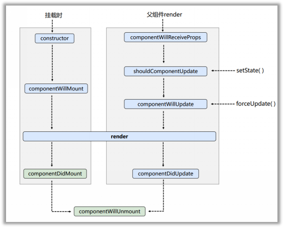

# React
<hr />

[[toc]]

### 使用React需要引入的库：

1. react.js：React核心库;
2. react-dom.js：提供操作DOM的react扩展库 (一定要在 1 之后引入);
3. babel.min.js：解析JSX语法代码转为JS代码的库。


### 关于虚拟DOM：

- 本质上是 Object 类型的对象 (一般对象)；
- 虚拟DOM的属性没有真实 DOM 那么多，因为用不上；
- 虚拟DOM 最终还是会被 React 转化为 真实DOM 渲染在页面上；


### JSX本质：

>其本质为一个 `React.createElement` 函数，接收多个参数来返回 `Vnode`
>
>1. 第一个参数：标签名 (原生HTML标签，自定义组件)；
>2. 第二个参数：标签属性信息 (没有属性则为 null)；
>3. 第三个参数：子元素 (可接受多个子元素作为参数 或 子元素数组)


### JSX的语法规则：

1. 定义虚拟DOM时不要写引号；

2. 标签中如果需要混用 **JS 表达式**时，需要用花括号包裹；

   JS表达式：是会产生一个值的，可以放在任何一个需要值的地方；

   JS语句：if, for, switch等不会产生返回值的，如果写在花括号中会报错；

3. CSS样式 的类名指定不要用 `class` 要用 `className`；

4. 事件绑定大小写改变：`onclick = "demo()" => onClick = {demo}`

5. 内联样式，要用 `style=key:value}}` 的形式去写，外层括号表示其中要书写js语句,内层括号表示是一个对象；

6. 不能有多个根标签；

7. 标签必须闭合，要么有一对，要么自结束；

8. 标签首字母：

   - 小写字母开头，则将标签转为html中同名元素，若无同名元素，则报错；
   - 大写字母开头，React就会渲染对应的组件，若组件没有定义，则报错；


### 组件化：

- ##### 函数式组件：

  ````jsx
  // 1.定义函数式组件
  function MyComponent() {
      return <h2>我是用函数定义的组件(适用于【简单组件】的定义)</h2>
  }
  // 2.渲染组件到页面
  // 注意：这里的组件标签必须自结束或者有一对
  ReactDOM.render(<MyComponent/>, document.getElementById('test'));
  ````

  执行了 `ReactDOM.render` 之后：

  1. React 解析组件标签，找到 MyComponent 组件；
  2. 发现组件时使用函数定义的，随后调用该函数，将返回的虚拟DOM转化为真实DOM，随后渲染在页面上；

  

- ##### 类式组件：

  ````jsx
  // 1.创建类式组件，必须继承React中的内置类
  class MyComponent extends React.Component {
      // 被定义在MyComponent的原型链上供实例使用
      render() {
          return <h2>我是用类定义的组件(适用于【复杂组件】的定义)</h2>
      }
  }
  // 注意：创建类式组件三要点
  // 1)必须继承React中的内置类
  // 2)必须写 render(),且render()中必须有返回值
  
  // 2. 渲染类组件到页面
  ReactDOM.render(<MyComponent/>, document.getElementById);
  ````

  执行了 `ReactDOM.render` 之后：

  1. React 解析组件标签，找到 MyComponent 组件；

  2. 发现组件时使用类定义的，随后创建该类的实例，并通过该实例调用到原型上的render方法，将 render 返回的虚拟DOM转为真实DOM，最后渲染在页面中；

     

  ##### 组件实例的三大核心属性：

  - `State` (状态) ：驱动页面的数据做一些变化

    ````js
    // 原生写法
     class Weather extends React.Component {
         constructor(props) {
             super(props);
             // 设置状态，以动态显示数据
             this.state = { 
                 isHot: true
             };
             // bind()的作用是将this.changeWeather(类原型链上的)复制一份
             // 并将该复制份的this指向当前构造函数的实例this
             // 最后将该复制份写在实例的changeWeather中
             this.changeWeather = this.changeWeather.bind(this);
         }
         // 返回虚拟DOM
         render() {
             let isHot = this.state.isHot;
             // 这里点击事件的函数不能写调用后的，因为会直接执行，changeWeather应该作为回调函数
             // 这里点击事件的changeWeather实际调用的是bind()复制的即实例的changeWeather
             return <h2 onClick={this.changeWeather}>今天的天气很{isHot ? '炎热' : '寒冷'}</h2>
         }
         changeWeather() {
             // 此时如果直接写会报错 state is undefined，因为changeWeather被点击事件调用时this在严格模式下指向undefined
             // 因此在构造器中书写语句，更改this指向
             // this.state.isHot =  this.state.isHot ? false : true;     // 错误！！！
             // 注意：state不可以直接更改，需要通过React.Component的内置API setState() 更改
             // 因此写做：
             // 1. 因为在setState参数中书写的是对象因此需要用花括号包裹
             // 2. 前面的isHot是 this.state的属性名，无需加this.state, 后面的是值，需要通过this.state.isHot获取
             this.setState({isHot: !this.state.isHot});
             console.log(this.state.isHot)
         }
     }
    ````

    **注意**：

    1. `state` 应该书写做一个对象；

    2. 在React中绑定事件通常使用直接绑定在标签内的方式，且写法改为 `onClick = {this.事件函数的声明}`，注意花括号中不能写事件函数的调用；

    3. `setState()`：在事件中是无法直接改变类组件的 `state` 的，只能通过 `this.setState()` 方法来改变组件的状态，且在该方法只会对的参数中书写的属性名进行覆盖，而不会直接对整个 `state` 的值进行覆盖； 

    4. 因为在  `changeWeather` 中书写的 `this` 在被调用时是 `undefined` 因此需要在构造器中将 `changeWeather` 复制一份，且改变其 `this` 保存在实例中，以供实例调用；

       

    ````js
    // 简写state
    class MyComponent extends React.Component {
        // 写构造器是为了重写state的属性并且绑定点击事件的this
        // 但是由于这两个属性是属于每一个组件的实例
        // 因此可以把这些写在构造器外部，即简写state
        // 在构造器外部写属性必须使用赋值语句
        state = ({isHot: false, wind: '微风'});
        render() {
            return <h2 onClick={this.changeWeather}>今天的天气很{this.state.isHot ? '炎热' : '凉爽'}, {this.state.wind}</h2>
        };
        // 因为箭头函数本身没有this而会去函数定义处的外部找this
        changeWeather = () => {
            this.setState({isHot: !this.state.isHot});
        }
    }
    ````

    

  - `Props`：可以存储渲染组件时在标签中传入的一些数据，并在组件内容中显示

    ````jsx
    // 导入关键包 prop-type 库
    <script src="./js/prop-types.js" type="text/javascript"></script>
    
    class MyComponent extends React.Component {
         render() {
             // 解构复制获取几个属性的值
             // 该语句不能直接写在类中，会报错
             const {name, age, sex} = this.props;
             console.log(name,age,sex)
             return (
                 <ul>
                     <li>姓名：{name}</li>
                     <li>年龄：{age}</li>
                     <li>性别：{sex}</li>
                 </ul>  
             );
         }
     }
    // 对类中props中数据的类型进行限定，写在类外部
    MyComponent.propTypes = {
        // name: React.PropTypes.string.isRequired		// 该React.PropTypes在React 15.5中已被弃用，使用以下方法；
       
        name: PropTypes.string.isRequired,      // 限制该值为string类型，且为必填
        age: PropTypes.number,
        sex: PropTypes.string,
        speak: PropTypes.func
    };
    // 给Props中的数据设置默认值
    MyComponent.defaultProps = {
        age: 18,
        sex: 'male'
    }
    ````

    **注意**：

    1. 要先导入proptype 库，由此引入一个新的对象 `PropTypes`;
    2. 使用 `PropTypes.类型` 来规定传入值的类型，在此类型必须为全小写 (`number/string/boolean/func...`)；
    3. `isRequired` 表示该传入值为必须填写的；
    4. `propTypes` 和 `defualtProps`：是对设置在类本身，从而对 `Props` 进行限制，而不是设置在类的每个实例上；

    

    简写 `prop`：

    ````jsx
    class Person extends React.Component {
        render() {
            const {name, age, sex} = this.props;
            return (
                <ul>
                    <li>姓名：{name}</li>
                    <li>年龄：{age}</li>
                    <li>性别：{sex}</li>
    			</ul>
    		);
    	}
        // 因为props默认值和props所需属性是定义在类本身的，因此也可以使用static关键字将其定义在类中
        // 这样就不用定义在类外部，尽量将组件一体化
        static propTypes = {
            name: PropTypes.string.isRequired,
            age: PropTypes.number,
            sex: PropTypes.string
        };
        static defaultProps = {
            // 如果设置了isRequired属性默认值不会生效
            // name: 'WW',
            age: 18,
            sex: 'female'
        };
    }
    ````

    构造器是否接收 `Props`，是否传递给 `super()`，取决于是否希望在构造器中使用 `this.props` 去获取 `props` 的值；

    

    函数式组件使用 `props`：给

    ````jsx
    function Person(props) {
        const {name, age, sex} = props;
        retrun (
            <ul>
                <li>姓名：{name}</li>
                <li>性别：{sex}</li>
                <li>年龄：{age}</li>
            </ul>
        );
    }
    // 并使用类原始的限制方法， 可以对传入的值进行限制
    Person.propTypes = {
        name: PropTypes.string.isrequired,
        age: PropTypes.number,
        sex: PropTypes.string
    }
    // 赋默认值
    Person.deaultProps = {
        age: 18,
        sex: 'female'
    }
    ````

    在函数定义的组件中虽然没有实例化的 `this` ，但是可以通过 `props` 参数来接收到组件标签中所传递的属性，并自动归类为一个对象；

    

  - `refs`：渲染组件时在标签中书写 `ref  ` 属性，会自动保存在类组件的 `refs` 中，在 `refs` 中其属性名为 `ref` 属性的值，属性值为书写该 `ref` 的`DOM`节点；

    ````jsx
     class MyComponent extends React.Component {
                
         // 3-1. 调用API创建一个容器，该容器能且仅能存放一个ref
         myRef = React.createRef();
    
    
        submitData = () => {
            // console.log(this.refs)
            // ref中存储了两个键值对
            // 其名为ref的属性值，其值为ref对应的DOM元素
            // 如果定义了两个同名的ref，后面的会把前面的覆盖掉
            console.log(this.refs.input1.value);
        }
        
        submitData2 = () => {
            console.log(this.input2.value);
        }
        
        submitData3 = () => {
            // console.log(this.myRef);
            // 上面语句会输出一个对象，里面只包含一个值，{current:input}
            // 该值的属性名为系统指定 current 无法更改，该对象的属性值为 当前DOM节点
            console.log(this.myRef.current.value)
        }
        render() {
            return (
                <div>
                    {/* 1. 字符串定义ref的方式(已弃用) */}
                    <input type='text' ref='input1'/> &nbsp;
                    <button onClick={this.submitData}>点击提交左侧数据</button> &nbsp;
                    
                    {/* 2. 回调函数定义ref，该回调函数被系统自动调用，其会接收到一个参数，该参数就是当前回调函数所在的DOM节点 */}
                    <input type='text' ref= {c => this.input2 = c} onBlur={this.submitData2}/>&nbsp;
                    {/* 回调函数ref作为内联样式绑定在标签上的时候，如果页面有更新会导致ref被触发两次第一次值为null，第二次值才为DOM元素，因此可以使用class绑定的方式 */}
    
                    {/* 3. 新API creatRef 创建定义ref(最推荐使用)*/}
                    <input type='text' ref= {this.myRef} onBlur={this.submitData3}/>    
    
                </div>
            );
        }
    }
    ````

    三种方式定义 `ref`：

    1. 直接用字符串类型定义；
    2. 使用回调函数 `c => this.name = c` ，c 就表示当前设置该 ref 的节点，特别注意这里的节点是保存在类组件的实例中的，并非在refs中；
    3. 使用新的 API，`const name = new CreateRef()` 创建容器，后使用 `ref = {this.name}` 将当前DOM节点存入容器，使用该方法时，属性名是被指定为 `current` 的，且无法更改；

    **注意**：尽量少用 refs 这样会打破组件的封装；

    

### 事件处理：

- 通过 `onXxx` 属性指定事件处理函数：

  1. React使用自定义 (合成) 事件，而不是原生的 DOM 事件 ——是为了更好的兼容性
  2. React事件通过事件委托的方式处理 (委托给组件最外层的元素) ——是为了高效；

- 通过 `event.target` 得到发生事件的 DOM元素的对象：

  因为 React 要求尽量不要过度使用 `ref`，若在所操作的元素与所要获取的元素是同一元素时，可以使用 `event.target `

  ````jsx
  {/*上述ref案例中的失去焦点事件就可以被改为以下形式*/}
  submitData2(e) = {
  	console.log(e.target.value);
  }
  
  render() {
      return (
      	<input onBlur={this.submitData2} type='text' placehold='失去焦点提交数据'/>
      );
  }
  ````

  

- 受控组件：现取现用，即时反馈数据；

  ````jsx
  class MyComponent extends React.Component {
      submitData = (e) => {
          e.preventDefault();
          const {username, password} = this;
          console.log(`受控组件 ———— 用户名：${username.value}，密码：${password.value}`);
      };
      render() {
          return (
              <form action="http://www.baidu.com" onSubmit={this.submitData}>
                  <input ref={c => this.username = c} type='text' name='username' />
                  <input ref={c => this.password = c} type='password' name='password' />
                  <button>登录</button>
              </form>
          );
      }
  }
  ````

  注意：

  1. 使用**回调函数存储 `ref` 时，是将 `ref` 存储在当前类组件的实例中，而非存储在 `this.ref` 中**；

     

     

- 非受控组件：将每一次的值提取出来，存在状态中，需要用的时候提取出来；

  ````jsx
   class OtherComponent extends React.Component {
       // 初始化state中内容
       state = ({
           username: '',
           password: ''
       });
      // 提交表单绑定函数
      submitData = (e) => {
          e.preventDefault();
          const {username, password} = this.state;
          console.log(`非受控组件 ———— 用户名：${username}，密码：${password}`);
      };
      // 输入框内容改变事件绑定函数
      saveState = (dataName) => {
          // 因为此时该函数不再是被onChange绑定且调用的事件函数了，那么此时传入的参数也不再是event，而是由用户传入的参数
          // console.log(dataName);
          return (e) => {
              // 因为这个函数是onChange直接调用的函数，则该函数可以接收到参数 event
              // this.state.[dataName] = e.target.value;      // 报错：这里的state不可以直接设置，必须使用内置API setState()
              this.setState({[dataName]: e.target.value});
          };
      };
      render() {
          return(
              <form onSubmit={this.submitData}>
                  {/*注意：因为saveState已经被用户自主调用，因此这里的onChange得到的是saveState的返回值*/}
                  <input type="text" name="username" onChange={this.saveState('username')}/>
                  <input type="text" name="username" onChange={this.saveState('password')}/>
                  <button>登录</button>
              </form>
          );
      }
  }
  ````

  注意：

  1. `onChange` 绑定事件中，因为 `savaState` 已经被用户自主调用了，因此 `onChange` 绑定的是该函数的返回值，而不是该函数；

  2. 因为 `saveState` 是被用户调用的，因此传入的参数也不是 `event`，而是用户自主传入的参数，`saveState` 的返回值函数传入的参数才是 `event`；

     

  拓展高阶函数的概念：

  > 有两类高阶函数，只要满足以下两个条件之一，就称为高阶函数：
  >
  > 1. 参数是函数；
  >
  > 2. 返回值是函数；
  >
  > 
  >
  > 如上的 `saveState` 就是第二种类型的高阶函数；

  函数的柯里化：

  

### 组件的生命周期：

>组件从创建到死亡它会经历一些特定的阶段；
>
>组件在生命的每个时间点，都有自定义的回调函数 (钩子函数 / 生命周期钩子) ，会在特定的时刻调用；
>
>我们在定义组件时，会在特定的生命周期回调函数中，做特定的工作。


- 旧版本的生命周期图




- 初始化阶段：由 `ReactDOM.render()` 触发---初次渲染

  1. `constructor()`

  2. `componentWillMount()`

  3. `render()`

  4. **`componentDidMount()`** 

     一般在这个钩子中初始化：开定时器，发送网络请求、订阅消息；

     

- 更新阶段：由组件内部 `this.setSate()` 或 父组件重新 `render` 触发

  1. `shouldComponentUpdate()`

  2. `componentWillUpdate()`

  3. `render()`

  4. `componentDidUpdate()`

     

- 卸载组件：由 `ReactDOM.unmountComponentAtNode()` 触发

  1. `componentWillUnmount()`

     一般在这个钩子中收尾：关闭定时器，取消订阅；

     

````jsx
// 单个正常组件流程
class Count extends React.Component {
    // 构造器
    constructor(prop) {
        console.log('1. Count---constructor');
        super(prop);
        this.state = {
            num: 0
        };
    };
    // 事件绑定函数
    changeNum = () => {
        let { num } = this.state;
        num++;
        this.setState({ num });
    };
    force = () => {
        // 强制更新不需要经过更新阀门 shouldComponentUpdate()
        this.forceUpdate();
    };
    unload = () => {
        ReactDOM.unmountComponentAtNode(document.getElementById('test'));
    }
    
    // componentWillMount() 组件即将挂载时被调用
    componentWillMount() {
        console.log('2. Count---componentWillMount');
    }
    // componentDidMount() 组件挂载完成时被调用
    componentDidMount() {
        console.log('4. Count---componentDidMount');
    }

    // 更新状态阀门，如果不设置则返回值自动为true，如果设置则返回值必须为布尔值，若返回值为false则拒绝更新状态
    shouldComponentUpdate() {
        console.log('5. Count---shouldComponentUpdate');
        // 若不设置返回值，报错：Count.shouldComponentUpdate(): Returned undefined instead of a boolean value.
        // return false;       // 状态值不会被改变
        return true;
    }
    // 状态即将更新
    componentWillUpdate() {
        console.log('6. Count---componentWillUpdate');
    }
    // 状态更新完毕
    componentDidUpdate() {
        console.log('7. Count---componentDidUpdate');
    }

    // 卸载组件
    componentWillUnmount() {
        console.log('8. count---componentWillUnmount');
    }
    // 挂载组件 和 状态更新时被调用
    render() {
        console.log('3. Count---render');
        return (
            <div>
                <h2>计数器：{this.state.num}</h2>
                <button onClick={this.changeNum}>+ 1</button> &nbsp;&nbsp;
                <button onClick={this.unload}>卸载</button> &nbsp;&nbsp;
                <button onClick={this.force}>点我强制更新状态</button>
        	</div>
    	);
    }
}
````

注意：

- 组件被挂载在页面上的流程：`1 -->  2  -->  3  -->  4 ` 

- 组件被 `setState()`  后的流程：`5 -->  6  -->  3  -->  7  ` 

  此时更新状态通过了更新阀门，即 `shouldComponentUpdate()`，若不自主设定时，默认 `return true`，若设定时，则必须设定返回值为布尔值，否则报错；若设定 `return false`，则拒绝用户更新 `state`；  

- 组件被 `forceUpdate` 后的流程：`6  -->  3  -->  7  ` 

  强制更新时，无需经过更新阀门，此时无论更新阀门返回值为何，都将在不改变状态值的情况下，对 `state` 进行强制刷新；

- 组件即将被卸载的流程：`8`


````jsx
// 父子关系组件更新流程
class A extends React.Component {
    state = {
        car: 'minicoper'
    };
    changeCar = () => {
        // let {car} = this.state;      
        // 因为这里不需要对state做计算或者判断，因此无需赋值
        this.setState({ car: 'aoto' });
    };

    // 更新阀门
    shouldComponentUpdate() {
        console.log('1. A---shouleComponentUpdate');
        return true;
    }
    // 即将更新
    componentWillUpdate() {
        console.log('2. A---componentWillUpdate');
    }
    // 更新完成
    componentDidUpdate() {
        console.log('9. A---componentDidUpdate');
    }
    render() {
        console.log('3. A---render');
        return (
            <div>
                <div>这是A组件</div>
                <button onClick={this.changeCar}>点击换车</button>
                <B car={this.state.car} />
            </div>
        );
    }
}

class B extends React.Component {
    // 子组件即将接收父组件的数据
    componentWillReceiveProps() {
        console.log('4. B---componentWillReceiveProps')
    }
    // 更新阀门
    shouldComponentUpdate() {
        console.log('5. B---shouleComponentUpdate');
        // return false;       
        // 若A组件设置为true B组件设置为false
        // 则A组件会改变状态值，B组件不会接收, 执行顺序为 1-2-3-4-5-9
        return true;
    }
    // 即将更新
    componentWillUpdate() {
        console.log('6. B---componentWillUpdate');
    }
    // 更新完成
    componentDidUpdate() {
        console.log('8. B---componentDidUpdate');
    }
    render() {
        console.log('7. B---render');
        return (
            <div>这是B组件，car：{this.props.car}</div>
        );
    }
}
````

**注意**：

- A，B组件的更新阀门都 `renturn true`：`1 -->  2  -->  3  -->  4  -->  5 -->  6  -->  3  -->  7  -->  8  -->  9` 

  A组件安装 `setState()` 更新流程执行，直到 `render()`，然后将值通过 `props` 传给 B组件，开始执行 B组件 的更新流程，但是由于需要接收 A组件传过来的值，因此在正常的 `steState()` 之前多了一个 `componentWillReceiveProps()`，最后 B组件 正常更新步骤执行完毕后，才执行 A组件钩子函数 `componentDidUpdate()`;

- A组件更新阀门为 `true`，B组件更新阀门为 `false`：`1 -->  2  -->  3  -->  4  -->  5 -->  9` 

  此时 A组件中 状态更新完成，但是 B组件 更新阀门关闭，拒绝接收任何，因此没有执行更新的钩子函数；


- 新版本生命周期图：

  

  

- 废弃了三个钩子：

  1. `componentWillReceiveProps()`
  2. `componentWillMount()`
  3. `componentWillUpdate()`

  在新版本的 React 中，想使用这三个钩子必须加上 `UNSAFE_` 前缀，否则会报警告；

  

- 提出了两个新钩子：

  1. `getDerivedStateFromProps()`

     不定义在实例上，定义在类原型上，则用 `static` 定义；

     有返回值，且返回值为 `null`，或者一个状态对象；

     如果返回值为一个状态对象的话，页面中映射的状态对象则将变更为当前返回值，且无法再由 `setState` 修改；

     此方法用于 `state` 完全由 `props` 决定时，但是尽量避免这样使用；

  2. `getSnapshotBeforeUpdate()`：用于在页面更新之前捕获一些页面有关数据；

     ````jsx
      class List extends React.Component {
          state = {
              arr: [],
          };
         componentDidMount() {
             setInterval(() => {
                 // 这样定义是错误的，因为state中没有一个状态名为 arr[arr.length],
                 // this.setState({arr[arr.length]: `新闻${arr.length + 1}`});
                 // 因此使用以下写法
                 const {arr} = this.state;
                 const news = `新闻${arr.length + 1}`;
                 this.setState({arr: [news, ...arr]});
                 console.log(this.state);
             },1000)
         }
         // 在更新之前捕获页面的一些数据
         getSnapshotBeforeUpdate() {
             // 在该案例中，可以用于页面添加数据，但是滚动条不滚动
             // ScrollTop用于获取页面已卷动高度，ScrollHeight表示页面总高度
             const top = this.refs.list.scrollTop;
             const height = this.refs.list.scrollHeight;
             console.log(top, height);
             // 该方法的返回值会传给 componentDidUpdate(prevprop, prevstate, snapshot) 中的snapshot参数;
             // 因此该方法会与 componentDidUpdate() 结合使用
             return height;
         }
         componentDidUpdate(prevProp, prevState, snapshot) {
             // console.log(prevProp, prevState,snapshot);
             this.refs.list.scrollTop += this.refs.list.scrollHeight - snapshot;
         }
     
         render() {
             return (
                 <ul className='news-list' ref='list'>
                     {
                         this.state.arr.map((item, index) => {
                         // map方法会自动接收两个参数，item: 遍历数组的当前项，index：当前项的索引
                         // 注意：遍历数组时，要给每个遍历返回的标签写上对应的key
                         // 否则报警告：arning: Each child in a list should have a unique "key" prop.
                         return <li key={index}>{item}</li>
                         // 此时更新内容会动态的反馈在页面上
                         })
                     }
         		</ul>
         	);
         }
     }
     
     ReactDOM.render(<List/>, document.getElementById('test'));
     ````

     注意：

     1. 如果在状态中定义一个数组，那么如果需要不停的向数组中加入数据，就可以采用扩展运算符的形式；
     2. 对象的必须解构赋值给对象，而非其他类型，否则报错；
     3. `scrollTop` 表示页面已卷动高度，`scrollHeight` 表示页面总高度；
     4. `getSnapshotBeforeUpdate()` 一般配合 `componentDidUpdate(prevProps, prevState, snapshot)` 使用，前者的返回值是后者的第三个参数；
     5. 如果类组件中的标签需要通过遍历获得，则必须给每个遍历获得的元素添加其唯一的 `key` 属性；
     6. 遍历数组并将其改写为标签形式一般使用 `arr.map(item, index)` 方法，该方法参数为一个函数，函数中书写需要对遍历到的每一项做何种操作，且该方法不会改变原数组，而是会返回一个新的数组；

     

### React脚手架：

>用来帮助程序员快速创建一个基于React库的模板项目：
>
>1. 包含了所有需要的配置 (语法检查、jsx编译、devServer)；
>2. 下载好了所有相关的依赖；
>3. 可以直接运行一个简单的效果；
>
>
>
>React提供了一个用于创建react项目的脚手架库: create-react-app；
>
>项目的整体技术架构为:  react + webpack + es6 + eslint；
>
>使用脚手架开发的项目的特点: 模块化,，组件化，工程化；


- 搭建脚手架步骤：

  1. 全局安装：`npm install -g create-react-app`；

  2. 切换到创建项目的目录，cmd输入命令：`create-react-app hello-react`；

  3. 进入项目文件夹：`cd hello-react`;

  4. 启动项目：`npm start`；

     

- 脚手架项目结构：

  ````txt
  public ---- 静态资源文件夹
      favicon.icon ------ 网站页签图标
      index.html -------- 主页面
      logo192.png ------- logo图
      logo512.png ------- logo图
      manifest.json ----- 应用加壳的配置文件
      robots.txt -------- 爬虫协议文件
      
      
  src ---- 源码文件夹
      App.css -------- App组件的样式
      App.js --------- App组件
      App.test.js ---- 用于给App做测试
      index.css ------ 样式
      index.js ------- 入口文件
      logo.svg ------- logo图
      reportWebVitals.js --- 页面性能分析文件(需要web-vitals库的支持)
      setupTests.js ---- 组件单元测试的文件(需要jest-dom库的支持)
  ````

  其中较为重要的三个文件：

  1. `index.html`  —— 主页面；
  2. `App.js` —— APP组件，也是 root 中唯一渲染的组件，其余子组件都渲染在 App 组件中；
  3. `index.js` —— 入口文件，在此文件中书写将 `App.js` 渲染到主页面 `index.html` 的语句；

  

- #### react脚手架配置代理总结

  方法一：

  > 在package.json中追加如下配置

  ```json
  "proxy":"http://localhost:5000"
  ```

  说明：

  1. 优点：配置简单，前端请求资源时可以不加任何前缀。

  2. 缺点：不能配置多个代理。

  3. 工作方式：上述方式配置代理，当请求了3000不存在的资源时，那么该请求会转发给5000 （优先匹配前端资源）

     

  方法二：

  1. 第一步：创建代理配置文件

     ```
     在src下创建配置文件：src/setupProxy.js
     ```

  2. 编写setupProxy.js配置具体代理规则：

     ```js
     const proxy = require('http-proxy-middleware')
     
     module.exports = function(app) {
       app.use(
         proxy('/api1', {  //api1是需要转发的请求(所有带有/api1前缀的请求都会转发给5000)
           target: 'http://localhost:5000', //配置转发目标地址(能返回数据的服务器地址)
           changeOrigin: true, //控制服务器接收到的请求头中host字段的值
           /*
           	changeOrigin设置为true时，服务器收到的请求头中的host为：localhost:5000
           	changeOrigin设置为false时，服务器收到的请求头中的host为：localhost:3000
           	changeOrigin默认值为false，但我们一般将changeOrigin值设为true
           */
           pathRewrite: {'^/api1': ''} //去除请求前缀，保证交给后台服务器的是正常请求地址(必须配置)
         }),
         proxy('/api2', { 
           target: 'http://localhost:5001',
           changeOrigin: true,
           pathRewrite: {'^/api2': ''}
         })
       )
     }
     ```

  说明：

  1. 优点：可以配置多个代理，可以灵活的控制请求是否走代理。

  2. 缺点：配置繁琐，前端请求资源时必须加前缀。

     

- #### 消息订阅-发布机制：实现兄弟组件间通信

  1. 下载 `npm install pubsub-js --save`；

  2. 引入包：`import PubSub from 'pubsub-js' `；

  3. 订阅消息：`let token = PubSub.subscribe('delete', (msg, data) => { })`

     第一个参数：消息名

     第二个参数：函数(消息名， 消息数据)

  4. 发布消息：`PubSub.publish('delete', data)` ；

  5. 取消订阅：`PubSub.unsubscribe(token)`


### React路由：

>路由是一个 `(key: value)` 的映射关系，key为传给 url 的路径，value 为 function 或 component；

- 后端路由：

  1. 理解：value是function, 用来处理客户端提交的请求。
  2. 注册路由： `router.get(path, function(req, res))`
  3. 工作过程：当node接收到一个请求时, 根据请求路径找到匹配的路由, 调用路由中的函数来处理请求, 返回响应数据

- 前端路由：

  1. 浏览器端路由，value是component，用于展示页面内容。
  2. 注册路由:  `<Route path="/test" component={Test}>`
  3. 工作过程：当浏览器的path变为 /test 时, 当前路由组件就会变为Test组件

- 基本使用：

  1. 安装 `react-router-dom`：`npm install --save react-router-dom`;
  2. 在 App.jsx 中引入，`Link` 组件，用来向地址栏传递 `path`，`<Link to='/name'>`
  3. 在展示区将需要展示的组件用 `<Route>` 组件书写，`<Route path='/name' component={ComponentName}>`

  特别地，以上两个通过 `react-router-dom` 引入的组件需要被 `<BrowserRouter></BrowserRouter>` 包裹，该标签最好直接书写在 `index.js` 中，在 `ReactDom.render()` 渲染时，直接包裹 `<App/>` 标签；

- 路由组件和一般组件：

  1. 写法不同：

     一般组件：`<Demo/>`

     路由组件：`<Route path='/demo' component={Demo} />`

  2. 存放位置不同：

     一般组件：component 文件夹中

     路由组件：pages 文件夹中

  3. 接收到的 props 不同：

     一般组件：书写标签时传什么就接受到什么

     路由组件：接收到三个固定属性

     ​					history：

     ​							-- go

- `NavLink` 与 封装的 `MyNavLink`

  1. NavLink 可以实现路由链接的高亮，默认样式名为 `active`，可通过 `activeClassName` 指定其他样式名；

  2. 标签体内容是一个特殊的标签属性 `children`;

  3. 通过 this.props.children 可以获取标签体的内容；

     

- switch 的使用：

  >用于注册路由时，一个路径匹配多个组件，为了提高效率，引入 `<Switch>` 组件将 `<Link>` 包裹起来，此时如果再出现一个路径匹配多个路由的状况，则只读取展示第一个组件；


- 样式丢失：当Link需要跳转去一个二级以上路由时，url改变后，再次刷新页面，原先引入的样式会因为错认url地址而无法显示

  三个解决方法：

  1. 将引入样式路径前的 . 删掉；

  2. 在引入样式路径前加上 `%pubilic_URL%`

  3. 使用 `HashRouter` ，因为该路由器会在地址栏后面加入 # ，# 后的内容不被识别 (少用)

     

- 精准匹配与模糊匹配：

  >当 Link 填写的内容与 Route 不完全一致时：
  >
  >模糊匹配：如果Route中含有Link的内容，且顺序一致，则在模糊匹配时可显示内容；
  >
  >精准匹配：则需要两个 path 完全一直，才会显示内容；

  在 Route 标签中加入 exact 关键字 则为路由开启严格匹配，但并不建议开启严格匹配，因为开启后可能会导致二级路由无法跳转；

  

- `<Redirect>` 组件：

  >相当于给页面定一个主页，即一开始就显示的页面；

  写法：`<Redirect to='/pathName'>`

  一般写在所有路由的最后，作为兜底；

  

- 嵌套路由：在一个路由组件中又有导航区和展示区，需要跳转到其他路由组件，以此构成层层嵌套的关系

  在不同的路由组件中传递参数的三种方式：

  1. `params`：

     使用 Link 传递时将想传的参数书写在 path 后，eg：`/home/message/${id}/${title}`;

     使用 Route 接收时在 path 后添加需要接收的参数名，eg：`/home/message/:id/:title`

     如上，id 与 title 参数就会通过 props 传入路由组件中，并被自动解析成为一个对象，存放在 `this.props.match.params` 中；

     

  2. `search`：

     使用 Link 传递时将想传的参数书写在 path 后，eg：`/home/message/？id=${id}&title=${title}`;

     在 Route 中无需声明接收；

     存放在路由组件中的 `this.props.location.search`，但是其储存形式为字符串直接截取了url中，问号及其后面的值，称其为 `urlencoded` 编码；

     此时为了将 `urlencoded` 转换为对象，需要使用react的内置库 `querystring` 中的对象来操作，`qs.stringify(obj)` 是将对象转换为 url，`qs.parse(encoded)` 是将 url 转换为对象；

     

  3. `state`：

     Link 标签中 to 的值改为对象形式 ,eg：`{pathname: '/home/message', state: {id: id, title: title}}`；

     在 Route 中无需声明接收；

     此时参数作为一个对象，存储在 `this.props.location.state` 中；

     注意：因为这里的地址栏中不显示参数，因此内容的显示是靠着浏览器的 history 维护的，此时如果清除浏览器缓存，则会报错，无法从  `this.props.location.state`  解构出 id，title 的值，因此可以写作 `const {id, title} = this.props.location.state || {}`，则不报错；

     

- push模式与replace模式

  >浏览器的 history 类似一个栈，当 url 不断地切换时，浏览过的页签会被不断地推入栈中，当前的页面永远都是栈顶元素；
  >
  >push 模式是路由的默认模式，其作用就是不断地把访问的页面推到栈顶；
  >
  >replace 模式，需要在 Link 标签中书写一个 replace 才会启开，启开 replace 模式的页签在被点击时会自动替换栈顶元素，如果每个页签都启用 replace 模式，则浏览器不会留下任何访问痕迹；

  

- 编程式路由导航：原理是利用 history 自身携带的三个 API (`go(n)`，`goForward`，`goBack`)

  特别地，一般组件的 this.props 中并没有 history，因此也没有以上三个 API，那么想要**在一般组件中使用路由组件的 API 就需要引入 `withRouter`** 并在暴露该组件时，将其用 `withRouter()` 包裹，写做 `defualt export withRouter(Component)`，因此也可知 `withRouter()` 的返回值是一个新组件；

  

- `BrowseRouter` 与 `HashRouter` 的区别

  1. 底层原理不一样

     - `BrowserRouter` 使用的是H5的 history API，不兼容IE9及以下版本
     - `HashRouter` 使用的是URL的哈希值。

  2. path表现形式不一样

     - `BrowserRouter` 的路径中没有#,例如：localhost:3000/demo/test
     - `HashRouter` 的路径包含#,例如：localhost:3000/#/demo/test

  3. 刷新后对路由state参数的影响

     - `BrowserRouter` 没有任何影响，因为state保存在history对象中。
     - `HashRouter` 刷新后会导致路由state参数的丢失！！！

     备注：HashRouter可以用于解决一些路径错误相关的问题。

     

### React UI组件库：ant-design (antd)

> **按需引入 + 自定主题：**
>
> 1. 安装依赖：`npm install react-app-rewired customize-cra babel-plugin-import less less-loader`;
>
> 
>
> 2. 修改package.json
>
>   ````json
> "scripts": {    
>     "start": "react-app-rewired start",    
>     "build": "react-app-rewired build",    
>     "test": "react-app-rewired test",    
>     "eject": "react-scripts eject"
> }
>   ````
>
> 
>
> 3. 根目录下创建config-overrides.js
>
>   ````js
> //配置具体的修改规则
> const { override, fixBabelImports,addLessLoader} = require('customize-cra');
> module.exports = override(    
>     fixBabelImports('import', {        
>         libraryName: 'antd',        
>         libraryDirectory: 'es',        
>         style: true,    
>     }),    
>     addLessLoader({        
>         lessOptions:{            
>             javascriptEnabled: true,            
>             modifyVars: { '@primary-color': 'green' }
>         }   
>     })
> );
>   ````
>
> 
>
> 4. 备注：不用在组件里亲自引入样式了，即：import 'antd/dist/antd.css'应该删掉


### redux

>redux是一个专门用于做**状态管理**的JS库(不是react插件库)。
>
>它可以用在react, angular, vue等项目中, 但基本与react配合使用；
>
>
>
>作用：
>
>1. 集中式管理react应用中**多个组件共享**的状态；
>2. 一个组件需要改变另一个组件的状态 (通信)；


工作流程原理图：


#### 三大核心概念：

- **store**：将state、action、reducer联系在一起的对象

  创建步骤：

  1. `import {createStore} from 'redux'`
  2. `import reducer from './reducers'`
  3. `const store = createStore(reducer)`

  常用 API：

  - `getState()`：得到 `state`

  - `dispatch(action)`：分发 `action`，触发 `reducer` 调用, 产生新的 `state`

  - `subscribe(listener)`：注册监听, 当产生了新的 `state` 时, 自动调用

    

- **reducers**：用于初始化状态、加工状态。

  当收到的 `prevState = undefined` 时，`reducer` 会初始化该值；   

  加工时，根据旧的 `state` 和 `action`， 产生新的 `state` 的**纯函数**；

  

- **Action Creators**：将想要对 `state` 进行的操作封装成对象

  - 包含2个属性

    `type`：标识属性, 值为字符串, 唯一, 必要属性

    `data`：数据属性, 值类型任意, 可选属性

  

#### 创建 `redux`：

1. 去除 `Count` 组件自身的状态

2. 在src下建立:

   - redux
     - `store.js`
     - `count_reducer.js`
     - `count_action.js`：用于将对组件的操作改造为一个 `action` 对象；
     - `constant.js`：放置编码中容易疏忽写错的 `action` 中的 `type`；

3. `store.js`：

   - 引入 `redux` 中的createStore函数，创建一个 `store`
   - `createStore` 调用时要传入一个为其服务的 `reducer`
   - 记得暴露 `store` 对象

4. `count_reducer.js`：

   - reducer的本质是一个函数，接收：preState,action，返回加工后的状态

   - reducer有两个作用：初始化状态，加工状态

   - reducer被第一次调用时，是store自动触发的，为了初始化值：
     `preState` 为 `undefined`，
     `action` 为 `{type:'@@REDUX/INIT_a.2.b.4}`

     

**注意：**redux只负责管理状态，并不驱动着页面的重新 `render`；

- 解决方法一：

  因此可以在组件中使用 `store.subscribe(() => {})` 在其回调函数中书写 `this.setState({})` 在其中传入空对象，可以达到既不改变状态值，又触发页面重传的目的，但是这种方法需要给每个使用 `redux` 的对象都书写一个API，比较麻烦； 

- 解决方法二：

  在 `render <APP/>` 时，通过在 `store.subscribe()` 中书写回调函数的方式来促进页面重新渲染，该方法会监测store中状态的改变，一旦发生改变则重新渲染 `<App/>`；
  		

异步 `action`：运用在需要异步请求，但是又不想在组件中书写请求的情况下

>同步 `action`：返回值为一个 Object 类型的一般对象；
>
>异步 `action`：返回值为一个函数值，store 接收到这个函数后会自动调用执行这个函数，该函数可以接收一个参数 `diapatch`；

步骤：

- 在 `action.js` 中书写异步 `action`;

- 由于 `store` 不识别异步函数，因此

  1. 安装 `redux-thunk` 依赖包；

  2. 引入 thunk 中间件：`import thunk from 'redux-thunk'`

  3. 引入使用中间件的函数：`import {applyMiddleware} from 'react'`

  4. 将 `applyMiddleware(thunk)` 写做 `createStore()` 的第二个参数，表示运用此中间件；

     

### react-redux：

>UI组件：不能使用任何redux的api，只负责页面的呈现、交互等。
>
>容器组件：负责和redux通信，将结果交给UI组件。

创建一个容器组件：

1. 安装 `redux` 依赖包；

2. `import {connect} from 'react-redux'`

3. **`connect(mapStateToProps,mapDispatchToProps)(UI组件)`**

   - `mapStateToProps(state)`：映射状态，返回值是一个对象
   - `mapDispatchToProps(dispatch)`：映射操作状态的方法，返回值是一个对象

   书写以上两个方法的目的是通过 `props` 将 `state 或 操作state` 的方法传给UI组件；

   

`react-redux` 优化：

- 容器组件 和 UI组件 整合一个文件

- 无需在 `<APP>` 中通过 Props给一个个的容器组件传递 `store`，给 `<App/>` 包裹一个 `<Provider store={store}>` 即可。

- 不用再使用 `subscribe()` 检测redux中状态的改变，容器组件自动监测；

- `mapDispatchToProps ` 也可以简单的写成一个对象

- 一个组件要和redux“打交道”要经过哪几步？

  1. 定义好UI组件---不暴露

  2. 引入connect生成一个容器组件，并暴露，写法如下：

     ````js
     connect(    state => ({key:value}), //映射状态    {key:xxxxxAction} //映射操作状态的方法)(UI组件)
     ````

     

数据共享：

- store.js

  1. `import {combineReducers}  from 'redux'`

  2. 将 不同的 reducer 以对象的形式储存在 store 中：`const allReducer = combineReducers({name: key})`，为了避免引入过多的 reducer，可以将所有的 reducer 引入另一个 js文件中，再将 allReducer，引入 store 中；

  3. 此时由于 state的内容改变，不再是存储单独数据的一个一般类型，而是一个对象，因此在 connect 调用函数时，从参数中获取内容也不再是 `count: state` 而改为 `count: state.count` 才能取出需要的数据；

     

纯函数：只要是同样的输入(实参)，必定得到同样的输出(返回)

>遵守以下约束：
>
>- 不得改写参数数据；
>
>- 不会产生任何副作用，例如网络请求，输入和输出设备；
>
>- 不能调用Date.now()或者Math.random()等不纯的方法 ，因为以上两个方法会使每次输出结果不相同；
>
>
>
>redux 的 reducer 必须是一个纯函数；


`react-redux` 开发者工具的使用 (自主监听 redux 中数据变化)

1. `npm install redux-devtools-extension`

2. `store` 中配置：

   ````jsx
   import {composeWithDevTools} from 'redux-devtools-extension'
   const store = createStore(allReducer,composeWithDevTools(applyMiddleware(thunk)))
   ````

   

### React 扩展：

- `setState` 更新状态的两种写法：

  - `setState(stateChange, [callback])` ------ 对象式的setState：

    1. `stateChange` 为状态改变对象(该对象可以体现出状态的更改)；
    2. `callback` 是可选的回调函数, 它在状态更新完毕、界面也更新后(render调用后)才被调用；

  - `setState(updater, [callback])` ------ 函数式的setState：

    1. `updater` 为返回 `stateChange` 对象的函数。

    2. `updater` 可以接收到 `state` 和 `props`。

    3. `callback` 与上相同；

       

  >总结：对象式的setState是函数式的setState的简写方式(语法糖)
  >
  >
  >
  >使用原则：
  >
  >- 如果新状态不依赖于原状态 => 使用对象方式；
  >- 如果新状态依赖于原状态 => 使用函数方式；
  >- 如果需要在setState()执行后获取最新的状态数据，要在第二个callback函数中读取；

  

- 路由组件的 LazyLoad

  - 通过 `React` 的 `lazy` 函数配合 `import()` 函数动态加载路由组件 ===> 路由组件代码会被分开打包
    `const Login = React.lazy(()=>import('@/pages/Login'))`

    or

    `const Login = lazy(()=>import('./pages/Login'))`

    第二种写法需要在 `react` 库中引入 `lazy`；

  - 通过 `<Suspense>` 指定在加载得到路由打包文件前显示一个自定义loading界面

    ````jsx
    import {Suspense} from 'react'
    <Suspense fallback={<h1>loading.....</h1>}>
        <Switch>
            <Route path="/xxx" component={Xxxx}/>
            <Redirect to="/login"/>
        </Switch>
    </Suspense>
    ````

    

- `Hooks` or `React Hook`

  >Hook是React 16.8.0版本增加的新特性，使用者可以在函数组件中使用 state 以及其他的 React 特性；

  常用的三个 Hook：

  - `State Hook: React.useState()`

    >State Hook让函数组件也可以有state状态, 并进行状态数据的读写操作
    >语法:  `const [xxx, setXxx] = React.useState(initValue)  `
    >
    >
    >
    >`useState()` 说明:
    >	-- 参数: 第一次初始化指定的值在内部作缓存
    >	-- 返回值: **包含2个元素的数组, 第1个为内部当前状态值, 第2个为更新状态值的函数**；
    >
    >
    >
    >setXxx()2种写法:
    >
    >- setXxx(newValue): 参数为非函数值, 直接指定新的状态值, 内部用其覆盖原来的状态值
    >- setXxx(value => newValue): 参数为函数, 接收原本的状态值, 返回新的状态值, 内部用其覆盖原来的状态值

    

  - `Effect Hook: React.useEffect()`

    >Effect Hook 可以让你在函数组件中执行副作用操作(用于模拟类组件中的生命周期钩子)
    >
    >
    >
    >React中的副作用操作：
    >
    >- 发ajax请求数据获取
    >- 设置订阅 / 启动定时器
    >- 手动更改真实DOM
    >
    >
    >
    >语法和说明: 
    >
    >````jsx
    >React.useEffect(() => { 
    >   // 在此可以执行任何带副作用操作
    >   return () => { // 在组件卸载前执行
    >       // 在此做一些收尾工作, 比如清除定时器/取消订阅等
    >   }
    >}, [stateValue]) // 如果指定的是[], 回调函数只会在第一次render()后执行
    >````
    >
    >
    >可以把 useEffect Hook 看做如下三个函数的组合
    >
    >- `componentDidMount()`：函数的第二个参数为 空数组时[]；
    >- `componentDidUpdate()`：函数第二个参数中为 state 某个或某几个对象时；
    >- `componentWillUnmount()`：retrun 的函数；

    

  - `Ref Hook: React.useRef()`

    > Ref Hook可以在函数组件中存储/查找组件内的标签或任意其它数据
    >
    > 语法：`const refContainer = useRef()`
    >
    > 作用：保存标签对象,功能与React.createRef()一样

    

- Fragment

  因为 jsx 规定组件只能有一个根标签，因此在组件层层嵌套时，可能会多出一些无用的嵌套根标签，此时可以使用：`<Fragment></Fragment>`  or `<></>`

  在解析 React 时，浏览器会自动将这两个标签去除；

  两者的区别是，在需要遍历渲染时 `<Fragment>` 中可以传入 `key`，而 `<>` 不能传任何值；

  

- Context

  >一种组件间的通信方式，常用于 **祖组件** 和 **后代组件** 之间的通信；

  使用步骤：

  1. 创建Context容器对象：`const XxxContext = React.createContext() `

  2. 渲染子组时，外面包裹xxxContext.Provider, 通过value属性给后代组件传递数据：

     ````jsx
     <xxxContext.Provider value={数据}>
         子组件
     </xxxContext.Provider>
     ````

  3. 后代组件读取数据：

     ````jsx
     //第一种方式:仅适用于类组件 
     static contextType = xxxContext;  // 声明接收context
     this.context; // 读取context中的value数据
     
     //第二种方式: 函数组件与类组件都可以
     <xxxContext.Consumer>
         {
         value => ( // value就是context中的value数据
         要显示的内容
         )
     }
     </xxxContext.Consumer>
     ````

  注意：在应用开发中一般不使用 `context`，一般都用它封装 `react` 插件，如 `react-redux` 中给容器组件传递 `store` 的 `<Provider>`

  

- 组件优化：

  >Component 本身自带的两个问题：
  >
  >- 只要执行 `setState()`，即使不改变状态数据, 组件也会重新 `render()` ==> 效率低；
  >- 只当前组件重新 `render()`, 就会 自动重新 `render` 子组件，纵使子组件没有用到父组件的任何数据 ==> 效率低；
  >
  >原因：`Component` 中的 `shouldComponentUpdate()` 总是返回 `true`
  >
  >
  >
  >高效率做法：
  >
  >只有当组件的 `state` 或 `props` 数据发生改变时才重新 `render()`；

  解决办法：

  - 方法一：
    重写 `shouldComponentUpdate()` 方法，比较新旧state或props数据, 如果有变化才返回true, 如果没有返回false；
  - 方法二：
    将 `Component` 改写为 `PureComponent`，`PureComponent` 重写了`shouldComponentUpdate()`，只有 `state` 或 `props` 数据有变化才返回 `true`；

  **注意：** `PureComponent` 只是进行 `state` 和 `props` 数据的浅比较, 如果只是数据对象内部数据变了, 返回 `false` ，因此不要直接修改 `state` 数据, 而是要产生新数据；

  

- `render props`：

  > 向组件内部动态传入带内容的结构标签 (在一个组件中动态的嵌套另一个组件)

  两种方式：

  - `children props`：

    ````jsx
    // 在A组件的父组件中传入
    <A>
      <B>xxxx</B>
    </A>
    
    // 在A组件中接收
    {this.props.children}
    
    问题: 如果B组件需要A组件内的数据, ==> 做不到 
    ````

  - `render props`：

    ````jsx
    // 在A组件的父组件中定义render 函数
    <A render={(data) => <C data={data}></C>}></A>
    
    // 在A组件中调用父组件中定义的函数，动态创建一个新组件
    // 在函数中传入的参数即为A组件传给新组件的props
    {this.props.render(内部state数据)}
    
    // 在C组件中接收A组件作为参数传过来的值
    读取A组件传入的数据显示 {this.props.data} 
    ````

    

- 错误边界

  >用来捕获后代错误的组件，若后代组件出错，则渲染出备用页面，以防止一个组件出错而影响整个页面；
  >
  >
  >
  >特点：
  >
  >只能捕获**后代组件生命周期产生的错误**，不能捕获自己组件产生的错误和其他组件在合成事件、定时器中产生的错误；

  使用方式：

  `getDerivedStateFromError` 配合 `componentDidCatch`

  ````jsx
  // 生命周期函数，一旦后台组件报错，就会触发
  static getDerivedStateFromError(error) {
      console.log(error);
      // 在render之前触发
      // 返回新的state
      return {
          hasError: true,
      };
  }
  
  componentDidCatch(error, info) {
      // 统计页面的错误。发送请求发送到后台去
      console.log(error, info);
  }
  ````