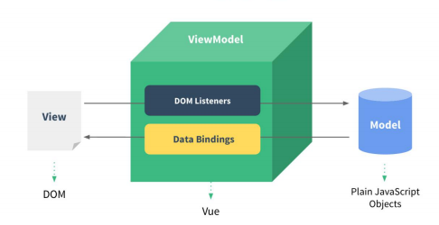
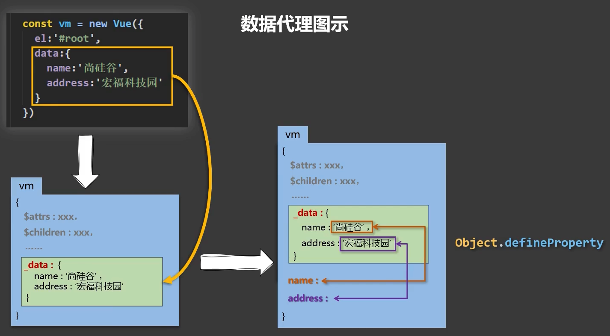
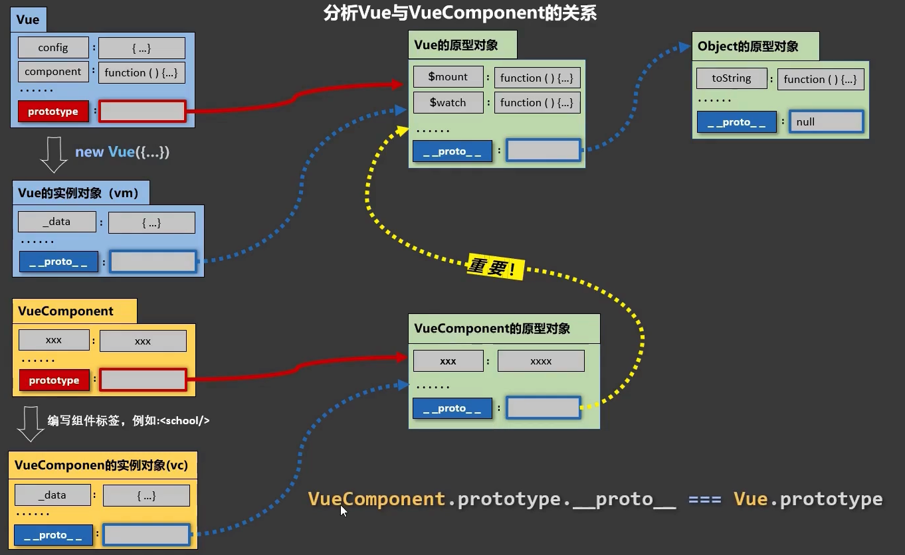

# vue

<hr />

[[toc]]

<hr />

>特点：
>
>1. 裁剪组件化模式，提高代码复用率，一个vue文件中包含着 `html/css/js` 三大模块；
>2. 声明式编码，无需直接操作dom；
>3. 使用虚拟DOM+新diff算法；
>
>规则：
>
>- 必须创建一个vue实例，并在创建时传入一个配置对象(el/data)；
>- 相应的在html容器中，语法依旧符合html规范，但新增了一些vue语法；
>- html容器中的代码被称为 Vue模板；
>
>**注意**：
>
>- **容器和实例必须是一一对应的**；
>- 真实开发中只有一个Vue实例配合组件一起使用；
>- 容器中 `{{}}` 中必须是 js表达式；


### Vue的模板语法

- 插值语法：`{{}}`，**用于解析标签体内容**

- 指令语法： `v-xxx:`，其后接一个键值对，其中被双引号包裹的值会被当作 js表达式 解析(`v-bind:` 可简写为 `:`)，**用于解析标签(标签属性，标签体内容，绑定事件...)**；

  `v-bind` 是一个单向数据绑定，`v-model` 是双向数据绑定；

  双向数据绑定：即对页面上数据的修改会改变 `data` 中对应属性的值，**但双向数据绑定只能用于表单元素**，`v-modal` 的默认值是 `value`，因此 `v-modal:value=''` 可简写为 `v-modal=''`；

  

### MVVM模型

- M：模型(Modal)，对应data中的数据
- V：视图(View)，模板，页面中的DOM
- VM：视图模型(ViewModal)，Vue实例对象



验证可知：

- `data` 中所有的属性，最后都会出现在Vue实例(vm)上；
- vm上所有的属性都可以被模板解析使用；


### 数据代理(data)

> 定义：通过一个对象代理对另一个对象中的属性进行操作(读/写)

> 基础：Object.defineproperty方法 (给对象添加属性)
>
> ````js
> const person = {
> name: 'WW.',
> sex: 'female'
> }
> 
> let number = 18;
> 
> // 该方法接收三个参数(对象名，对象值，属性值(配置对象))
> Object.defineProperty(person, 'age',  {
> // value: 18,
> 
> // 控制属性是否可枚举，默认false
> enumerable: true,
> // 控制属性是否可改变，默认false
> writable: true,
> // 控制属性是否可删，默认false
> configurable: true
> 
> // 当该属性被读取时，get函数(getter)会被自动调用，且返回值就是该属性的值
> get: function() {
> 	// 每一次访问age都会触发getter的调用
> 	// 因此就实现了age是一个可以根据外部动态可变的
> 	// 若书写该方法就不能写value和writable否则b如下错
> 		// Uncaught TypeError: Invalid property descriptor. Cannot both specify accessors and a value or writable attribute, #<Object> 
> 	return number;
> 	}
> 
> 	// get 和 set可以进行如下简写
> 	// 当通过 person.age 修改该属性时，set函数(setter)就会被调用，且会收到修改的具体值
> 	set(value) {
>   console.log(value);
>   // 但由于此时age还是通过get函数获取的
>   // 因此再次读取age值时，并没有改变，所以进行如下操作:
> 		number = value;
>   // 这样就实现了双向数据绑定，改变一个另一个也改变
> }
> })
> ````
>
> **注意**：使用该方法定义的属性是不可枚举的，且不可变，不可删的；



> 数据代理实际上是通过vm对象来代理data对象中属性的操作；
>
> 原理：
>
> 通过 `Object.defineProperty()` 把data对象中的所有属性添加到vm的 `_data` 中，为每一个添加到vm上的属性都指定一个 `getter/setter`，在 `getter/setter` 内部操作data中对应的属性；


### 事件处理(methods)

> 标签使用 `v-on:click="<funcname>(para)"` (简写形式：`@click="<funcname>(para)"`)绑定事件，在新建的Vue实例配置对象中 `methods` 属性可书写事件绑定的函数，若未传参数，则该函数接收的第一个参数为事件对象 `event`，反之则为参数；
>
> 若既想要穿参数又想要接收 `event` ，则可以在参数列表中使用 `$event` 接收时间对象；
>
> **注意**：该函数一定要写为普通函数，否则this的指向会出错；
>
> 
>
> 事件修饰符 (可连着写)：
>
> `.prevent`：阻止默认事件；
>
> `.stop`：阻止时间冒泡；
>
> `.once`：事件只被触发一次；  
>
> `.captrue`：在事件捕获阶段触发事件，而非冒泡阶段；
>
> `.self`：只有 `event.target` 是当前操作的原始时才触发事件；
>
> `.passssive`：事件在触发后：执行绑定的事件回调 => 执行事件默认行为，使用该修饰符后：立即执行事件默认行为 => 事件回调执行；
>
> 
>
> 常用按键别名 (可连着写)：
>
> - 回车 => `.enter`
> - 删除 => `.delete`
> - 退出 => `.esc`
> - 空格 => `.space`
> - 换行 => `.tab` (特殊，必须配合 `keydown` 使用)
> - 上 => `.up`
> - 下 => `.down`
> - 左 => `.left`
> - 右 => `.right`
>
> 系统修饰键(用法特殊)：`ctrl/alt/shift/meta`
>
> 1. 配合 `keyup` 使用：按下修饰键同时，再按下其他键，随后释放其他键，事件才被触发；
> 2. 配合 `keydown` 使用：正常触发事件；


### 计算属性(computed)

> 前提：只要data中数据发生改变，Vue就会重新解析模版，遇到插值语法中包含函数，则每次解析都会执行一遍函数；
>
> 当我们所要渲染到页面上的数据，是需要通过对 `data` 进行一些操作运算后得出时，一般不会将运算操作写在 `{{}}` 中，而是使用以下两种方法：
>
> ````html
> 姓：<input type="text" v-model="firstName"/> <br /><br />
> 名：<input type="text" v-model="secondName"/> <br /><br />
> 
> <!-- 不推荐写法 -->
> 姓名： <span>{{firstName.slice(0, 3)}} - {{secondName.slice(0, 3)}}</span> <br /><br />
> 
> <!-- methods写法 -->
> 姓名： <span>{{fullName1()}}</span><br /><br />
> 
> <!-- 计算属性，推荐 -->
> 姓名： <span>{{fullName2}}</span>
> ````
>
> 
>
> - 利用 `methods` 中书写的方法
>
>   ````js
>   new Vue({
>     el: '#root',
>     data: {
>     	firstName: 'WW.'
>       secondName: 'HH.'
>   	},
>      methods: {
>        fullName1() {
>          return this.firstName.slice(0, 3) + ' - ' + this.secondName.slice(0, 3);
>        }
>      },
>   });
>   ````
>
> - 计算属性
>
>   ````js
>   computed: {
>      fullName2: {
>        // 每次在读取fullName2时，计算属性中的get每次都会被自动调用
>        get() {
>          return this.firstName.slice(0, 3) + ' - ' + this.secondName.slice(0, 3);
>        },
>        // 若想改变fullName2的值，必须设置set函数
>          set(value) {
>            console.log(value + '@');
>            const arr = value.split('-');
>            this.firstName = arr[0];
>            this.secondName = arr[1];
>          }
>      },
>     // 若没有改变值的需求，则可以使用简写方法
>     fullName2() {
>       return this.firstName.slice(0, 3) + ' - ' + this.secondName.slice(0, 3);
>     }
>       
>    }
>   ````
>
> **注意**：计算属性比直接书写方法好的点在于
>
> 1. 计算属性有缓存，当调用了一次后，只要其引用的 `data` 值不改变，就会直接从缓存中读取值，而 methods 无缓存，会一次次调用；


### 监视属性 (watch)

> 监控data中某一个属性的变化(包括计算属性)
>
> `computed` 能做的 `watch` 也能做，但 `watch` 能做的，`computed` 不一定能做，因为 `computed` 依靠着 `get return` 的数据工作，而 `watch` 并不；所以 `watch` 可以做一些类似定时器，ajax此类的异步操作；
>
> **注意**：
>
> - 所有**被** Vue 管理的函数最好写为**普通函数**，这样 `this` 才是 vm 或 组件的实例对象；
> - 所有**不被** Vue 管理的函数，如写在 `watch` 中的异步函数最好写作**箭头函数**，否则 `this` 指向会出问题；

````js
 const vm = new Vue({
   el: "#root",
   data: {
     isHot: true,
   },
   methods: {
     changeWeather() {
       this.isHot = !this.isHot;
     }
   },
   watch: {
     // 1.常规写法：
     isHot: {
       // 初始化时，就调用一次handler，默认值为false
       immediate: true,
       // 若监听的属性是一个对象，要求对象中任意一属性变化，则调用handler时
       // 则将deep设置为true，表示开启深度监听，默认值为true
       deep: true,
       // 当监听属性变化时，handler自动被调用
       handler(newValue, oldValue) {
         console.log('%', newValue, oldValue);
       }
     },
     // 3.若只需要在其中配置handler的话，可简写为：
     isHot(newValue, oldValue) {
       console.log('@', newValue, oldValue);
     },
     fullName() {
       console.log('fullName')
     }
   }
 });


// 2.写在外部
vm.$watch('isHot', {
  // 初始化时，就调用一次handler，默认值为false
  immediate: true,
  // 当监听属性变化时，handler自动被调用
  handler(newValue, oldValue) {
    console.log('%', newValue, oldValue);
  }
})
````


### 绑定class和style样式

````html
<!-- :class为v-bind:class的简写 -->

<!-- 字符串写法：用于样式类名不确定，需要动态指定 -->
<div class="basic" :class="mood"></div>

<!-- 数组写法：用于样式类名不确定，个数也不确定 -->
<div class="basic" :class="classArr"></div>

<!-- 对象写法：用于样式类名确定，个数也确定，但要动态决定是否使用 -->
<div class="basic" :class="classObj"></div>

<!-- style样式写法, 注意需要将样式名改为驼峰命名 -->
<div class="basic" style="{fontSize: fontSize + 'px'}"></div>
````

````js
new Vue({
  data: {
    mood: 'normal',
    classArr: ['a', 'b', 'c'],
    classObj: {
      a: false,
      b: true
    },
    fontSize: 40
  }
});
````


### 条件渲染

> `v-show` ：属性值为布尔值，相较于 `v-if` 只是隐藏节点，不是将DOM彻底删除，对DOM操作较多时更适合用该语法；
>
> `v-if `：属性值为布尔值，可与 `v-else-if/v-else` 组合使用，将DOM彻底删除，适用于同时操作一组DOM 或者 对DOM操作不多的情况；


若多个DOM同时使用一个条件，那么可以使用如下写法：

````html
<!-- 原始写法 -->
<div v-if="n === 1"></div>
<div v-if="n === 1"></div>

<!-- 简单写法，template不会被渲染到页面结构中 -->
<template v-if="n === 1">
  <div></div>
  <div></div>
</template>
````

**注意**：`template` 只能配合 `v-if` 使用；


### 列表渲染

````vue
<template>
<!-- 
 当页面要根据 data 中数组/对象，渲染页面的话就会使用到 `v-for="item in/of arr"` 

 `key` 形同 React 的 `key` 是用来对比DOM的唯一标识；

 若不写 `:key` 则会自动将 `index` 作为 `key`；

	如：
-->
<li v-for="item for arr" :key="item.id">
  {{item.name}} + '-' {{item.age}}
</li>
</template>
````


### Diff 和 key

虚拟DOM中key的作用：

> key是虚拟DOM对象的标识，当数据发生变化时，Vue会根据【新数据】生成【新的虚拟DOM】，随后Vue进行【新虚拟DOM】与【旧虚拟DOM】的差异比较，比较规则如下：
>
> 1. 旧虚拟DOM中找到了与新虚拟DOM相同的key：
>    - 若虚拟DOM中内容没变, 直接使用之前的真实DOM；
>    - 若虚拟DOM中内容变了, 则生成新的真实DOM，随后替换掉页面中之前的真实DOM；
> 2. 旧虚拟DOM中未找到与新虚拟DOM相同的key，创建新的真实DOM，随后渲染到到页面。

>**注意**：用index作为key可能会引发以下问题
>
>- 若对数据进行：逆序添加、逆序删除等破坏顺序操作:
>  会产生没有必要的真实DOM更新 ==> 界面效果没问题, 但效率低；
>- 如果结构中还包含输入类的DOM：
>  会产生错误DOM更新 ==> 界面有问题；

>开发中如何选择key：
>
>- 最好使用每条数据的唯一标识作为key, 比如id、手机号、身份证号、学号等唯一值；
>- 如果不存在对数据的逆序添加、逆序删除等破坏顺序操作，仅用于渲染列表用于展示使用index作为key是没有问题的；


### Vue检测数据变化的原理——数据劫持

> 核心是利用 `getter` 和 `setter`，监视data中所有层次的数据
>
> 
>
> 监测对象数据原理：通过setter实现监视，且要在newVue时就传入要检测的数据
>
> 1. 对象中后追加的属性，Vue默认不做响应式处理；
> 2. 如需给后添加的属性做响应式，则使用 `this.$set/Vue.set(target, key, value)`
>
> 
>
> 监测数组数据原理：通过包裹数组更新元素的方法实现，本质就是：
>
> 1. 调用原生对应的方法对数组进行更新(`pop/push/shift/unshift/splice/sort/reverse`)；
> 2. 重新解析模版进而更新页面；
>
> 或者还可使用 `this.$set/Vue.set` 对数组项进行更新，key值就是索引值；
>
> 
>
> **注意⚠️**：使用 `this.$set/Vue.set` 时，不能给 vm 或 vm的根数据(``vm._data`)对象添加属性；


### 收集表单数据

- `<input type="text" />`，则 `v-model` 收集的是 `value` 的值，用户的输入的就是 `value` 值；
- `<input type="radio" />`，则 `v-model` 收集的是 `value` 的值，需要手动给标签配置 `value` 值；
- `<input type="checkbox" />`：
  - 没有配置 `input` 的 `value` 属性，收集的就是 `checked`，是一个布尔值；
  - 配置了 `value` 属性，就一定要将 `data` 属性值写为数组，否则会自动读取 `checked` 中的值；

`v-modal` 的三个修饰符：

>`.Lazy`：失去焦点再收集数据
>
>`.number`：输入字符串自动转为有效数字；
>
>`.trim`：输入首尾空格删除；


### 过滤器 (filters)

> 对要显示的数据进行特定的格式化后再显示(适用于一些简单的逻辑处理)；
>
> 
>
> 注册过滤器：`Vue.filter(name.callback)全局 or new Vue(filters: {})局部`
>
> 使用过滤器：`{{xxx | 过滤器名}}` 或 `v-bind:属性 = "xxx | 过滤器名"`
>
> `xxx` 作为过滤器的第一个参数传递给过滤器，过滤器若也传入参数，则会从第二个形参开始读取，最后将过滤器的返回值放入模版位置解析，即：
>
> **`{{x | change(a, b)}}`  => 被解析时是: `change(x, a, b) {return x + a + b}` => 模版解析值：`{{x + a + b}}`**
>
> 多个过滤器也可串联写法，并不改变原本数据，而是产生新的对应数据；


### 内置指令

- `v-text`：形同插值语法，写在标签属性中，将所有内容当成字符串解析，无法解析html；
- `v-html`：如上，但可解析html，但是其有**严重的安全性问题**，在网站上动态渲染任意的HTML是极其危险的，容易导致XSS攻击，因此一定要在可信用户上使用 `v-html`，且永远不在提交内容上使用 `；
- `v-cloak`：没有值，本质是一个特殊属性，Vue实例创建完毕并接管容器后，会删除 `v-cloak` 属性，使用 css `[v-cloak] {display: none}` + `<div v-cloak> </div>` 可解决页面因网速慢而显示出 {{}} 模版字符串的问题；
- `v-once`：没有值，且在初次动态渲染后就被视为静态内容了；
- `v-pre`：没有值，Vue会跳过该属性所在节点的编译过程，可利用其跳过没有指令语法，也没有插值语法的节点，加快编译过程；


### 自定义指令 (derectives)

> 根据需求自定义指令，书写在 `directives` 中
>
> 
>
> 被调用时机：
>
> 1. 在指令与元素成功绑定时；
> 2. 指令所在的模版被重新解析时(例：`el: '#root'` ，则在`#root` 被重新解析时，该指令所对应函数就重新调用)；  

自定义指令完整写法：

````js
custom: {
  // 指令与元素成功绑定时被调用
  bind(){},
  // 指令所在元素被插入页面时被调用
  inserted() {},
  // 指令所在模版被重新解析时被调用
  update() {}
}
````

函数写法：

````js
custom(element, binding) {
  // 接收两个参数：
  // 1.第一个为书写指令的 el
  // 2.第二个为binding的各种数据，是一个对象
}
````

就是完整写法的 `update + bind` 结合；


**注意⚠️**：

- 若指令名由多个单词组成，则需要用 `-` 连接，不能用小驼峰，且在 `directives` 中需要使用字符串包裹属性名；
- 指令相关函数中的 `this` 指向是 `window`，即 `bind/update/inserted` 函数中的 `this` 都是 `window`；
- 可使用 `Vue.directive(custom, {bind/update/inserted}/func)` 定义全局的自定义指令；


### 生命周期


初次挂载：

- **`mounted`**：Vue完成模版解析并且把初始的真实DOM放入页面后调用；
- 

更新：

卸载：


### 组件化编程

> 传统方式编写应用，一个HTML文件引入多个css和js文件，存在关系混乱，不好维护，且代码复用率不高的缺点；
>
> 组件就是将应用中**局部功能代码**和**资源**封装为一个集合；
>
> 每次使用组件时，只需要将其引入HTML文件中即可；

使用组件的步骤：

````js
// 1. 定义组件(Vue.extend())
const demo = Vue.extend({
  // 定义组件格式
  template: `
  	<h2>name: {{name}}</h2>
  	<h3>age: {{age}}</h3>
  `
  // 不能写对象式，只能写函数式
  data() {
    return {
      name: 'WW.',
      age: 21
    }
  }
});

// 简写形式
const demo = {
    // 定义组件格式
    template: `
      <h2>name: {{name}}</h2>
      <h3>age: {{age}}</h3>
    `
    // 不能写对象式，只能写函数式
    data() {
      return {
        name: 'WW.',
        age: 21
      }
    }
}

// 2. 注册组件(局部注册/全局注册)
new Vue({
  el: '#root',
  // 局部注册
  components: {
    // demo: demo,
    // 简写为：
    demo
  }
});
// 全局注册
Vue.component('demo', demo);

// 3. 使用组件(假设以下为一个html文件)
`<div id='root'>
	<demo></demo>
</div>`
````

**注意⚠️**：

- 定义组件时不用写 `el`，因为其是一个被复用的结构，不指定其为任何一个模板服务；

- 定义组件时 `data` 必须写为一个函数，使得组件的每个复用都有自己的实例，避免被复用时，数据存在引用关系；


>组件本质上是一个名为 `VueComponent` 的构造函数，且在调用 `Vue.extend(options)` 时，Vue底层会自动调用 `new VueComponent(options)` 生成一个组件的实例对象； 
>
>**注意⚠️**：每次调用 `Vue.extend(options)`，返回的都是一个新的 `VueComponent`；  


> - 在**组件**配置中的函数，其 `this` 指向均是 **`VueComponent` 的实例对象**；
> - 在 `new Vue(options)` 的配置中，其 `this` 指向均是 **`Vue` 实例对象**；




目的：让组件实例对象(VueComponent) 也能访问到 Vue原型上的属性；


### `.vue` 文件

````vue
<template>
	<!-- html => 组件的结构 -->
</template>

<script>
  // js => 组件的交互
</script>

<style>
	/* css => 组件的样式 */
</style>
````


**`ref` 属性**

> 用来给元素/自组件注册引用信息(id替代者)；

- 用在html标签上获取真实的DOM元素，用在组件标签上获取的是组件实例对象(`VueComponent`)；
- 定义：`ref='a'` / 获取：`this.$ref.a`


**props**

>让组件接收外部传入的数据

````vue
<template>
	<!-- 父组件传递数据 -->
	<!-- props的值必须使用引号包裹，但若希望其是一个数值，则在属性名之前加冒号，表示引号内的值是一个表达书 -->
	<Demo test="WW." name="HH." :age="18"/>
</template>

<script>
	// 接收数据
  Vue.extend({
    // 方式1⃣️：简写
    props: ['test', 'name'],
    
    // 方式2⃣️：限制类型
    props: {
    	name: String，
      test: String,
      age: Number
  	},
    
    // 方式3⃣️：限制类型/必要性/默认指定值
    props: {
      name: {
        type: String,
        // 注意⚠️：一般情况下，required和default不需要一起写
        required: true,
        default: 'HH.'
      },
    }
  });
</script>
````

**注意⚠️**：

- 默认 `props` 是不可修改的，若需要修改可以在 `data` 中引用一份 `props` 的数据；
- `props` 与 `data` 中属性不可重名，若重名了默认会读取 `props` 中的属性值；


**mixin混合**

> 可以把多个组件共用的配置提取为一个混入对象；

````js
// mixin.js
export const mixin = {
  // 配置与VueComponent中配置项一致
  data() {
    return {
      a: 123,
    }
  },
  methods: {
    changeName() {
      console.log(this);
    }
  }
}
````

````vue
<script>
  // 局部混合，在 .vue组件文件中
  // 分别引入，引入名与暴露名一致
  import {mixin} from '../mixin.js'
  
	Vue.extend({
    data() {
      name: 'WW.'
    },
    mixins: [mixin]
  })
  
  
  // 全局混合 在main.js中
  Vue.mixin(mixin);
</script>
````

**注意⚠️**：

- 若 `mixin` 中引入内容和组件中 `data/methods等` 出现重名状况，则默认使用组件中内容；

- 若 `mixin` 中引入内容和组件中生命周期出现重复状况，则两个文件中关于生命周期的内容都会被调用；


**插件(plugin.js)**

> 用于增强Vue；
>
> 本质为一个包含install方法的对象，该方法的第一个插参数是Vue，第二个及易购的参数是使用插件时，传递的参数数据；

````js
// 定义插件：plugin.js在src目录下
export default = {
  install(Vue, options) {
    // 添加全局过滤器
    Vue.filter(...);
               
    // 添加全局指令
    Vue.directive(...);
    
    // 配置全局混入
    Vue.mixin(...);
              
    // 添加实例方法
    Vue.prototype.$myMethod = function() {};
    Vue.prototype.$myPrototype = ...;
  }
}
````

````js
// 使用插件
import plugins from './plugin'
// use语句必须在new Vue之前使用
Vue.use(plugins, options);

new Vue({});
````


**scoped**

> 使样式在组件局部生效，防止组件汇总在App组件时，产生冲突；
>
> 写法: `<style scoped>`


### 组件自定义事件

````vue
<template>
	<!-- 使用props获取自组件数据 -->
	<student :getStudentName="getStudentName"/>
	<!-- 绑定自定义指令, 方法1⃣️：v-on -->
	<School v-on:myInstruct="getSchoolName" />
	<!-- 绑定自定义指令, 方法2⃣️：ref -->
	<School ref="school" />
</template>

<script>
	new Vue({
    el: '#root',
    methods: {
      getStudentName(studentName) {
        console.log(studentName);
      },
      getSchoolName(schoolName) {
        console.log(schoolName);
      }
    },
    mounted() {
      // 方法2⃣️：相对来说更为灵活
      // 表示myInstruct事件被触发时，会调用getSchoolName方法
      this.$refs.school.$on('myInstruct', this.getSchoolName)
    }
  });
</script>
````

````vue
<template>
	<!-- Student组件 -->
	<button @click="sendStudentName">将Student组件内容提交给App组件</button>

	<!-- School组件 -->
	<button @click="sendSchoolName">将School组件内容提交给App组件</button>
	<button @click="unbind">解绑自定义事件</button>
</template>

<script>
	// Student组件
  Vue.exdent({
    props: ['getStudentName'],
    data() {
      return() {
        name: 'studentName'
      }

    },
    methods: {
      sendStudentName() {
    		getStudentName(this.name);
  		}
    }
  });
  
  // School组件
  Vue.extend({
    data() {
      return {
      	name: 'studentName'
      }
    },
    methods: {
      sendSchoolName() {
        // 触发School组件实例身上的myInstruct事件
        this.$emit('myInstruct', this.name);
      },
      unbind() {
        this.$off('myInstruct');    // 解绑一个事件
        this.$off(['myInstrct', 'demo']);		// 解绑多个
        this.$off();				// 解绑所有的
      }
    }
  });
  
  // WW组件
  Vue.extend({
    data() {
      return {
        name: 'WW.'
      }
    }
  });
</script>
````

**注意⚠️**：在组件中使用原生事件 `@click`，Vue会自动寻找自定义事件中的 `click`，若想触发原生事件，必须写为 `@click.native`；


### 组件间通信

- **全局事件总线(GlobalEventBus)**

  > 组件间通信方式，适用于任意组件间通信

  ````js
  // main.js: 安装全局事件总线
  new Vue({
    beforeCreate() {
      // 这里的this就是vm
      Vue.prototype.$bus = this;
    }
  });
  
  // 组件：使用事件总线
  // 接收事件总线
  methods() {
    demo(data) {
      
    }
  }
  mounted() {
    this.$bus.$on('xxx', this.demo)
  }
  
  // 提供数据
  this.$bus.$emit('xxx', data);
  
  // 在卸载组件时，解绑事件
  this.$bus.$off('xxx');
  ````

  

- **消息订阅与发布**


### Vuex

>`state`：驱动应用的数据源 => `类data`；
>
>`view`：以声明的方式将 `state` 映射到视图 => `类template`；
>
>`actions`：响应在 `view` 上的用户输入导致的状态变化 => `类methods`；


此时，当多个组件共享状态时，上图的单向数据流简洁性很容易被破坏：

- 多个视图依赖于同一状态；
- 来自于不同视图的行为需要变更同一状态；

因此就会将组件的共享状态抽象出来，以一个全局单例模式管理，在这种模式下，组件树就构成了一个巨大视图，在任何位置的组件都能够获取或者触发行为；


**使用Vuex**

````js
import Vue from 'vue'
import Vuex from 'Vuex'

Vue.use(Vuex)

const store = new Vuex.Store({
    // 存放状态
    state: {
        count: 0
    },
    // 存放更改状态的方法
    mutations: {
        increment(state) {
            state.count++
        }
    }
})
````


> Vuex的核心概念 => `store`，本质上是一个容器，包含着应用中大部分状态，但和全局对象有以下差别：
>
> 1. Vuex状态是响应式的；
> 2. 无法直接改变状态，而是要通过 commit `mutations` 中的方法改变；


````js
// main.js
import store from './store.js'

new Vue({
  render: h => h(App),
  // 挂载方法
  store
})
````

````vue
<script>
  // Demo.vue 组件
	export default {
    // 读取属性
    computed: {
      count() {
        return this.$store.state.count
      }
    }
    // 调用commit方法
    methods() {
      clickIncrement() {
        this.$store.commit('increment')
      }
    }
  }
</script>
````

使用 `this.$store.state.count` 引入多个 `state` 代码过于重复，此时可使用 `mapState`：

````js
import { mapState } from 'vuex'

export default {
  computed: mapState({
    // 方法1⃣️：
    count: state => state.count
    
    // 方法2⃣️：'count' === state => state.count
    count: 'count'
  })
  
  // 若映射计算属性与state重名，则可以写做数组形式
  computed: mapState(['count'])
}
````


> `getter`：可认为是 `store` 的计算属性
>
> 当有多个组件需要用到某个属性时，复制函数或抽取一个到共享函数再多个导入两种方法都不理想，则定义 `getter`，只有当其依赖值发生变化时，才会被重新计算；

````js
const store = new Vuex.Store({
  state: {
    todos: [
      { id: 1, text: '...', done: true },
      { id: 2, text: '...', done: false }
    ]
  },
  getters: {
    // getter	中函数可以接收state作为第一个参数
    // 接收其他getter作为第二个参数
    doneTodos: (state, getters) => {
      return state.todos.filter(todo => todo.done)
    }
  }
})
````

`````vue
<script>
	import { mapGetters } from 'vuex'
  
  export default {
    computed: {
      // 使用扩展运算符将getter混入computed对象中
      // 若映射名一致，就写数组，映射名不一致就写对象
      ...mapGetters([
        'doneTodosCount',
        'anotherGetter'
      ])
    }
  }
</script>
`````


> Mutations：更改Vuex的 `store` 中的状态的方法，每个mutation都有一个字符串的**事件类型**和一个**回调函数**；
>
> 回调函数会实际根据状态更改，并且接受 `state` 作为第一个参数，在调用时也可以传入额外参数，在第一个参数之后开始接受，但建议额外参数作为一个对象的形式传入；

- `store.commit()` 的两种形式：

  ````js
  // 形式1⃣️：将回调函数名作为第一个参数传入
  store.commit('increment', {
    amount: 10
  })
  
  // 形式2⃣️：将回调函数名作为type属性传入
  store.commit({
    type: 'increment',
    amount: 10
  })
  ````

- **Mutation需要遵守的响应规则**

  1. 最好在 `store` 中初始化好所有所需属性；
  2. 当需要在对象上添加新属性时，应该使用:
     -  `Vue.set(obj, 'newProp', 123)`
     - 新对象替换老对象：`state.obj = {...state.obj, newProp: 123}`

- `mapMutation`

  ````js
   methods: {
     	// 同名映射：
      ...mapMutations(['increment']),
      // 不同名映射
      ...mapMutations({
        add: 'increment' 
      })
    }
  ````

**注意⚠️**：`Mutation` 必须是同步函数！


> `Action`：`Mutation` 只可以处理同步事务，`Action` 则用来处理异步事务；
>
> 值得注意的是 `Action` 提交的是 `mutation`，而不是直接变更状态；
>
> `Action` 函数接受的是一个与 `store` 实例具有相同属性和方法的 `context` 对象，函数中通过:
>
> - 调用 `context.commit` 提交一个 `mutation`;
> - `context.state / context.getters` 来获取 `state / getter`;
>
> 但接收 `context` 做为参数时，通常不直接接收 `context`，而是使用解构赋值的方式 `{ commit }` 接收；

````js
// store.js 定义actions
const store = new Vuex.Store({
  actions: {
    increment (context) {
      context.commit('increment')
    }
  }
})
````

````vue
<script>
	// 分发Action
  store.dispatch('increment')
  // 同样可以接收参数，和mutation有同样接收参数的写法
</script>
````

`mapActions` 写法与 `mapMutations` 写法同；


**Module**

> 应用的所有状态集中到一起会显得十分臃肿，因此使用 `module` 将 `store` 分割成模块，每个模块拥有自己的 `state、mutation、action、getter 和 自身子模块`；
>
> 
>
> 模块内部的 `mutation` 和 `getter`，接收的第一个参数是**模块的局部状态对象(state)**；
>
> `action` 的 `局部state` 则依旧是使用 `context.<statename>` 接收，若想接收 `根节点state` 则可使用 `rootState.<statename>` 接收；
>
> 在 `getter` 中，`rootState` 可作为第三个参数接收；