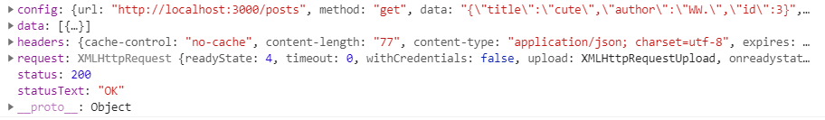

# AJAX (Asychronous JavaScript And XML)

<hr />

>在页面不刷新的情况下，向服务器发送异步请求，从而获取数据；
>
>允许根据用户事件来更新页面内容，实现懒加载

 缺点：

- SEO不友好 (搜索引擎无法搜索到)；

- 没有浏览历史不能回退；

- 存在跨域问题；

  

HTTP协议：

- 请求报文：

  ````text
  1. 行		请求类型(GET、POST) / URL / HTTP协议版本
  2. 头		Host、Cookie、Content-type等
  3. 空行      必须有空行
  4. 体		GET请求体为空，POST则不一定
  ````

- 响应报文：

  ````text
  1. 行		HTTP协议版本 / 响应状态码(200, 304等) / 响应状态字符串(OK)
  2. 头		Host、Cookie、Content-type,charSet等
  3. 空行      必须有空行
  4. 体		html文件内容
  ````

  

同源策略：协议、域名号、端口号必须完全相同，违背同源策略就是跨域；

JSONP解决跨域：只支持get请求；


## axios 入门与源码

1. 首先搭建 `json-server`

   - 安装
   - 构建文件
   - 启动服务

2. 安装axios：

   项目中一般使用 `npm install axios` 或  `yarn add axios` 引入

3. axios 使用

   ````js
   axios({
       // 请求类型
       method: 'POST',
       // URL
       url: 'http://localhost:3000/posts',
       // 请求体内容
       data: {
           title: 'HH.',
           authod: 'WW.'
       }
       
   }).then(response => {
       consloe.log(response);
   });
   ````

   `axios` 对象被调用，其传入一个对象类型的参数，其中可以传入 `url`, `method` 等属性，调用后传回一个 `promise` 对象作为返回值，其中使用 `then` 调用成功时进行的操作；

   此时控制台输出的 `response` 是一个对象，其中：

   
   
   - `config`：配置对象，与请求相关内容都保存在该属性中；
   - `data`：响应体内容；
   - `headers`：响应头信息；
   - `request`：保存原生的AJAX;
   - `status`：状态码；
   - `statusText`：状态内容；


- axios默认配置

  ````js
  axios.default.method = 'GET';
  axios.defualt.baseURL = 'http://localhost:3000'
  ````

  

