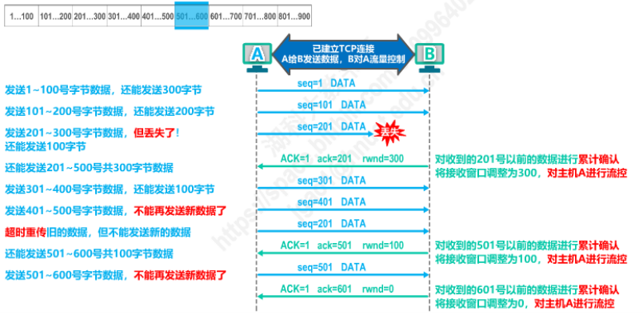

# 计算机网络


## 运输层

>因特网的运输层为应用层提供了两种不同的运输协议，即**面向连接的TCP**和**无连接的UDP**，这两种协议就是运输层讨论的主要内容。
>
>运输层协议又称端到端协议，如何为**运行在不同主机上的应用进程**提供直接的通信服务是运输层的任务。


- #### 运输层端口号概念

  - 运行在计算机上的进程用PID (进程标识符) 来标志；

  - 计算机并不是统一的操作系统，不同的操作系统 **使用不同格式的进程标识符**；

  - 但为了使运行在不同操作系统之间的计算机应用进程之间能够进行网络通信，必须使用**统一的方法对TCP/IP体系**对应用进程进行标识；

  - TCP/IP体系的运输层使用**端口号**来区分应用层的不同应用进程；

    - 端口号使用16比特 (2^16) 表示，取值范围 0~65535;

      - **熟知端口号**：0~1023，IANA把这些端口号指派给了TCP/IP体系中最重要的一些应用协议，例如：**FTP使用 21/20，HTTP使用 80，DNS使用 53**。
      - **登记端口号**：1024~49151，为没有熟知端口号的应用程序使用。
      - **短暂端口号**：49152~65535，留给客户进程选择暂时使用。当服务器进程收到客户进程的报文时，就知道了客户进程所使用的动态端口号，通信结束后，这个端口号可供其他客户进程以后使用。

    - **端口号只具有本地意义**，即端口号只是为了标识本计算机应用层的各个进程，在因特网中，**不同计算机中的相同端口号是没有联系的**。

      

- #### 运输层复用和分用概念

  

  - **TCP/IP体系的应用层常用协议所使用的运输层熟知端口号**

    

    

  - **域名服务器 (DNS服务器）**

    - 网络通讯大部分是基于TCP/IP的，而TCP/IP是基于IP地址的，所以计算机在网络上进行通讯时只能识别如“202.96.134.133”之类的IP地址，而不能认识域名。我们无法记住10个以上IP地址的网站，所以我们访问网站时，更多的是在浏览器地址栏中输入域名，就能看到所需要的页面，这是因为有一个叫“DNS服务器”的计算机自动把我们的域名“翻译”成了相应的IP地址，然后调出IP地址所对应的网页。

    - DNS是应用层协议，事实上他是为其他应用层协议工作的，包括不限于HTTP和SMTP以及FTP，**用于将用户提供的主机名解析为ip地址**。

      **DNS获取具体过程如下：**

      1. 用户主机上运行着DNS的客户端；
      2. 浏览器将接收到的url中抽取出域名字段，就是访问的主机名，比如`http://www.baidu.com/`, 并将这个主机名传送给DNS应用的客户端；
      3. DNS客户机端向DNS服务器端发送一份查询报文，报文中包含着要访问的主机名字段（中间包括一些列缓存查询以及分布式DNS集群的工作）；
      4. 该DNS客户机最终会收到一份回答报文，其中包含有该主机名对应的IP地
      5. 一旦该浏览器收到来自DNS的IP地址，就可以向该IP地址定位的HTTP服务器发起TCP连接；

  - **用户端获取页面的流程**

    

    

    1. 由用户端在浏览器地址栏中输入url地址；

    2. 浏览器使用**UDP协议**向DNS服务器发送DNS查询请求；

    3. DNS服务器依照浏览器发送的url获取页面的IP地址；

    4. DNS服务器响应用户端，将页面IP地址发回给用户端；

    5. 用户端收到页面IP地址，并使用**TCP/IP协议**发送HTTP请求给Web服务器；

    6. Web服务器收到用户端的HTTP请求，并以HTTP响应将页面内容发送给用户端。

       

- #### UDP和TCP对比

  

  

  - **面向报文传输和面向字节流传输**

    1. **面向报文的传输方式是应用层交给UDP多长的报文，UDP就照样发送，即一次发送一个报文**。因此，应用程序必须选择合适大小的报文。若报文太长，则IP层需要分片，降低效率。若太短，会使IP太小。

       UDP对应用层交下来的报文，既不合并，也不拆分，而是保留这些报文的边界。这也就是说，应用层交给UDP多长的报文，UDP就照样发送，即一次发送一个报文。

    2. **面向字节流的话，虽然应用程序和TCP的交互是一次一个数据块（大小不等），但TCP把应用程序看成是一连串的无结构的字节流**。TCP有一个缓冲，当应用程序传送的数据块太长，TCP就可以把它划分短一些再传送。如果应用程序一次只发送一个字节，TCP也可以等待积累有足够多的字节后再构成报文段发送出去。

  - **可靠交付和不可靠交付**

    - UDP是不可靠交付，若有误码，仅仅丢弃，其他什么也不做，适用于IP电话、视频会议等实时应用；

    - TCP/IP是可靠交付，不会出现传输差错，适用于要求可靠传输的应用，例如文件传输；

      

- #### TCP的流量控制

  - 流量控制就是让发送方的发送速率不要太快，让接收方来不及接受，以避免导致数据的丢失。
  - 利用**滑动窗口**机制可以方便的在TCP连接上实现对发送方的流量控制。
    - TCP接收方**利用自己的接受窗口的大小**来**限制发送方的发送窗口大小**；
    - TCP发送方收到接收方的**零窗口通知**后，应**启动持续计时器**，持续计时器**超时后**，向接收方**发送零窗口探测报文**；

  

  

  ````text
  此时字节数据并未发送完毕，B主机接收缓存后又有了一些存储空间，此时它将自身接收窗口调整为300，并通告A主机，等待A主机发来数据。
  
  如果此时该通告丢失！
  
  A主机会一直等待B主机发送的非零窗口通知；
  B主机也在一直等待A主机发送来的字节数据；
  这种互相等待使得两个主机形成一种死锁局面，并一直持续。
  
  此时采取持续计时器措施，如下：
  ````

  

  

- #### TCP的拥塞控制

  - 某段时间，若**对网络中某一资源的需求超过了该资源所能提供的可用部分，网络性能就要变坏**，这种情况就叫**拥塞**。

    注：在计算机网络中的链路容量 (带宽)、交换结点中的缓存和处理机等，都是网络资源。

  - 出现拥塞而**不及时控制**，整个网络的**吞吐量将随着负荷的增大而下降**。

    

  - **四种避免拥塞的方法**

    - **<u>慢开始算法</u>**

      - 当主机开始发送数据时，如果立即把大量数据字节注入到网络，那么就有可能引起网络拥塞，因为现在并不清楚网络的负荷情况；

        因此，较好的办法是先探测下，即由小到大逐渐增大发送窗口，也就说，由小到大逐渐增大拥塞窗口数值；

        通常在刚刚开始发送报文段时，先把拥塞窗口cwnd设置为一个最大报文段MSS的数值。而在每收到一个对新的报文段的确认后，把拥塞窗口增加至多一个MSS的数值。用这样的方法逐步增大发送方的拥塞窗口cwnd，可以使分组注入到网络的速率更加合理。

      - **每经过一个传输轮次，拥塞窗口wcnd就加倍** (拥塞窗口的大小等于此时发送的报文数，则拥塞窗口加倍就代表着此时发送报文的数量加倍)；

        

      - 

    - **<u>拥塞避免算法</u>**

      - 让拥塞窗口cwnd缓慢地增大，**即每经过一个往返时间RTT就把发送方的拥塞窗口cwnd加1**；
      - 当有报文数据段丢失，发送方未收到接收方发出的确认，重传计时器超时时，则判断网络可能出现拥堵；
        1. 此时将ssthresh的值更新为**发生拥塞时拥塞窗口cwnd值的一半**；
        2. **拥塞窗口cwnd值变为1**，重新执行慢开始算法；

    - **<u>快重传算法</u>**

      - 但其实有时个别报文段会在网络中丢失，但实际网络并未发生拥塞，错误的将拥塞窗口cwnd变为1，启动慢开始算法，**极大的降低了传输效率**；

      - 此时启用快重传算法，让发送方可以更早的知道个别报文段的丢失，不必等到超时重传计时器超时再重传；

        - 要求**接收方**不要等待自己收到发送数据时才进行捎带确认，而是**立即发送确认**；

        - 即使**接受方**收到了失序报文段也要立即发出对已收到报文段的**重复确认**；

        - **发送方**一旦**收到了3个连续的重复确认** (重复确认是从接收方收到失序报文段开始的)，就将相应的报文段**立即重传**，而不是等该报文端的超时重传计时器超时再重传。

          

    - **<u>快恢复算法</u>**

      - 发送方一旦收到3个重复确认，就知道只是丢失了个别报文段，于是不启动慢开始算法，而执行快恢复算法；

        - 发送方将**慢开始门限ssthresh值和拥塞窗口cwnd值都调整为当前窗口的一半，开始执行拥塞避免算法**；

        - 也有的快恢复实现是把快恢复开始时的拥塞窗口cwnd的值设置为，**新的ssthresh+3**

          - 以为发送方收到3个重复确认，就表明有3个数据报文已经离开网络；
          - 这3个报文段不再消耗网络资源而是停留在接收方的接受缓存中；
          - 因此现在网络中不是堆积了报文段而是减少了3个报文段，所以可以把拥塞窗口增大些；

          

    以上四种方法的**基本原理**：

    

    

- #### TCP超时重传时间选择

  - 重传时间选择较短：引起不必要的重传，使网络负荷较大。

    

  - 重传时间选择较长：会使下一个报文数据没办法及时发送，空闲时间增大，降低传输效率。

    

    

  - **较为合适的超时重传时间应该略大于往返时间**

    

    

    

  

- #### TCP可靠传输的实现

  - TCP基于**以字节为单位的滑动窗口**来实现可靠传输；

    - 发送方在未收到接收方确认时，可将发送窗口内还未发送的数据发送出去
    - 接收方只接收序号落入发送窗口内的数据

  - 虽然发送方的发送窗口是根据接收方的接收窗口设置的，**但同一时刻两个窗口大小并不总是一样大**；

    - 网络传递窗口值需要经历一定的时间滞后，且时间不确定
    - 发送方还可能根据当时网络的拥塞情况改变自己发送窗口的大小

  - 对于**不按序到达的数据该如何处理** (丢弃 或者 临时存放在接收窗口中等待字节流中所缺少的字节收到后，再按序交付给上层应用程序)，TCP无明确规定；

  - TCP要求接收方必须有**累计确认**和**捎带确认**机制，以此减小传输开销；

    - 接收方不应过分推迟发送确认，否则会导致不必要的超时重传
    - 捎带确认不经常发生，因为大多数应用程序很少同时在两个方向上发送数据

  - **TCP的通信是全双工通信**，通信中的每一方都在发送和接受报文段；

    

- #### TCP建立连接

  - **三报文握手**建立连接

    

    **第一次**

    第一次握手：建立连接时，客户端发送[syn](https://baike.baidu.com/item/syn)包（seq=j）到服务器，并进入SYN_SENT状态，等待服务器确认；SYN：同步序列编号（Synchronize Sequence Numbers）。

    **第二次**

    第二次握手：服务器收到[syn](https://baike.baidu.com/item/syn)包，必须确认客户的SYN（[ack](https://baike.baidu.com/item/ack)=j+1），同时自己也发送一个SYN包（seq=k），即SYN+ACK包，此时服务器进入SYN_RECV状态。

    **第三次**

    第三次握手：客户端收到服务器的SYN+ACK包，向服务器发送确认包ACK([ack](https://baike.baidu.com/item/ack)=k+1），此包发送完毕，客户端和服务器进入[ESTABLISHED](https://baike.baidu.com/item/ESTABLISHED)（TCP连接成功）状态，完成三次握手。

    完成三次握手，客户端与服务器开始传送数据。

    > 注：
    >
    > 1）TCP的标准规定，SYN=1的报文段不能携带数据，但要消耗一个序号。
    >
    > 2）TCP的标准规定，普通的确认报文如果不携带数据则不消耗序号。


- #### TCP的连接释放

  - **四挥手报文**释放连接

    

- #### TCP报文段首部格式

  

  
  
  
  
  ## 应用层
  
  > 应用层是计算机网络体系结构的**最顶层**，是设计和建立计算机网络的最终目的，也是计算机网络中发展最快的部分。
  >
  > 
  >
  > 解决通过应用进程的交互来实现特定网络应用的问题


​	

- #### 客户/服务器方式 (C/S方式) 和 对等方式 (P2P方式)

  - 网络应用程序运行在处于网络边缘的不同的端系统上，通过彼此间的通信来共同完成某项任务。

  - 开发一种新的网络应用首先需要考虑的问题就是**网络应用程序在各种端系统上的组织方式和它们之间的关系**，目前流行的主要有以下两种：

    

    - **客户/服务器** (Client/Server, C/S) 方式

      - 客户和服务器是指通信中所涉及的两个应用进程；

      - 客户/服务器方式所描述的是进程之间服务和被服务的关系；

      - **客户是服务请求方，服务器是服务提供方**；

      - **服务器总是处于运行状态**，并等待客户的请求服务。**服务器具有固定的端口号 (例如HTTP服务器的默认端口号为80)，而运行服务器的主机也具有固定的IP地址**；

        

        

        

      - C/S方式是因特网上传统的、同时也是最成熟的方式，很多我们熟悉的网络应用采用的都是C/S方式；包括**万维网WWW、电子邮件、文件传输FTP等**；

      - 基于C/S方式的应用服务通常是**服务集中形**的，即应用服务集中在网络中比客户计算机少得多的服务计算器上；

        - 由于一台服务器计算器要为多个客户机提供服务，在C/S应用中，**常会出现服务器计算机更不上众多客户机请求的情况**。

        - 为此，在C/S应用中，常用**计算机集群**构建一个强大的**虚拟服务器**。

          

    - **对等方式** (Peer-to-Peer, P2P) 方式

      - 在P2P方式中，**没有固定的服务请求者和服务提供者**，分布在网络边缘各端系统中的应用程序是对等的，被称为**对等方**。**对等方之间直接通信**，每个对等方即是服务请求者，又是服务提供者。

      - 目前，在 因特网上流行的P2P应用主要包括**P2P文件共享、即时通信、P2P流媒体、分布式储存等**；

      - 基于P2P的应用是**服务分散型**的，因为服务不是集中在少数几个服务型计算机中，而是分散在大量对等计算机中，这些计算机并不为服务供应商所有，而是为个人控制的桌面计算机和笔记本电脑，他们通常位于住宅、校园和办公室中。

        

        

        

      - P2P方式的最突出特性之一就是它的**可延展性**。因为系统每增加一个对等方，不仅增加的是服务的请求者，同时也增加了服务的提供者，**系统性能不会因为规模的增大而降低**。

      - P2P方式**具有成本上的优势**，因为它通常不需要庞大的服务器设施和服务器带宽；

        

    - 两者对比

      

      

  - #### 动态主机配置协议DHCP

    - 两台连接到互联网上的电脑相互之间通信，必须有各自的IP地址，由于IP地址资源有限，宽带接入运营商不能做到给每个报装宽带的用户都能分配一个固定的IP地址，**所以要采用DHCP方式对上网的用户进行临时的地址分配**。

      也就是你的电脑连上网，DHCP服务器才从地址池里临时分配一个IP地址给你，每次上网分配的IP地址可能会不一样，这跟当时IP地址资源有关。

      当下线的时候，DHCP服务器可能就会把这个地址分配给之后上线的其他电脑。这样就可以有效节约IP地址，既保证了网络通信，又提高IP地址的使用率。

      

      

    - **DHCP工作过程**

      1. DHCP DISCOVERY：请求IP租约
      2. DHCP OFFER：提供IP租约
      3. DHCP REQUEST：选择IP租约
      4. DHCP ACK：确认IP租约

      

      

      

  - #### 域名系统DNS

    

    

    

    

    

    - **域名解析过程**

      - **递归查询**：**主机向本地域名服务器的查询一般都是采用递归查询**。

        所谓递归查询就是：如果主机所询问的本地域名服务器不知道被查询域名的IP地址，那么本地域名服务器就以DNS客户的身份，向其他根域名服务器继续发出查询请求报文（**即替该主机继续查询**），而不是让该主机自己进行下一步的查询。

        因此，递归查询返回的查询结果或者是所要查询的IP地址，或者是报错，表示无法查询到所需的IP地址。

      - **迭代查询**：**本地域名服务器向根域名服务器的查询通常是采用迭代查询**。

        迭代查询的特点是这样的：当根域名服务器收到本地域名服务器发出的迭代查询请求报文时，要么给出所要查询的IP地址，要么告诉本地域名服务器，“你下一步应当向哪一个域名服务器进行查询”。然后让本地域名服务器进行后续的查询（**而不是替本地域名服务器进行后续的查询**）。

        根域名服务器通常是把自己知道的顶级域名服务器的IP地址告诉本地域名服务器，让本地域名服务器再向顶级域名服务器查询。顶级域名服务器在收到本地域名服务器的查询请求后，要么给出所要查询的IP地址，要么告诉本地域名服务器下一步应该向哪一个权限域名服务器进行查询。最后，知道了所要解析的域名的IP地址，然后把这个结果返回给发起查询的主机。

        当然，本地域名服务器也可以采用递归查询，这取决于最初的请求报文的设置是要求使用哪一种查询方式。

        

    

    - **高速缓存**

      

      

      

  - #### 文件传送协议FTP

    - 将某台计算机中的文件通过网络传送到可能相距很远的另一台计算机中，是一项基本的网络应用，即文件传送；

    - **文件传送协议FTP**是因特网上使用最广泛的文件传送协议；

      - FTP**提供交互式访问**，允许客户**指明文件的类型与格式**，并允许**文件具有存取权限** (如访问文件的用户必须经过授权，并输入有效的口令)；
      - FTP屏蔽了各计算机系统的细节，因而合适于在异构网络中任意计算机之间传送文件；

    - **FTP基本工作原理**

      

      

      

      

      

      

  - #### 电子邮件

    

    - 电子邮件采用**客户/服务器方式**

    - 电子邮件系统的三个主要组成构件：**用户代理、邮件服务器**，以及**电子邮件所需的协议**；

      - **用户代理**：是用户与电子邮件系统的接口，又称为**电子邮件客户端软件**；

      - **邮件服务器**是电子邮件系统的基础设施。因特网上所有的ISP都有邮件服务器，其**功能是发送和接收邮件**，同时还要负责维护用户的邮箱；

      - **协议**包括邮件**发送协议** (例如SMTP) 和 邮件**读取协议** (例如POP3，IMAP)

        

        

        

    -  **简单邮件传送协议SMTP**的基本工作原理

      

      

      

      

      

      

    - **邮件读取协议**

      - **邮局协议POP**，POP3是其第三个版本，是因特网正式标准；

        非常简单、功能有限的邮件读取协议；用户只能以**下载并删除**或**下载并保留**的方式从邮件服务器下载邮件到用户方计算机；**不允许用户在邮件服务器上管理自己的邮件** (例如创建文件夹，对邮件进行分类管理等)；

      - **因特网邮件访问协议IMAP**，IMAP4是其第四个版本，目前还只是英特网建议标准；

        功能比POP3强大的邮件读取协议；**用户在自己的计算机上可以操控邮件服务器中的邮箱**，就像在本地操控一样，因此是IMAP是一个联机协议；

      - POP3和IMAP协议都采用**基于TCP连接的客户/服务器方式**；**POP3使用**熟知的端口**110**，**IMAP4使用**熟知的端口**143**；

      - 

        

        

    - **基于万维网的电子邮件**

      

      

    

    

