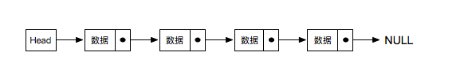
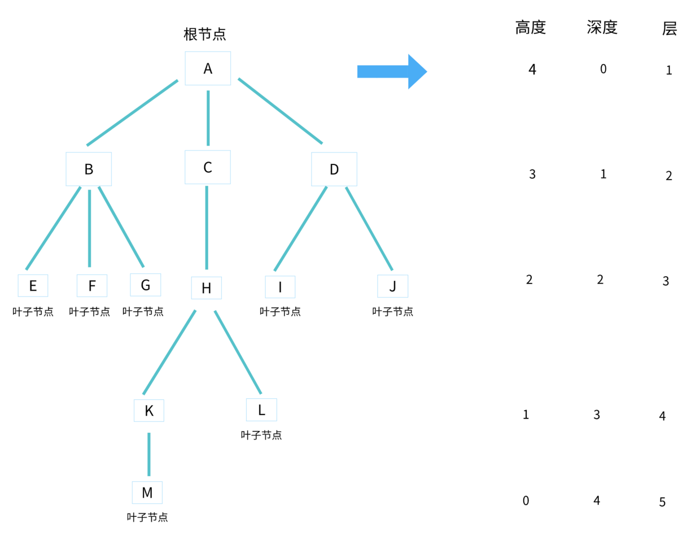
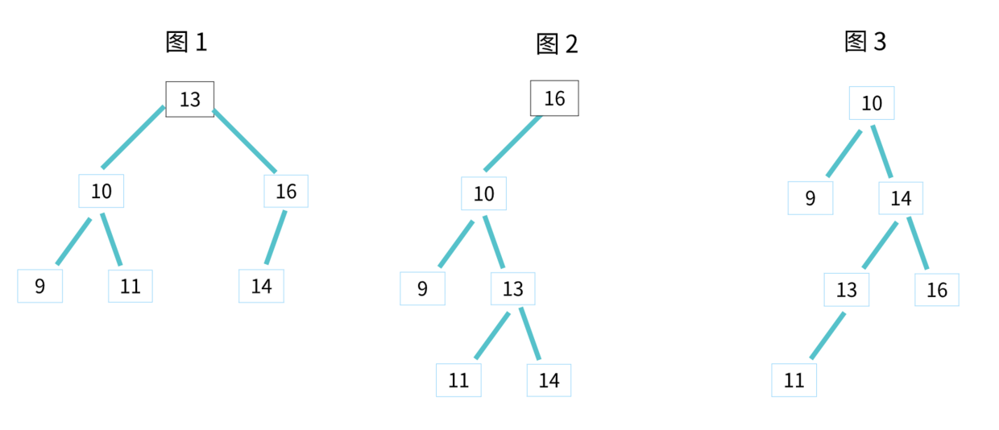
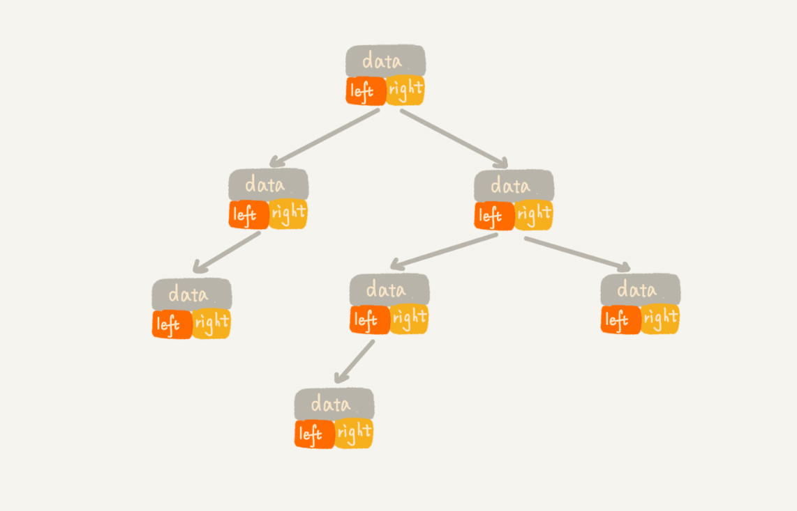
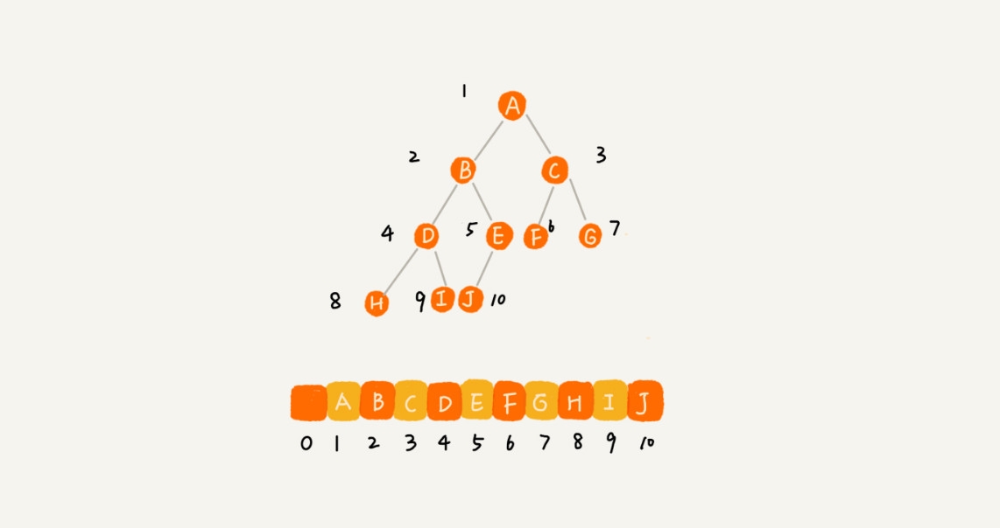
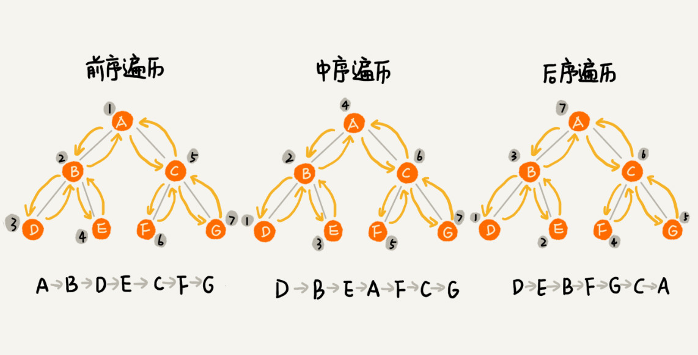

## 链表

> 由于数组的存储数据的位置也相邻，因此在数组中插入或者删除一个数字的时候需要耗费的大量的时间操作，一个个挪动数据存储的位置；
>
> 因此我们引入了链表结构，利用不连续的空间存储数据，再使用指针指向下一个节点的位置；


- #### 单项链表

  

  >特点：
  >
  >- 可用任意的内存空间存储数据；
  >- 每个节点都由**数据本身和一个指向后续节点的指针组成**；
  >- 整个链表存取**必须从头指针 `head` 开始**，头指针指向第一个节点；
  >- 最后一个节点的指针指向 NULL；

  

  - 实现一个链表

    ````js
    
    ````

    

## 树

>节点：树中的每个元素称为节点，如 A、B、C、D、E、F、G、H、I、J。
>
>父节点：指向子节点的节点，如 A。
>
>子节点：被父节点指向的节点，如 A 的孩子 B、C、D。
>
>父子关系：相邻两节点的连线，称为父子关系，如 A 与 B，C 与 H，D 与 J。
>
>根节点：没有父节点的节点，如 A。
>
>叶子节点：没有子节点的节点，如 E、F、G、H、I、J。
>
>兄弟节点：具有相同父节点的多个节点称为兄弟节点，如 B、C、D。
>
>节点的高度：节点到叶子节点的`最长路径`所包含的边数。
>
>节点的深度：根节点到节点的路径所包含的边数。
>
>节点层数：节点的深度 +1（根节点的层数是 1 ）。
>
>树的高度：等于根节点的高度。
>
>森林： n 棵互不相交的树的集合。



注意：高度和深度是从0开始计数的，而层是从1开始计数的；


**堆**其实是一种特殊的树。只要满足这两点，它就是一个堆

- 堆是一个完全二叉树。
  完全二叉树：除了最后一层，其他层的节点个数都是满的，最后一层的节点都靠左排列。
- 堆中每一个节点的值都必须大于等于（或小于等于）其子树中每个节点的值。
  也可以说：堆中每个节点的值都大于等于（或者小于等于）其左右子节点的值。这两种表述是等价的。

换而言之，**堆只可以保证最顶层的数字是最小或者最大的**；


#### 二叉查找树：特殊的二叉树，相对`较小`的值保存在`左节点`中，`较大`的值保存在`右节点`中



#### 完全二叉树的储存：

- ##### 链式存储

> 每个节点由 3 个字段，其中一个存储数据，另外两个是指向左右子节点的指针
> 我们只要拎住根节点，就可以通过左右子节点的指针，把整棵树都串起来
> 这种存储方式比较常用，大部分二叉树代码都是通过这种方式实现的；




- ##### 顺序存储

> 用数组来存储，对于完全二叉树，如果节点 X 存储在数组中的下标为 i ，那么它的左子节点的存储下标为 2 * i ，右子节点的下标为 2 * i + 1，反过来，下标 i / 2 位置存储的就是该节点的父节点。
>
> 注意：根节点存储在下标为 1 的位置。完全二叉树用数组来存储是最省内存的方式。




二叉树的**三种遍历**方式：



三种遍历中，每个节点至多被访问2次，跟节点的个数n成正比，所以时间复杂度是O(n)；


现用 JS 代码实现二叉树数据结构：

- 创建一个二叉树的类：

  ```js
  
  ```


