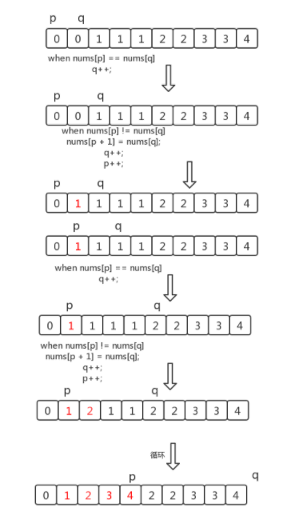
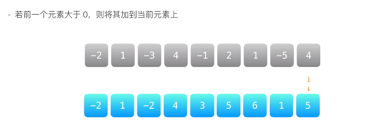
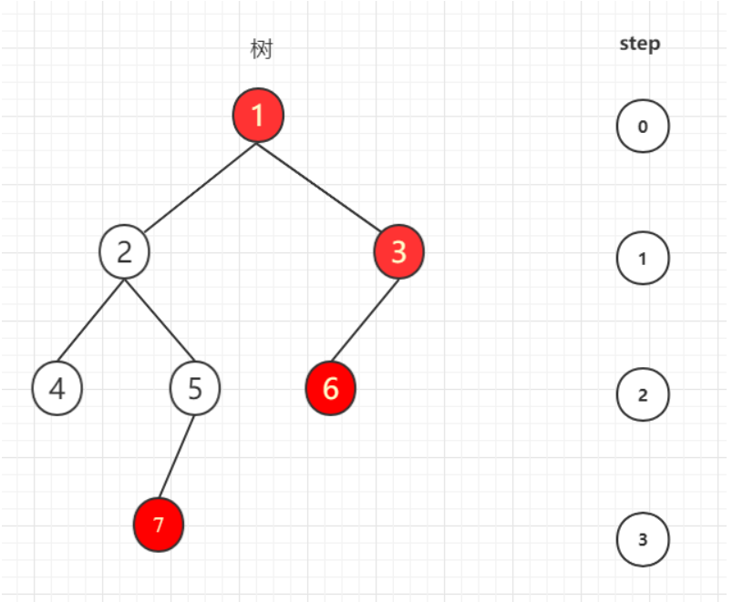

# LeetCode算法

------


#### 3月2日

> 第26题 删除**排序数组**中的重复项
>
> 原地删除：不使用新数组，并原数组长度不变

**双指针**：



使用p 和 q 两个指针指向数组中不同位置的元素，p = 0，q = p + 1；如果 arr[ p ] == arr [ q ];则 q 指针向后移动一格，p指针位置不变；反之，则给 arr[p + 1] 赋值为 arr [ q ]，且 p，q指针同时向后移动一格；

````js
var removeDuplicates = function(nums) {
    // 定义p指针初始位置为0
    var p = 0;
    // 定义q指针，无论两指针位置数值是否相等，q指针都要向后位移一格
    for(var q = 1; q < nums.length; q++){
        if(nums[p] != nums[q]){
            nums[p + 1] = nums[q]
            p++;
        }
    }
    console.log(nums.length);
    return p + 1;
};
````


#### 3月3日

> 第27题  移除元素
>
> 原地删除：不使用新数组，并原数组长度不变

方法 一：**直接覆盖**

使用p 和 q 两个指针指向数组中**相同位置**的元素，p = 0，q = 0；其中 p 用来指向原数组中删除与val相等的元素后，更新元素的位置，q指针指向每次与val对比的元素；

````js
var removeElement = function(nums, val) {
    var p = 0;
    for (var q = 0; q < nums.length; q++) {
        if (val != nums[q]) {
            nums[p] = nums[q];
            p++;
        }
    }
    return p;
};
````

方法二：**双指针**

使用两个指针，p指向数组头，max指向数组尾，val与数组头数字作比较，一旦相等则将max指向位置数字赋值给p指向位置数字，同时max指针向前挪一格；

````js
var removeElement = function(nums, val) {
    var max = nums.length;
    for (var p = 0; p < max;) {
        if (val == nums[p]) {
            // 如果两值相等，则将p位置数值赋值为数组末尾值
            nums[p] = nums[max - 1];
            // 将数组长度减一
            max--;
        }else {
            p++;
        }
    }
    return p;
};
````


>第28题  strStr() 
>
>给定一个 haystack 字符串和一个 needle 字符串，在 haystack 字符串中找出 needle 字符串出现的第一个位置 (从0开始)。如果不存在，则返回  -1。

错误解法：

````js
var strStr = function(haystack, needle) {
    var count = -1;
    if (needle.length == 0) {
        count = 0;
    }
    for (var i = 0, j = 0; i < haystack.length; i++) {
        if (needle.length > haystack.length) {
            count = -1;
            break;
        }
        if (needle.length == 0) {
            count = 0;
            break;
        } else {
            if (count == -1) {
                if (needle[j] == haystack[i]) {
                    j++;
                    count = i;
                    if (j >= needle.length) {
                        break;
                    }
                }
            } else {
                if (needle[j] == haystack[i]) {
                    j++;
                    if (j >= needle.length) {
                        break;
                    }
                } else {
                    count = -1;
                }
            }
        }
    }
    return count;
};
````


正确解法：

````js
var strStr = function(haystack, needle) {
    if (needle == '') return 0;
    for (var i = 0; i < haystack.length; i++) {
        if (haystack[i] === needle[0]) {
            var flag = true;
            // 如果第一位相等则进入循环
            for (var j = 1; j < needle.length; j++) {
                // 一旦有一位不相等则 令flag为flase并退出内层循环
                if (haystack[i + j] != needle[j]) {
                    flag = false;
                    break;
                }
            }
            if (flag) return i;
        }
    }
    return -1;
};
````

或者

````js
var strStr = function(haystack, needle) {
    if (needle == '') return 0;
    for (var i = 0; i < haystack.length; i++) {
        if (haystack[i] === needle[0]) {
            // 一旦第一位相似，就截取haystack后续与needle字符长度相等的字符穿比较
            if (haystack.substring(i, i + needle.length) === needle) {
                return i;
            }
        }
    }
    return -1;
};
````


#### 3月4日

> 第35题  搜索插入位置
>
> 给定一个排序数组和一个目标值，在数组中找到目标值，并返回其索引。如果目标值不存在于数组中，返回它将会被按顺序插入的位置。

方法 一：**直接查找**

使用p 和 q 两个指针指向数组中**相同位置**的元素，p = 0，q = 0；其中 p 用来指向原数组中删除与val相等的元素后，更新元素的位置，q指针指向每次与val对比的元素；

````js
// 方法一：
var searchInsert = function(nums, target) {
    var index = nums.indexOf(target);
    // 如果数字在该数组中不存在，则走入循环，寻找数字插入位置并返回
    if (index == -1) {
        for (var i = 0; i < nums.length; i++) {
            if (nums[i] > target) {
                nums.splice(i, 0, target);
                return i;
            }
            if (i == nums.length - 1) {
                return i + 1;
            }
        }
    } else {
        return index;
    }
};

// 方法二：执行速度最快
var searchInsert = function(nums, target) {
    var index = 0;
    if (nums.lentgh === 0) {
        return index;
    }
    while (nums[index] < target) {
       index++;
    }
    return index;
};
````

方法二：**二分查找**

使用三个指针，`l_hand` 指向数组头，`r_hand` 指向数组尾，`mid` 表示头尾指针平均数向下取整，`target` 与 `mid` 数字所指位置作比较；

- 如果 `target < arr[mid]` , 则 `r_hand = mid - 1` ，并重新计算mid； 

- 如果 `target > arr[mid]` , 则 `l_hand = mid + 1` ，并重新计算mid；

对比 `r_hand` 与 `l_hand` 的值，若 `r_hand < l_hand`，则立即停止循环，输出 `l_hand`;

````js
var searchInsert = function(nums, target) {
    var l_hand = 0, r_hand = nums.length - 1;
    while (true) {
        // 每次l_hand或者r_hand改变后，重新计算mid的值
        var mid = parseInt((l_hand + r_hand) / 2);
        if (l_hand > r_hand) {
            return l_hand;
        }
        if (nums[mid] < target) {
            l_hand = mid + 1;
        } else {
            r_hand = mid - 1;
        }
    }
};
````


<u>**Tips: 二分查找适用于数组有序排列，查找目标数的场景；**</u>


> 第35题  最长公共前缀
>
> 编写一个函数来查找字符串数组中的最长公共前缀。如果不存在公共前缀，返回空字符串 `""`。

````js
var longestCommonPrefix = function(strs) {
    if (strs.length === 0) {
        return '';
    } else if (strs.length === 1 && strs[0] != '') {
        return strs[0];
    }

    // 计算最大公共长度
    var length = strs[0].split('').length;
    for (var k = 1; k < strs.length; k++) {
        if (length > strs[k].split('').length) {
            length = strs[k].split('').length + 1;
        }
        
    }
    
    for (var i = 0, j = 0; i < strs.length; i++) {
        if (strs[i] == '') {
            return '';
        }
        if (strs[i][j] === strs[i + 1][j]) {
            // 判断数组项是否达到最后一个
            if (i == strs.length - 2) {
                // 是的话则将数组项归零
                i = -1;
                // 判断j的长度是否超过最大公共总长
                if (j < length - 1) {
                    j++;
                } else {
                    return strs[0].slice(0, j + 1);
                }
            }
        } else if (j != 0){
            return strs[0].slice(0, j);
        } else {
            return '';
        }
    }
};
````

要注意几种特殊情况：

1. 数组长度为0，无法进入循环；
2. 数组长度为1，且不为空串；
3. 数组长度不为0，且每一项都相等；


#### 3月5日

> 第35题  回文数
>
> 给你一个整数 x ，如果 x 是一个回文整数，返回 true ；否则，返回 false 。
>
> 回文数是指正序（从左向右）和倒序（从右向左）读都是一样的整数。例如，121 是回文，而 123 不是。

方法 一：直接查找

使用 `l_hand`  和 `r_hand` 两个指分别指向数组中最头和最尾的元素，`l_hand = 0，r_hand = arr_lentgh` ；对比两下标位置数的大小，直到 `l_hand > r_hand` 结束循环；

````js
var isPalindrome = function(x) {
    var x_str = x.toString();
    // 为个位数时，不进入for循环直接跳出
    var l_hand = 0, r_hand = x_str.length - 1;
    // 错误while循环写法
    // while (l_hand != r_hand)
    // 此时只考虑到了x为奇数的情况，未考虑到x为偶数的情况
    // 输入11时，即无法走出循环，也不符合 return false; 条件
    while (l_hand < r_hand) {
        if (x_str[l_hand] == x_str[r_hand]) {
            l_hand++;
            r_hand--;
        } else {
            return false;
        }

    }
    return true;
};
````


>第20题 有效的括号
>
>给定一个只包括 '('，')'，'{'，'}'，'['，']' 的字符串 s ，判断字符串是否有效。
>
>有效字符串需满足：
>
>1. 左括号必须用相同类型的右括号闭合；
>2. 左括号必须以正确的顺序闭合；

**栈存储：**

一个栈遵循 Last In Frist Out 即 后进先出 的原则，本题方法是：

1. 先定义一个新数组 `arr[]`，该数组只可使用 `push() 和 pop()` 方法，即只能从数组尾部操作数组，则该数组可视为一个后进先出的栈；
2. 遍历一遍数组
   - 每当遍历到 `'(' || '{' || '['` 时，将 `'(' || '{' || '['`  推入 `arr[]`；
   - 每当遍历到 `')' || '}' || ']'` 时，将该符号与 `arr.pop()` 返回的值比较； 
3. 若比较的值相等，则继续遍历数组；反之，`return false;`
4. 直至循环结束，此时检查 `arr[]` 是否为空数组，若为空则 `return true` ；反之，`return false;`

注意：考虑 s 为单括号的情况；

````js
var isValid = function(s) {
    var arr = [];
    for (var i = 0; i < s.length; i++) {
        if (s[i] == '(' || s[i] == '[' || s[i] == '{') {
            // arr[arr.length] = s[i];
            arr.push(s[i]);
        } else {
            if (s[i] == ')' && arr.pop() == '(' || s[i] == '}' && arr.pop() == '{' || s[i] == ']' && arr.pop() == '[') {
                
            } else {
                return false;
            }
        }
    }
    // 此次，特别注意要写else，因为要考虑到s为单括号的情况(s = '[') 
    if (arr.length == 0) {
        return true;
    } else {
        return false;
    }

};
````


#### 3月7日

> 第53题  最大子序列和
>
> 给定一个整数数组 `nums` ，找到一个具有最大和的连续子数组（子数组最少包含一个元素），返回其最大和。

方法 一：**动态规划**

先遍历一遍数组如果前一个元素大于0，则与前一个元素相加，反之则保持自身元素不变；如此得到一个新数组，此时再遍历一遍数组，所得到的最大值，就是最大子序列的和；



````js
var maxSubArray = function(nums) {
    for (var i = 1; i < nums.length; i++) {
        if (nums[i - 1] > 0) {
            nums[i] += nums[i - 1];
        }
    }
    var max = nums[0]
    for (var j = 1; j < nums.length; j++) {
        if (max < nums[j]) {
            max = nums[j];
        }
    }
    return max;
};
````

**动态规划 (Dynamic Progarmming) 实质上是将一个大问题拆解成若干的相同或相似的小问题；通过寻求小问题的解，推算出大问题的解。**

方法二：**贪心法**

先设定一个当前最大值 `temp_max` , 此时遍历数组，如果 `temp_max` 为负数就领 `temp_max == nums[s]`，即将 当前遍历的数组 赋值给 当前最大值 ，反之则将 `temp_max += num[i]`，且每一次遍历都要将 `temp_max` 与 `max` 的值作比较；`max` 存储的是在一整轮遍历下来的最大值，最后 `return max` 得到的就是最大子序列和；

````js
var maxSubArray = function(nums) {
    // 当前和
    var temp_max = nums[0];
    // 最大和
    var max = nums[0];
    
    for (var i = 1; i < nums.length; i++) {
        if (temp_max > 0) {
            temp_max += nums[i];
        } else {
            temp_max = nums[i];
        }
        if (temp_max > max) {
            max = temp_max;
        }
    }
    return max;
};
````


> 第58题  最大子序列和
>
> 给你一个字符串 s，由若干单词组成，单词之间用空格隔开。返回字符串中最后一个单词的长度。如果不存在最后一个单词，请返回 0 。
>
> **注意：最后一个单词末尾的空格需要消除**

方法一：

先遍历一遍数组，如果末尾为空格则删除空格，直至末尾没有空格为止。

````js
var lengthOfLastWord = function(s) {
    var arr_s = s.split(' ');
    // 要注意末尾的空格
    for (var i = arr_s.length - 1; i >= 0; i--) {
        if (arr_s[i] == '') {
            arr_s.pop();
        } else {
            break;
        }
    }
    // 如果有一个字符串全是空格，则在删除所有空格之后长度为0
    if (arr_s.length == 0) {
        return 0;
    }
    return arr_s.pop().length;
};
````


#### 3月8日

> 第66题  加一
>
> 给定一个由 **整数** 组成的 **非空** 数组所表示的非负整数，在该数的基础上加一；最高位数字存放在数组的首位， 数组中每个元素只存储**单个**数字；
>
> 即123 + 1 = 124；99999 + 1 = 100000；
>
> 改写为 [1, 2, 3] -> [1, 2, 4];  [9, 9, 9, 9, 9] -> [1, 0, 0, 0, 0, 0]

方法 一：直接遍历

首先令数组 `digits` 末位加一，此时从末尾遍历数组，逐一向前检查是否有哪一位为10，若为10，则将该位归零，并将前一位进行加一操作；如果 `i == 0 && digits[i] == 10` 则在数组最前端 `unshift(1)`；

````js
var plusOne = function(digits) {
    digits[digits.length - 1]++;
    for (var i  = digits.length - 1; i >= 0; i-- ) {
        if (digits[i] == 10) {
            digits[i] = 0;
            digits[i - 1]++;
            if (i == 0) {
                digits.unshift(1);
                digits[i + 1] = 0;
            }
        }
    }
    return digits;
};
````

方法二：**数组转数字，后拆分为数组** (错误解法)

````js
var plusOne = function(digits) {
    var num_digits = Number(digits.join(''));
    num_digits++;
    digits = num_digits.toString().split('');
    // 此时digits 是一个字符串数组，每个数字都是作为字符串的形式存在于数组中
    // 调用digits.map(Number),是为了把每个字符串数字转化为数字
    return digits.map(Number);
};
````

> 当输入数组为 [6,1,4,5,3,9,0,1,9,5,1,8,6,7,0,5,4] 时
>
> 由于Number()，可识别最大范围为 16位
>
> 因此此时数字越界，Number无法正确转换为数字；


>第70题 爬楼梯
>
>假设你正在爬楼梯。需要 *n* 阶你才能到达楼顶；每次你可以爬 1 或 2 个台阶。你有多少种不同的方法可以爬到楼顶呢？

方法一：**动态规划 (Dynamic Programming)**

推规律可得，第 `n` 级的跳法次数 = 第 `n - 1` 级的跳法次数 + 第 `n - 2` 级的跳法次数；

因此先得到已知的当 `n < 4` 时，函数 `return n`；后定义指针 `prev` 初始值设定为 `n = 2` 时的值，`curr` 初始值设定为 `n = 3` 时的值；

进入循环，求得 跳 `n` 级台阶的跳法次数，同时更新 `prev 和 curr` 的值； 

````js
var climbStairs = function(n) {
    if(n < 4){
        return n;
    }
    // 指向 跳两级台阶的跳法次数
    var prev = 2;
    // 指向 跳三级台阶的跳法次数
    var curr = 3;
    for(var i = 4; i <= n; i++){
        // 得到跳 n级台阶的跳法次数
        var sum = prev + curr;
        // 更新为跳 n - 1级台阶的跳法次数
        prev = curr;
        // 更新为跳 n级台阶的跳法次数
        curr = sum;
    }
    return curr;
};
````


#### 3月9日

> 第88题  合并两个有序数组
>
> 给你两个**有序**整数数组 `nums1` 和 `nums2`，请你将 `nums2` 合并到 `nums1` 中*，*使 `nums1` 成为一个有序数组。

方法 一：直接遍历

````js
var merge = function(nums1, m, nums2, n) {
    nums1.splice(m, n);         // 删除nums1中长度为nums2，数值为0的数
    // nums1 = nums1.concat(nums2);       
    // 连接nums1和nums2，但是由于此方法不改变返回值,不可用
    // 改用循环将nums2的值推入nums1
    for (var k in nums2) {
        nums1.push(nums2[k]);
    }
    // 外部循环代表循环次数和每次循环的数组的下标值
    for (var i = m, index = 0; i < n + m; i++) {
        // 内层循环代表每次循环的第一个对比的下标
        for (var j = i ; j > index; j--) {
            // console.log(nums1[j], nums1[j - 1])
            if (nums1[j] < nums1[j - 1]) {
                var num = nums1.splice(j, 1);
                nums1.splice(j - 1, 0, num[0]);
                // console.log(nums1);
            } 
            // console.log(j);
        }
        // 因为nums2也是有序的所以第二个值不可能小于第一个值
        // 因此为了减少对比次数，每次只要对比到上次排序的数字的下标即可，减少了对比次数
        // j是数字排序后每次存入的位置的后一个，index是数字每次排序存入时的位置
        index = j - 1;
    }
    return nums1;
};
````


#### 3月10日

> 第136题  只出现一次的数字
>
> 给定一个**非空**整数数组，除了某个元素只出现一次以外，其余每个元素均出现两次。找出那个只出现了一次的元素。

方法 一：直接遍历

首先遍历数组的一半，从尾部开始推出数字，在推出一个数的的同时，用 `indexof()`在数组中寻找与该数相等的数字，若返回 `-1` 则表示无该数，退出循环 `return num` ；反之则使用 `splice()` 删除该数在数组中的重复数字，然后继续循环；

````js
var singleNumber = function(nums) {
    // 因为数组的长度一直在动态变化，所以需要保存住最开始的值
    var length = nums.length;
    for (var i = 0, num; i <  (length + 1) / 2; i++) {
        num  = nums.pop();
        if(nums.indexOf(num) != -1) {
            nums.splice(nums.indexOf(num), 1)
        } else {
            break;
        }
    }
    return num;
};
````

方法二：**位运算 (异或运算)**

首先定义一个 `ans =  0` ，遍历数组，逐个与 `ans` 做异或运算，由于在异或运算中相同的值异或结果会归零，所以最后异或运算得到的值就是数组中只出现一次的数字；

````js
var singleNumber = function(nums) {
    let ans = 0;
    for(const num of nums) {
        ans ^= num;
    }
    return ans;
};
````

> 位运算有几种：
>
> - 与运算 (&)
> - 或运算 (|)
> - 异或运算 (^)
> - 按位取反 (~)：最高位为1表示负数
> - 左移 (<<)：2 的 二进制 (10) 左移一位是 (100)，即为 4
> - 右移 (>>)：与上同理 4 的右移为 2

位运算被使用时都是通过计算机底层将**数字先转换成二进制**然后对其进行各种运算；


> 剑指Offer. 39  数组中出现次数超一半的数字
>
> 数组中有一个数字出现的次数超过数组长度的一半，请找出这个数字，你可以假设数组是非空的，并且给定的数组总是存在多数元素。

方法 一：直接遍历计数

````js
var majorityElement = function(nums) {
    var times = (nums.length + 1) / 2;
    
    for (var i = 0; i < nums.length; i++) {
        var count = 1;
        // 从顶部推出一个元素
        var num = nums.shift();
        // 当数组能检索到与这个元素值相同的元素时，就删除这个元素，并计数器值加一
        while (nums.indexOf(num) != -1) {
            nums.splice(nums.indexOf(num), 1);
            count++;
        }
        // 当无法检索到值相同的元素了，跳出循环，将计数器次数与预先设置好的门限值比较，若大于门限值，便返回这个数的值
        if (count >= times) {
            return num;
        }
    }
};
````

方法二：**摩尔投票法**

利用正负抵消的概念，设置一个 `vote = 0`，一旦遇见相同的数就令 `vote++ ` ，反之则 `vote--`，每当 `vote = 0` 时说明已遍历数字已经全部抵消，则指定在 `vote = 0` 的位置为一个新的 `more` 值；如此遍历直到结束， 返回 `more` 值；

````js
var majorityElement = function(nums) { 
    // 众数为more，计数器为vote
    var more = 0, vote = 0;
    for (var i = 0; i < nums.length; i++) {
        // 每当vote为0，重新定义more
        if (vote == 0) {
            more = nums[i];
            vote = 1;
            continue;
        }
        if (nums[i] == more) {
            vote++;
        } else {
            vote--;
        }
    }
    return more;
};
````


#### 3月11日

> 第925题  长按键入
>
> 你的朋友正在使用键盘输入他的名字 name。偶尔，在键入字符 c 时，按键可能会被长按，而字符可能被输入 1 次或多次。
>
> 你将会检查键盘输入的字符 typed。如果它对应的可能是你的朋友的名字（其中一些字符可能被长按），那么就返回 True。

方法 一：直接遍历

首先定义一个函数 `time`，遍历两个数组，记录每个字母出现的次数和字母的值，并将数据推入计数新的数组，最后`return times_arr`；对比两个新数组， 若出现值不等、出现次数不够多、或两数组长度不相等任一条件出现则返回false；反之则返回 true;

````js
var isLongPressedName = function(name, typed) {
    // 按顺序记录每个字母出现的次数及其值
    function time(arr) {
        var times_arr = [];
        for (var i = 0, count = 1; i < arr.length; i++) {
            if (arr[i] == arr[i + 1]) {
                count++;
            } else {
                times_arr.push(arr[i]);
                times_arr.push(count);
                count = 1;
            }
        }
        return times_arr;
    }

    var name_arr = time(name), typed_arr = time(typed);
    for (var i = 0; i < name_arr.length; i += 2) {
        // 若值不等、出现次数不够多、或两数组长度不相等任一条件出现则返回false
        if (name_arr[i] != typed_arr[i] || typed_arr[i + 1] < name_arr[i + 1] || name_arr.length != typed_arr.length) {
            return false;
        }
    }
    return true;
};
````

方法二：**双指针**

定义两个指针，j 指向 ` name[0]` ,i 指向 `typed[0]`；此时对比 `name[j] 和 type[i]` 的值，如果相等则 `j++,i++` ；若不等则对比 `typed[i] 和 typed[i - 1]` 的值，若相等 `i++` 后继续循环比较，不等则 `return false` ； 循环结束后 `j 与 name.length` 作比较，确定`name` 已经遍历完毕；若为遍历完毕，`return false`

````js
var isLongPressedName = function(name, typed) {
    /*
    for (var j = 0, i = 0; j < name.length; i++) {
        if (name[j] == typed[i]) {
            j++;
        } else {
            if (typed[i] != typed[i - 1]) {
                return false;
            } 
        }
    }
    return true;

    */
    // 如果只有以上代码的话 是错误的，因未考虑到typed中还含有多余其他字母的情况
    // 因此将 j < name.length 的条件改为 i < typed.length
    // 但只有这样也是不够的，因为可能会存在 name还含有多余字符串未对比的情况
    // 因此在循环之后还需要加一个if条件语句 确定name字符串已经扫描完毕
    for (var j = 0, i = 0; i < typed.length; i++) {
        if (name[j] == typed[i]) {
            j++;
        } else {
            if (typed[i] != typed[i - 1]) {
                return false;
            } 
        }
    }
    if (j >= name.length) {
        return true;
    }
    return false;
}
````


> 第38题  外观数列
>
> 给定一个正整数 `n` ，输出外观数列的第 `n` 项；
>
> [外观数列] 是一个整数序列，从数字 1 开始，序列中的每一项都是对前一项的描述。

 方法一：递归

````js
var countAndSay = function(n) {
    if (n == 1) {
        return "1";
    }
    // 在此时对n进行递归
    var n_str = countAndSay(n - 1).toString();
    var times_arr = [];
    for (var i = 0, count = 1; i < n_str.length; i++) {
        if (n_str[i] == n_str[i + 1]) {
            count++;
        } else {
            times_arr.push(count);
            times_arr.push(n_str[i]);
            count = 1;
        }
    }
    return times_arr.join('');
};
````

方法二：**正则表达式合并**

````js
var countAndSay = function(n) {
    let prev = '1'
    for(let i = 1; i < n; i++){
        prev = prev.replace(/(\d)\1*/g, item =>`${item.length}${item[0]}`)
    }
    return prev
};
````


#### 3月12日

> 第237题 删除链表中的Node节点
>
> 写一个函数，删除链表中的一个节点；你将不会被给予一个访问列表的头，相反你将会被直接给予一个node节点去删除，这个被删除的节点不会是尾节点

方法 一：

将节点自身的值改为下一个节点的值，然后再将自身的next指向下个节点指向的next；即完全替代下个节点并将下个节点抛弃；

````js
var deleteNode = function(node) {
    node.val = node.next.val;
    node.next = node.next.next;
};
````


>第1290题 将链表中的二进制数字转换为整数
>
>现有一个单链表的头作为参数，在链表中的每个数为 0 或 1，这个链表保存一个表示二进制的数组，返回这个数的十进制的值；

方法一：

首先定义一个空数组，将链表的数字都反向推入至数组中 (反向推入是为了方便后续转换为十进制的计算)；后遍历该数组，一旦某位 `arr[i] == 1` 使用转换方法将其转换，最后返回值`sum`；

````js
var getDecimalValue = function(head) {
    var arr = [], sum = 0;
    var currentNode = head;
    while (currentNode.next != null) {
        arr.unshift(currentNode.val);
        currentNode = currentNode.next;
    }
    // 因为当链表扫描到最后一位时，跳出循环，此时最后一位的值还没有推入数组
    // 因此在跳出循环后，要将最后一位的值推入
    arr.unshift(currentNode.val);
    for (var i in arr) {
       // 转换十进制的计算原则
       if (arr[i] === 1) {
            sum += Math.pow(2, i)
       }
    }
    return sum;
};
````

方法二：直接遍历链表转换二进制

````js
var getDecimalValue = function(head) {
    var sum = 0;
    var currentNode = head;
    while (currentNode) {
        // 将数值左移一位＋ 现在链表所指向值
        sum = (sum << 1) + currentNode.val;
        currentNode = currentNode.next;
    }
    return sum;
};
````


>第21题 合并两个有序链表
>
>将两个升序链表合并为一个新的升序链表并返回，新链表是通过拼接给定的两个链表的所有节点组成的；

方法一：

是通过不停的比较链表当前第一个值的大小，一层层递归最后从尾部不停的返回 next 值达到拼接链表的效果；

````js
var mergeTwoLists = function(l1, l2) {
    if(l1 === null){
        return l2;
    }
    if(l2 === null){
        return l1;
    }
    if(l1.val < l2.val){
        l1.next = mergeTwoLists(l1.next, l2);
        return l1;
    }else{
        l2.next = mergeTwoLists(l1, l2.next);
        return l2;
    }
};
````


#### 3月13日

> 剑指Offer第22题 获取链表中倒数第k个节点
>
> 输入一个链表，输出该链表中倒数第k个节点，为了符合大多数人的习惯，本题从1开始计数，即链表的尾节点是倒数第1个节点。

方法 一：

先记录链表长度为 `count`，已知在倒序为 `k` 位置上的数字，在正序位置会为 `count - k `；此时已知所需打印的节点在链表中的正序位置，再遍历一遍链表，打印节点；

````js
var getKthFromEnd = function(head, k) {
    var currentNode = head;
    var count = 0;
    if (head == null) {
        return head;
    }
    while (currentNode.next != null) {
        currentNode = currentNode.next;
        count++;
    }
    count = ++count - k;
    for (var i = 0; i < count; i++) {
        head = head.next;
    }
    return head;
};
````

方法二：**快慢指针法**

当快指针 fast 走了k步的时候慢指针slow 开始走，当快指针 fast 走出的时候 (即超出边界)时， 此时的 slow 位置即为链表中倒数第k个节点 ；

````js
var getKthFromEnd = function(head, k) {
    let slow = fast = head // 快、慢指针起始位置
    while (fast) {
        fast = fast.next

        if (k-- <= 0) { // 当走过k步 之后慢指针开始启动
            slow = slow.next
        }
    }
    return slow
};
````


>剑指Offer第6题 从尾到头打印链表
>
>输入一个链表的头节点，从尾到头反过来返回每个节点的值（用数组返回）。

方法一：

````js
var reversePrint = function(head) {
    var arr = [];
    while (head) {
        arr.unshift(head.val);
        head = head.next;
    }
    return arr;
};
````


>剑指Offer第24题 反转链表
>
>定义一个函数，输入一个链表的头节点，反转该链表并输出反转后链表的头节点。

方法一：迭代

将 `curr.next` 暂时赋值给 `next`，以保存变量，从 `curr` 中将当前节点取出，存入 `prev`，再从 `next` 中取回 `curr` 的值；一直如此循环，直到 `curr == null`；

````js
var reverseList = function(head) {
    let prev = null;
    let curr = head;
    while (curr) {
        const next = curr.next;
        curr.next = prev;
        prev = curr;
        curr = next;
    }
    return prev;
};
````

方法二：递归

````js
var reverseList = function(head) {
    // 递归出口
    if (head == null || head.next == null) {
        return head;
    }
    var newHead = reverseList(head.next);
    // 将head指向的下一个节点的指向指向head
    head.next.next = head;
    // 并且断开head 对下一个节点的指向
    head.next = null;
    // 返回值一直是反转链表的头节点,也就是递归出口的那个节点
    return newHead;
};
````


#### 3月14日

> 第876题 链表的中间节点
>
> 给定一个头结点为 `head` 的非空单链表，返回链表的中间结点；如果有两个中间结点，则返回第二个中间结点。

方法 一：

先记录链表长度为 `count` ，此时已知所需打印的节点在链表中的位置，再遍历一遍链表，打印节点；

````js
var middleNode = function(head) {
    var length = 0, currentNode = head;
    while (currentNode) {
        length++;
        currentNode = currentNode.next;
    }
    console.log(length);
    if (length % 2 == 0) {
        var mid = length / 2;
    } else {
        var mid = (length - 1) / 2;
    }
    console.log(mid);
    for (var i = 0; i < mid; i++) {
        head = head.next;
    }
    return head;
};
````

方法二：**快慢指针法**

定义快慢指针`fast 和 slow`，快慢指针同时出发，慢指针走一步 `slow = slow.next`，快指针走两步 `fast = fast.next.next`，当快指针 fast 走出的时候 (即超出边界)时， 此时的 slow 位置即为链表中的中间节点 ；

````js
var middleNode = function(head) {
    slow = fast = head;
    while (fast && fast.next) {
        slow = slow.next;
        fast = fast.next.next;
    }
    return slow;
};
````


>第160题  相交链表
>
>找到两个单链表的相交起始点

方法一：

求得两个链表的长度，将长度较长的链表截去一部分长度；此时从两个链表的头开始比较，当两个链表重合返回当前节点，反之返回null；

````js
var getIntersectionNode = function(headA, headB) {
    var currentNodeA = headA, lengthA = 0;
    var currentNodeB = headB, lengthB = 0;
    while (currentNodeA) {
        lengthA++;
        currentNodeA = currentNodeA.next;
    }
    while (currentNodeB) {
        lengthB++;
        currentNodeB = currentNodeB.next;
    }
    
    while (lengthB - lengthA > 0) {
        headB = headB.next;
        lengthB--;
    }
    while (lengthA - lengthB > 0) {
        headA = headA.next;
        lengthA--;
    }
    while (headB && headA) {
        if (headB == headA) {
            return headB;
        }
        headA = headA.next;
        headB = headB.next;
    }
    return null;
};
````


#### 4月14日

> 第704题  二分查找
>
> 给定一个 n 个元素有序的（升序）整型数组 nums 和一个目标值 target  ，写一个函数搜索 nums 中的 target，如果目标值存在返回下标，否则返回 -1。

此时使用二分查找定义两个指针，获取

````js
var search = function(nums, target) {
    var lo = 0, hi = nums.length - 1;
    while (lo <= hi) {
        var mid = parseInt((lo + hi) / 2), cur = nums[mid];
        if (cur > target) {
            hi = mid - 1;
        } else if (cur < target) {
            lo = mid + 1;
        } else {
            return mid;
        }
    }
    return -1;
};
````


#### 4月19日

> 第104题  二叉树的最大深度
>
> 给定一个二叉树，找出其最大深度。

方法一：深度优先

````js
var maxDepth = function(root) {
    if (root === null) return 0;
    const left = maxDepth(root.left);
    const right = maxDepth(root.right);
    // + 1 是因为每一层的递归返回时都要给层数加1
    return Math.max(left, right) + 1;
};
````

方法二：广度优先

````js
const maxDepth = (root) => {
  if (root == null) return 0;
  const queue = [root];
  let depth = 1;
  while (queue.length) {
    // 当前层的节点个数
    const levelSize = queue.length;          
    // 逐个让当前层的节点出列
    for (let i = 0; i < levelSize; i++) {    
      // 当前出列的节点
      const cur = queue.shift();            
      // 左右子节点入列
      if (cur.left) queue.push(cur.left);
      if (cur.right) queue.push(cur.right); 
    }
    // 当前层所有节点已经出列，如果队列不为空，说明有下一层节点，depth+1
    if (queue.length) depth++;
  }
  return depth;
};
````


> 第102题  二叉树的层序遍历
>
> 给定二叉树，请你返回其按层序遍历得到的节点值 (即逐层地，从左到右访问所有节点)

方法一：广度优先

````js
var levelOrder = function(root) {
    var res = [];
    if (root === null) return res;
    const queue = [root];
    while (queue.length != 0) {
        const levelSize = queue.length;
        // 逐个让当前节点出列，并打印该出列节点
        for (var i = 0, arr = []; i < levelSize; i++) {
            // 当前节点出列
            const cur = queue.shift();
            arr.push(cur.val);
            // 该节点左右子节点入列
            if (cur.left) queue.push(cur.left);
            if (cur.right) queue.push(cur.right);
            console.log(arr);
        }
        res.push(arr);
        
    }
    return res;
};
````


#### 4月21日

> 第94题  二叉树的中序遍历
>
> 给定一个二叉树的根节点 `root` ，返回它的中序遍历。

方法一：迭代

````js
var inorderTraversal = function(root) {
    // 创建一个栈
    var stk = [];
    // 创建一个结果数组一遍返回
    var res = [];
    while (root || stk.length) {
        // 先将左节点都推入栈中
        while (root) {
            stk.push(root);
            root = root.left;
        }
        // 弹出左节点，令当前指向节点等于弹出的节点
        root = stk.pop();
        // 将该弹出节点的值推入结果数组
        res.push(root.val);
        // 同时当前节点也相当于一个中间节点，当其被遍历后，遍历右节点
        // 因此将指针指向当前节点的右节点
        root = root.right;
    }
    return res;
    
};
````

方法二：递归

````js
var inorderTraversal = function(root) {
    var res = [];
    function inorder(node) {
        // 递归出口
        if (node === null) {
            return;
        }
        // 先遍历左边的所有节点
        inorder(node.left);
        // 将当前节点推入数组
        res.push(node.val);
        // 因为当前节点同时也是中间节点
        // 遍历中间节点后遍历右边节点
        inorder(node.right);
    }
    inorder(root);
    return res;
    
};
````


#### 4月22日

> 第15题  三数之和
>
> 给你一个包含 n 个整数的数组 nums，判断 nums 中是否存在三个元素 a，b，c ，使得 a + b + c = 0 ？请你找出所有和为 0 且不重复的三元组

方法一：双指针

````js
var threeSum = function(nums) {
    let res = [];
    if (nums.length < 3) return res;
    // 将数组排序
    nums.sort((a, b) => a - b);
    for (let i = 0; i < nums.length; i++) {
        // 如果当前数字大于0，后面所有数字的和无论如何都大于0
        // 直接返回当前结果数组
        if (nums[i] > 0)  return res;
        if(i > 0 && nums[i] == nums[i-1]) continue; // ???? [0,0,0]
        let L = i + 1, R = nums.length - 1;
        while (L < R) {
            const sum = nums[i] + nums[L] + nums[R];
            if (sum == 0) {
                res.push([nums[i], nums[L], nums[R]]);
                while (L < R && nums[L] == nums[L + 1]) L++;	// 去重
                while (L < R && nums[R] == nums[R - 1]) R++;	// 去重
                L++;
                R--;
            }
            else if (sum < 0)  L++; 
            else if (sum > 0) R--;
        }
    }
    return res;
};
````


>第226题  翻转二叉树

方法一：递归

````js
var invertTree = function(root) {
    // 递归出口
    if (root === null) {
        return null;
    }
    // 左右子树进行交换
    let temp = root.left;
    root.left = root.right;
    root.right = temp;
    // 先递归左子树
    invertTree(root.left);
    // 后递归右子树
    invertTree(root.right);
    return root;
};
````


#### 4月23日

> 第199题  二叉树的右视图
>
> 给定一棵二叉树，想象自己站在它的右侧，按照从顶部到底部的顺序，返回从右侧所能看到的节点值

方法一：BFS —— 广度遍历

````js
var rightSideView = function(root) {
  if(!root) return [];
  let queue = [root]                        // 队列 把树顶加入队列
  let arr = []                              // 用来存储每层最后个元素值
  while(queue.length > 0){
    let len = queue.length
    while (len) {
      let node = queue.shift()               // 取出队列第一个元素
      if(len === 1) arr.push(node.val)       
      // 当是 当前一层的最后一个元素时，把值加入arr
      if(node.left) queue.push(node.left)    // 继续往队列添加元素
      if(node.right) queue.push(node.right)
      len--
    }
  }
  return arr
};
````

方法二：DFS —— 深度遍历 (递归)



````js
var rightSideView = function(root) {
  if(!root) return []
  let arr = []
  dfs(root, 0, arr)
  return arr
};
function dfs (root, step, res) {
  if(root){
    if(res.length === step){
      res.push(root.val)           // 当数组长度等于当前 深度 时, 把当前的值加入数组
    }
    // console.log(step, '-------', res)
    dfs(root.right, step + 1, res) // 先从右边开始, 当右边没了, 再轮到左边
    dfs(root.left, step + 1, res)
  }
}
````


#### 5月6日

> 第165题  比较版本号
>
> 给你两个版本号 version1 和 version2 ，请你比较它们。
>
> 版本号由一个或多个修订号组成，各修订号由一个 '.' 连接。每个修订号由 多位数字 组成，可能包含 前导零 。每个版本号至少包含一个字符。修订号从左到右编号，下标从 0 开始，最左边的修订号下标为 0 ，下一个修订号下标为 1 ，以此类推。例如，2.5.33 和 0.1 都是有效的版本号。
>
> 比较版本号时，请按从左到右的顺序依次比较它们的修订号。比较修订号时，只需比较 忽略任何前导零后的整数值 。也就是说，修订号 1 和修订号 001 相等 。如果版本号没有指定某个下标处的修订号，则该修订号视为 0 。例如，版本 1.0 小于版本 1.1 ，因为它们下标为 0 的修订号相同，而下标为 1 的修订号分别为 0 和 1 ，0 < 1 。
>
> 返回规则如下：
>
> 如果 version1 > version2 返回 1，
> 如果 version1 < version2 返回 -1，
> 除此之外返回 0。

方法一：

````js
var compareVersion = function(version1, version2) {
    version1 = version1.split('.');
    version2 = version2.split('.');
    let n = Math.max(version1.length,version2.length)
    for(let i = 0;i < n;i++){
        // 如果此时某一版本号的下标为i的值为undefined的话，令其为0
        // 反之则用parseInt函数来清除其前导0
        let code1 = (version1[i]===undefined) ? 0 : parseInt(version1[i]);
        let code2 = (version2[i]===undefined) ? 0 : parseInt(version2[i]);
        if(code1>code2){
            return 1
        }else if(code1<code2){
            return -1
        }
    }
    return 0;
};
````

注意：**`parseInt()` 可以清除前导零**；


> 第349题  两个数组的交集
>
> 给定两个数组，编写一个函数来计算它们的交集；

方法一：排序 + 双指针

````js
var intersection = function(nums1, nums2) {
    // 数组排序
    nums1.sort((x, y) => x - y);
    nums2.sort((x, y) => x - y);
    const length1 = nums1.length, length2 = nums2.length;
    let index1 = 0, index2 = 0;
    const intersection = [];
    // 双指针法，因为数组以及排好序了所以无需循环嵌套
    while (index1 < length1 && index2 < length2) {
        const num1 = nums1[index1], num2 = nums2[index2];
        if (num1 === num2) {
            // 保证加入元素的唯一性
            if (!intersection.length || num1 !== intersection[intersection.length - 1]) {
                intersection.push(num1);
            }
            index1++;
            index2++;
        } else if (num1 < num2) {
            index1++;
        } else {
            index2++;
        }
    }
    return intersection;
};
````

先对数组进行排序，后利用双指针扫描给定数组，将相等的元素推入结果数组；

其中利用关键语句 `!intersection.length || num1 != intersection[intersection.length - 1]`，对推入的数字进行查重保证结果数组中数字的唯一性；