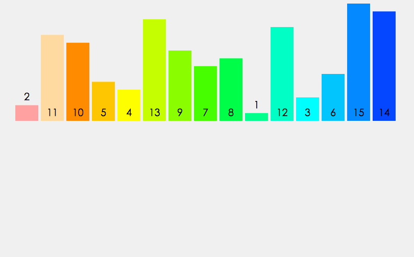

>有一组数组
>
>var arr = [-2, 3, 6, 1, -9, 2, 0, 8, 4]
>
>使用十种排序法对该数组进行排序


## 一 . 冒泡排序


````js
// 外层循环控制排序趟数
for (var i  = 0, temp; i < arr.length - 1; i++) {
    // 内层循环控制每趟排序多少次
    for (var j = arr.length; j >= i; j--) {
        if (arr[j] < arr[j - 1]) {
            temp = arr[j - 1];
            arr[j - 1] = arr[j];
            arr[j] = temp;
        }
    }
}
````

- 外层循环控制**排序趟数**，每个数组只需要进行 **`arr.length - 1` 趟排序**

- 内层循环控制**每趟排序的次数**，每次排序从后往前确认了最小的数字，则 `j >= i` 即可；

  因为第一趟排序已经确认了在 `arr[0]` 位置上的数字为最小的数字，那么第二趟排序则不用与 `arr[0]` 位置上的数值 比较了; 可直接比较到 `arr[1]` 位置上就停止比较； 

  每当 `arr[j] < arr[j - 1]` 时，则将 `arr[j] 与 arr[j - 1] ` 交换位置；


## 二.选择排序


````js
// 外层循环控制趟数
for (var i = 0, temp, min; i < arr.length - 1; i++) {
    min = arr.length - 1;
    // 内层循环控制排序搜索次数
    for (var j = arr.length - 2; j >= i; j--) {
        if (arr[min] > arr[j]) {
            min = j;
        }
    }
    temp = arr[i];
    arr[i] = arr[min];
    arr[min] = temp;
}
````

- 首先假定 `arr[min]` 的数字最小；

- 进行遍历，将 `arr[min] 与 arr[j]` 作比较，若 `arr[min] > arr[j]`，则令 `min = j`，当内层循环执行完毕，将 `arr[min] 与 arr[i](数组最前位置)` 的值进行交换；

  `j >= i` 的原理与冒泡排序相同，无需重复比较；

选择排序的原理：**从每趟遍历中找出数组中最小的值，然后把这个数值放到最前的位置上**；


## 三.插入排序


````js
// 外层循环决定排序趟数
for (var i = 1, temp; i < arr.length; i++) {
    // 决定每趟排序次数
    for (var j = i; j > 0; j--) {
        if (arr[j] < arr[j - 1]) {
            temp = arr[j];
            arr[j] = arr[j - 1];
            arr[j - 1] = temp;
        }
    }
    console.log('第' + i + '趟循环，得到数组：' + arr)
}
console.log(arr);
````

- 外层循环决定排序趟数，同时也决定 数组遍历到 是 `arr[i]` 在与前面的数进行比较排序；

- 内层循环决定每趟排序次数，由插入排序原理可知，每个 `arr[i]` 最多只需要比较 `i ` 次比较；因此设定 `j = 1`，使 `arr[j] 与 arr[j - 1]` 比较，并使 `j--` 令 `arr[j]` 逐一向前比较;

  又由于 前面的数组是已经有序的，则一旦得到 `arr[j] > arr[j - 1]` 就跳出内层循环，不再进行更多的无效比较； 

插入排序的原理：先假定 `arr[0]` 是已经排好序的数组，然后再从 `arr[1]` 开始逐一向前比较，若 `arr[1] < arr[0]`，就将两数交换位置，又开始比较 `arr[2] 与 arr[1] 和 arr[0] 的值`；直至遍历到 `arr[arr.length - 1]`，则数组排序完毕；


## 四.归并排序


````js
function mergeSort(arr) {
    // 递归的出口
    if (arr.length < 2) {
        return arr;
    }
    // 将数组一分为二
    var mid = parseInt(arr.length / 2);
    // 注意：数组的slice方法是左闭右开的
    var left = arr.slice(0, mid), right = arr.slice(mid, arr.length);
    return merge(mergeSort(left), mergeSort(right));
}
function merge(left, right) {
    // 创建一个空数组用来存储排序后的新数组
    var result = [];
    // 当两个数组都不为空时，比较两个数组第一个数的大小，将较小的数字从原数组中弹出推入新数组中
    while(left.length && right.length) {
        if (left[0] <= right[0]) {
            result.push(left.shift());
        } else {
            result.push(right.shift());
        }
    }
    // 此时将还有元素的数组中的数组逐一推入新数组中，最后返回新数组
    while (left.length) result.push(left.shift()); 
    while (right.length) result.push(right.shift());
    return result; 
}
console.log(mergeSort(arr));
````

- `mergeSort()` 函数作用是通过不断地递归将 `arr` 分割成只包含一个元素的小数组，同时也调用 `merge()` 函数，不断地对分割出来的函数进行排序；

- `merge()` 函数是对分割完成的数组进行排序的过程；

  因此归并排序实际上是一个让数组从小范围有序到大范围有序的过程； 

归并排序的原理：将一个乱序数组 `arr` 不停的一分为二成为一个个小数组，直到分隔到每个小数组中都只有一个元素，再对单独的元素进行排序；




## 五.快速排序


````js
function quickSort(arr, lo, hi) {
    // 递归的出口，当左边坐标的值大于等于右边坐标的值，则则结束函数
    if (lo >= hi) {
        return;
    }
    var flag = partition(arr, lo, hi);
    // 不停递归，将flag左边变得完全有序
    quickSort(arr, lo, flag);
    // 将flag右边变得完全有序
    quickSort(arr, flag + 1, hi);
    return arr;
}
// 使用每个数组的第一个数字做标识符，排序得到一个相对有序的数组
// 标识符左边的数字小于标识符，标识符右边的数字都大于标识符
function partition(arr, lo, hi) {
    var flag = arr[lo];
    // count为计数器，记录有几个数字小于标识符
    for (var i = lo + 1, temp, count = 0; i <= hi; i++) {
        if (arr[i] < arr[lo]) {
            count++;
            temp = arr[i];
            arr[i] = arr[lo + count];
            arr[lo + count] = temp;
        }
    }
    // 将标识符的与排序找到的小于它的数字的最右边的数换位置，即将标识符的位置置于整个数组正中间
    temp = arr[lo + count];
    arr[lo + count] = arr[lo];
    arr[lo] = temp;
    return lo + count;
}
console.log(quickSort(arr, 0, arr.length - 1));
````

- `quickSort()` 函数作用是选定一个 `flag` 标识符，利用标识符将数组一分为二，`flag`左边都小于它，右边都大于它，这样构成一个相对有序的数组，再利用递归继续对 `flag` 的左右两边的数组进行选新 `flag` 相对有序排序操作，直到最后的数组 `lo >= hi` ，即左边界大于等于有边界，说明数组已经排序完毕，此时结束递归一层层返回；

- `partition()` 函数是一个将 `flag` 标识符调整位置的操作，大致流程是将数组的第一个元素定为标识符 `flag`，定义一个计数器 `count` ，记录比 `flag` 小的元素的个数；

  然后向后遍历数组，遍历到小的元素则将 `count++`，并将元素挪到 数组的 `lo + count` 的位置；

  遍历完毕后，将 `flag` 与 `lo + count` 位置上的数字交换，此时就成功的将 `flag` 至于数组的正确位置；

快速排序的原理：先确定一个乱序数组 `arr` 的标识符 `flag` 的位置，然后再对左右两边的小数组进行排序，不停的确定 `flag`，该排序本质上是使数组从相对有序到绝对有序的过程；


::: tip TIPS:

堆排序、希尔排序、计数排序、基数排序、桶排序

后续更新中... 

:::