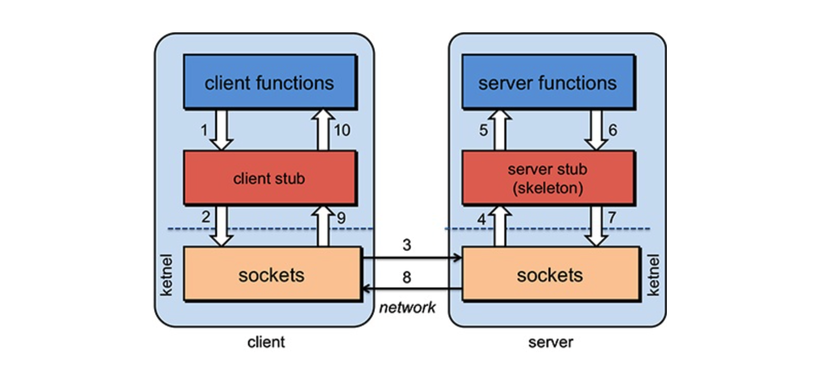

# Apollo

-----------

>- 管理项目中所有的配置，实现在所有的应用环境中配置的动态同步；
>- 灰度发布：将某个功能给逐渐放量特定的线上人群，避免新功能全量上线带来的风险
>- AB实验：将线上一部分真实人群流量拆分为多个组，给每组人群不同的策略功能，查看每组转化率，以此衡量策略功能的实现效果；
>
>
>
>扩展：
>
>RPC远程调用，现有AB两台服务器，应用部署在A上，需要调用B提供的方法，由于不在一个内存空间，不能直接调用，则需要通过网络来传输，调用语句；
>
>
>
>
>
>
>
>
>
>
>
>1. 通讯问题：在客户端和服务器之间建立TCP连接，远程调用的所有交换数据都在该连接里传输(按需连接 or 长连接都可)；
>2. 寻址问题：A服务器提供给PRC框架 (主机 or IP地址) 以及 特定端口，以此来连接到B服务器；
>3. 当A服务器上的应用发起远程过程通过调用时，方法的参数需要通过底层的网络协议(TCP)传输到B服务器，但因网络协议是基于二进制的，所以内存中参数的值需序列化为二进制的形式；
>4. B服务器收到请求之后，会进行反序列化，恢复内存中的表达方式，然后找到对应的方法，进行本地调用，得到返回值；