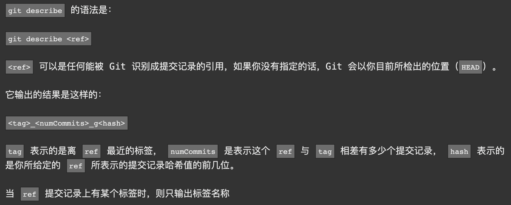

# Git

### 本地：

- `git commit -m <message>`：提交新修改，`--amend`表示对新提交的修改进行修改；

- `git branch <branch-name>`：创建分支

- `git checkout <branch-name>`：切换分支

- `git checkout -b <branch-name>`：创建分支并切换

- `git merge <branch-name>`：若两条分支各有独有的修改记录，则没有一个分支包含所有的修改内容，此时需要通过合并分支来解决问题

  1. `git merge <branch-name>`：当此时在main分支上时，将其他分支合并进main分支；
  2. `git checkout <branch-name>`：切换到其他分支；
  3. `git merge main`：将main分支合并到其他分支，保持两分支同步；

- `git rebase`：取出一系列提交记录并复制，然后放在另一个地方，相较于 `git merge` 改方法会更加线性，更加清晰；

  1. `git rebase <branch-name>`：当此时在其他分支上时，可以使用此语句将分支的修改复制，作为main分支的子节点；
  2. `git checkout main`：将分支切换到main上；
  3. `git rebase main`：此时将main `rebase` 到其他分支上；

- `HEAD`：对当前检出记录的符号引用，指向正在其基础上进行工作的提交记录，通常情况下，指向分支名，也可通过 `git checkout 提交记录名` 将其分离，使其命令指向某个具体的提交记录；

- `git log`：查看提交记录的哈希值，来指定提交记录，但是由于哈希值过长使用这种方法指定哈希值太过麻烦，因此可以通过相对引用来找到提交记录，如：

  - `^` ：上一个提交记录，可叠加；
  - `~<num>`：向上移动几个提交记录；

- `git branch -f <branch-name> HEAD相对引用`：会将分支强制指向HEAD的指向；

- 撤销变更：

  - `git reset`：将分支回退，新提交的记录会直接被删除，但只针对本地分支有效，针对远程分支无效；
  - `git revert`：在需要撤销的提交记录后添加了一个新提交，而新提交就中引入了更改，用来撤销需要撤销的提交；

- `git cherry-pick <提交号>`：同样是将提交记录复制到当前分支上，该写法相对于 `git rebase` 来说更为简单，但使用该命令一定要知道提交记录的提交号(也就是哈希值)；

- `git rebase -i <哪个提交记录>`：Git会打开一个UI界面，列出将要被复制到目标分支的备选提交记录，且显示每条提交记录的哈希值和提交说明，有助于理解，在该UI界面中可以做三件事：

  - 合并提交
  - 调整提交记录顺序
  - 删除不想要的提交

- `git tag`：使用标签标记提交记录，然后就可以针对某一提交记录进行操作；

- `git bisect`：查找产生Bug的提交记录的指令；

- `git describe`:

  

### 远程：

- `git clone`：从远程仓库拉取项目复制到本地，该本地项目被称为远程分支
- `git fetch`：同步远程分支与远程仓库的更新，并更新远程分支的指针(origin/main)，但其并不会改变本地仓库的状态，即不会更新main分支；
- `git pull`：拉取远程仓库更新并与本地仓库更新合并，相当于 `git fetch + git merge`，`git push --rebase = git fetch + git rebase`
- `git push origin <branch-name>` ：将本地提交上传到指定远程仓库