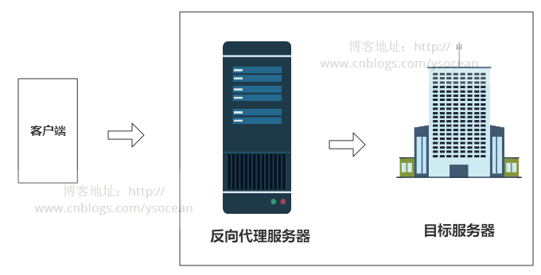

# Nginx

---------

> 代理：给某个对象提供一个代理对象，并由代理对象控制原对象的引用，即将自己不想做的事情委托给另一个人做，类似让中介找房子；

> 正向代理：正向代理服务其位于客户端和服务器之间，为了向服务器获取数据，客户端就要向代理服务器发送请求，并指定目标服务器，代理服务器将目标服务器返回的数据转交给客户端；

> 反向代理：即客户端对代理是无感知的，因为客户端无需任何配置即可访问，只需要将请求发送到反向代理服务器，由反向代理服务器选择目标服务器获取数据后，返回给客户端，此时反向代理服务器和目标服务器对外就是一个服务器，暴露的是代理服务器地址；

> **正向代理代理客户端，反向代理代理服务器**