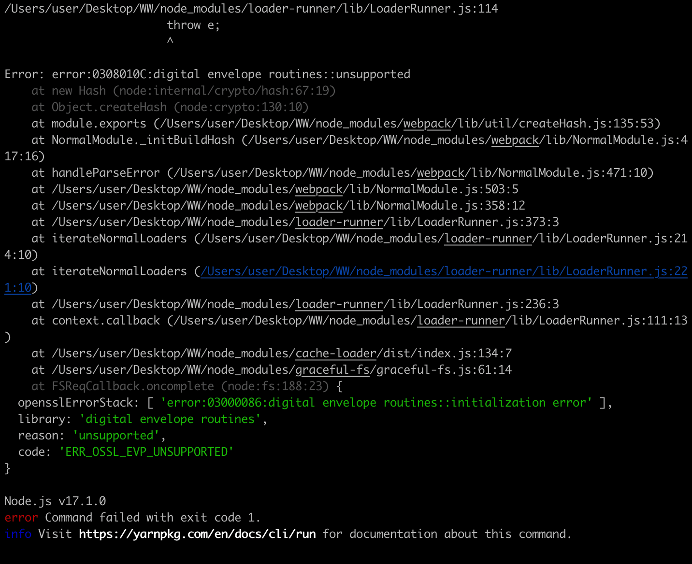
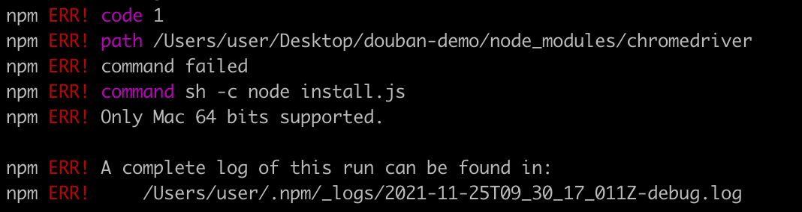
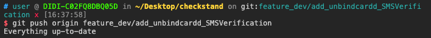
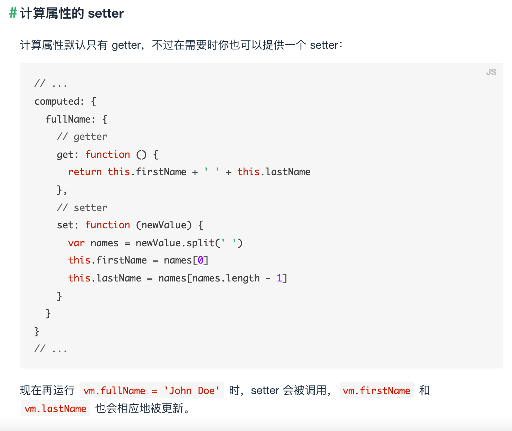
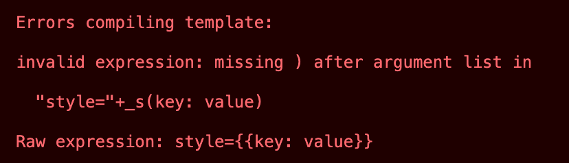

# 一整个大错特错


## NPM

- `npx vuepress dev docs` 报错：

  

  原因：Node v17.1.0版本问题

  解决方法：Node降低版本 `nvm intall 14`；

  

- `npm install` 报错

  

  mac不是64位的，chromedriver版本不对；

  解决方案：

  - `npm install -ignore-script`
  - 详细解决方案[https://blog.csdn.net/qq_41788977/article/details/109822271]
  - 安装指定的Vue cil版本[https://www.geek-share.com/detail/2806104496.html]


- 永久切换 `node` 版本

  1. 全局安装n：`sudo npm install -g n`；
  2. 删除指定版本：`sodo n rm <version number>`；
  3. 切换使用版本： `sudo n <version number>` or `nvm use <version number>`；

  

- 端口被占用报错
  1. 查询端口被占用情况：`sudo lsof -i:<port number>`
  2. 杀进程：`sudo kill -9 <PID>` or `kill <PID>`


## Git

- `git push` 报错：`everything up-to-date`

  

  报错原因：

  - 没有写 `git add`  和 `git commit` ；

  

## Vue

- 计算属性无法修改问题 (`8_searchList.html`)

  ````js
  // 错误
  computed: {
    filPerson() {
      return this.persons.filter(item => item.name.indexOf(this.keyword) !== -1);
    }
  },
    methods: {
      // 原顺序：0，正序：1，逆序：2
      changeOrder(codeOrder) {
        // 若codeOrder不为0，则
        if (codeOrder) {
          this.filPerson.sort((a, b) => {
            console.log(a.age, b.age);
            return (codeOrder === 1 ? a.age - b.age : b.age - a.age)
          });
          console.log(this.filPerson)
        }
      }
    },
  ````

  ````js
  // 正确 
  methods: {
     // 这样无法在初始化的时候显示数据
     search() {
       this.filPerson = this.persons.filter(item => {
         return item.name.indexOf(this.keyword) !== -1
       })
       console.log(this.filPerson);
  
     },
       changeOrder(codeOrder) {
         // 若codeOrder不为0，则
         if (codeOrder) {
           this.filPerson.sort((a, b) => {
             console.log(codeOrder)
             return (codeOrder === 1 ? a.age - b.age : b.age - a.age)
           });
           console.log(this.filPerson)
         }
       }
   },
  ````

  同样的 `methods`，控制台`filPerson` 改变了，但页面并不同步更新显示；

  错误原因：

  **计算属性只能通过 data 中的数据进行间接改变，而不能直接改变**；

  文档描述：

  


- `did you register the component correctly? For recursive components, make sure to provide the "name"` 组件未注册报错，可能有以下两个原因：

  - 组件自身没写 `name` 属性；
  - 父组件中的 `components` 属性未写或拼写错误； 

  

- `VuePress` 会检查md文件中代码块的语法，一旦有不和规的语法块，则导致整个页面无法显示：

  

  **暂未找到解决办法**

  